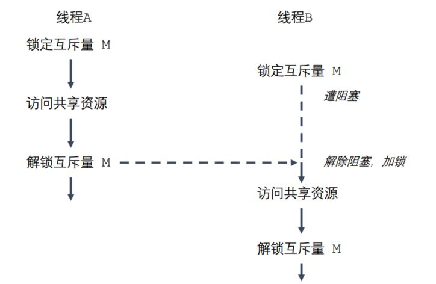
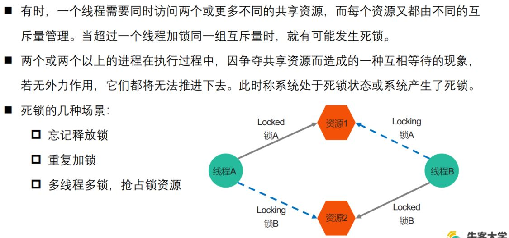
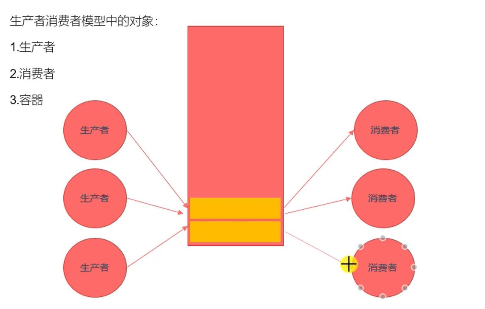
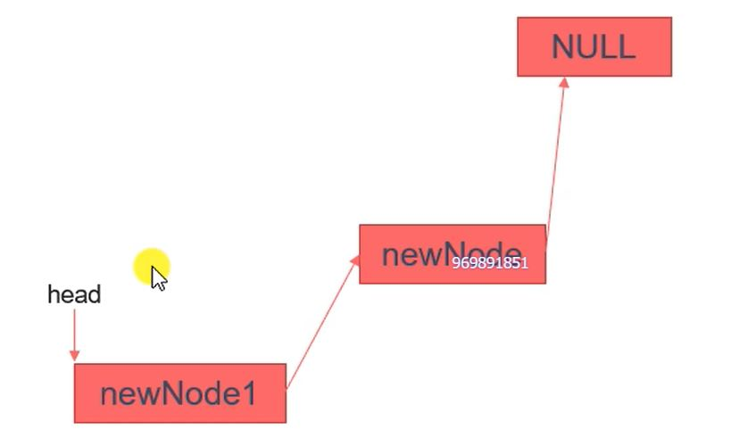

# 第3章 Linux多线程开发

- [第3章 Linux多线程开发](#第3章-linux多线程开发)
  - [3.1  线程概述](#31--线程概述)
    - [进程与线程](#进程与线程)
    - [线程之间共享和非共享资源](#线程之间共享和非共享资源)
  - [3.2 pthread_create()线程创建](#32-pthread_create线程创建)
  - [3.3 终止线程pthread_exit()](#33-终止线程pthread_exit)
  - [3.4 连接终止线程pthread_join()](#34-连接终止线程pthread_join)
  - [3.5 线程分离pthread_detach()](#35-线程分离pthread_detach)
  - [3.6 线程取消pthread_cancel()](#36-线程取消pthread_cancel)
  - [3.7 线程属性pthread_attr_](#37-线程属性pthread_attr_)
  - [3.8 线程同步](#38-线程同步)
  - [3.9 互斥锁](#39-互斥锁)
  - [3.10 死锁](#310-死锁)
  - [3.11 读写锁](#311-读写锁)
  - [3.12 生产者和消费者模型](#312-生产者和消费者模型)
  - [3.13 条件变量](#313-条件变量)
  - [3.14 信号量](#314-信号量)

## 3.1  线程概述

- *与进程（process）类似，线程（thread）是允许应用程序并发执行多个任务的一种机制。一个进程可以包含多个线程。同一个程序中的所有线程均会独立执行相同程序，且共享同一份全局内存区域，其中包括初始化数据段、未初始化数据段，以及堆内存段。（传统意义上的 UNIX 进程只是多线程程序的一个特例，该进程只包含一个线程*
  
### 进程与线程

  1. *根本区别：进程是操作系统资源分配的基本单位，而线程是处理器任务调度和执行的基本单位；*
  2. *资源开销：每个进程都有独立的代码和数据空间（程序 ），程序之间的切换会有较大的开销；线程可以看做轻量级的进程，同一类线程共享代码和数据空间，每个线程都有自己独立的运行栈和程序计数器（PC），线程之间切换的开销小*
  3. *内存分配：同一进程的线程共享本进程的地址空间和资源，而进程之间的地址空间和资源是相互独立的；*
  4. *影响关系：一个进程崩溃后，在保护模式下不会对其他进程产生影响，但是一个线程崩溃整个进程都死掉。所以多进程要比多线程健壮；*


- *线程是轻量级的进程（LWP： Light Weight Process），在 Linux 环境下线程的本质仍是进程。*
- *查看指定进程的 LWP 号： ps –Lf pid*

- 进*程间的信息难以共享。由于除去只读代码段外，父子进程并未共享内存，因此必须采用一些进程间通信方式，在进程间进行信息交换。*
- *调用 fork() 来创建进程的代价相对较高，即便利用写时复制技术，仍然需要复制诸如内存页表和文件描述符表之类的多种进程属性，这意味着 fork() 调用在时间上的开销依然不菲。*
  
- *线程之间能够方便、快速地共享信息。只需将数据复制到共享（全局或堆）变量中即可。*
- *创建线程比创建进程通常要快 10 倍甚至更多。线程间是共享虚拟地址空间的，无需采用写时复制来复制内存，也无需复制页表*
  
### 线程之间共享和非共享资源

|共享资源| 非共享资源 |
| :----:| :---:|
|进程 ID 和父进程 ID|线程 ID|
| 进程组 ID 和会话 ID|信号掩码|
| 用户 ID 和 用户组 ID|线程特有数据|
|文件描述符表|线程特有数据|
| 信号处置|实时调度策略和优先级|
| 文件系统的相关信息：文件权限掩码（umask）、当前工作目录|栈，本地变量和函数的调用链接信息|
|虚拟地址空间（除栈、 .text）| |

*NPTL，或称为 Native POSIX Thread Library，是 Linux 线程的一个新实现
它克服了LinuxThreads 的缺点，同时也符合 POSIX 的需求。与 LinuxThreads相比,
它在性能和稳定性方面都提供了重大的改进。
查看当前 pthread 库版本： getconf GNU_LIBPTHREAD_VERSION*

## 3.2 pthread_create()线程创建

```c++
/*
    一般情况下,main函数所在的线程我们称之为主线程（main线程），其余创建的线程
    称之为子线程。
    程序中默认只有一个进程，fork()函数调用，2进程
    程序中默认只有一个线程，pthread_create()函数调用，2个线程。

    #include <pthread.h>
    int pthread_create(pthread_t *thread, const pthread_attr_t *attr, 
    void *(*start_routine) (void *), void *arg);

        - 功能：创建一个子线程
        - 参数：
            - thread：传出参数，线程创建成功后，子线程的线程ID被写到该变量中。
            - attr : 设置线程的属性，一般使用默认值，NULL
            - start_routine : 函数指针，这个函数是子线程需要处理的逻辑代码
            - arg : 给第三个参数使用，传参
        - 返回值：
            成功：0
            失败：返回错误号。这个错误号和之前errno不太一样。
            不能用perror("")输出错误号信息
            获取错误号的信息：  char * strerror(int errnum);
        - Compile and link with -pthread 
            编译时需要指定静态库
            gcc pthread_create.c -o create -l pthread
            或
            gcc pthread_create.c -o create -pthread

*/
#include <stdio.h>
#include <pthread.h>
#include <string.h>
#include <unistd.h>
void * callback(void * arg) {
    printf("child thread...\n");
    printf("arg value: %d\n", *(int *)arg);
    return NULL;
}
int main() {
    pthread_t tid;
    int num = 10;
    // 创建一个子线程
    int ret = pthread_create(&tid, NULL, callback, (void *)&num);
    if(ret != 0) {
        // 传入错误号获取错误信息
        char * errstr = strerror(ret);
        printf("error : %s\n", errstr);
    } 
    for(int i = 0; i < 5; i++) {
        printf("%d\n", i);
    }
    sleep(1);
    return 0;   // exit(0);
}
```

## 3.3 终止线程pthread_exit()

```c++
/*
    #include <pthread.h>
    void pthread_exit(void *retval);
        功能：终止一个线程，在哪个线程中调用，就表示终止哪个线程
        参数：
            retval:需要传递一个指针，作为一个返回值，可以在pthread_join()中获取到。s

    pthread_t pthread_self(void);
        功能：获取当前的线程的线程ID

    int pthread_equal(pthread_t t1, pthread_t t2);
        功能：比较两个线程ID是否相等
        不同的操作系统，pthread_t类型的实现不一样，有的是无符号的长整型，有的
        是使用结构体去实现的。
        RETURN VALUE
        If the two thread IDs are equal, pthread_equal() returns a nonzero value; otherwise, it returns 0.
*/
#include <stdio.h>
#include <pthread.h>
#include <string.h>

void * callback(void * arg) {
    printf("child thread id : %ld\n", pthread_self());
    return NULL;    // pthread_exit(NULL);
} 

int main() {

    // 创建一个子线程
    pthread_t tid;
    int ret = pthread_create(&tid, NULL, callback, NULL);

    if(ret != 0) {
        char * errstr = strerror(ret);
        printf("error : %s\n", errstr);
    }

    // 主线程
    for(int i = 0; i < 5; i++) {
        printf("%d\n", i);
    }

    printf("tid : %ld, main thread id : %ld\n", tid ,pthread_self());

    // 让主线程退出,当主线程退出时，不会影响其他正常运行的线程。
    pthread_exit(NULL);

    printf("main thread exit\n");

    return 0;   // exit(0);
}
```
## 3.4 连接终止线程pthread_join()

```c++
/*
    #include <pthread.h>
    int pthread_join(pthread_t thread, void **retval);
        - 功能：和一个已经终止的线程进行连接
                回收子线程的资源
                这个函数是阻塞函数(子线程没有结束该函数就不执行)，调用一次只能回收一个子线程
                一般在主线程中使用
        - 参数：
            - thread：需要回收的子线程的ID
            - retval: 接收子线程退出时的返回值

                void pthread_exit(void *retval);
                    功能：终止一个线程，在哪个线程中调用，就表示终止哪个线程
                    参数：retval:需要传递一个指针，作为一个返回值，可以在pthread_join()中获取到

            - void** 可以改变传入指针的值
                #include<stdlib.h>
                void change(int** a){
                    int b=33;
                    *a=&b;
                }
                int main(){
                    int a=20;
                    int* data=&a;
                    // 需要传入该指针的地址才能修改
                    change(&data);
                    printf("*data=%d",*data);
                    return 0;
                }

        - 返回值：
            0 : 成功
            非0 : 失败，返回的错误号
*/

#include <stdio.h>
#include <pthread.h>
#include <string.h>
#include <unistd.h>

int value = 10;

void * callback(void * arg) {
    printf("child thread id : %ld\n", pthread_self());
    // sleep(3);
    // return NULL; 
    // int value = 10; // 局部变量
    pthread_exit((void *)&value);   // return (void *)&value;
} 

int main() {

    // 创建一个子线程
    pthread_t tid;
    int ret = pthread_create(&tid, NULL, callback, NULL);

    if(ret != 0) {
        char * errstr = strerror(ret);
        printf("error : %s\n", errstr);
    }

    // 主线程
    for(int i = 0; i < 5; i++) {
        printf("%d\n", i);
    }

    printf("tid : %ld, main thread id : %ld\n", tid ,pthread_self());

    // 主线程调用pthread_join()回收子线程的资源
    int * thread_retval;
    ret = pthread_join(tid, (void **)&thread_retval);

    if(ret != 0) {
        char * errstr = strerror(ret);
        printf("error : %s\n", errstr);
    }

    printf("exit data : %d\n", *thread_retval);

    printf("回收子线程资源成功！\n");

    // 让主线程退出,当主线程退出时，不会影响其他正常运行的线程。
    pthread_exit(NULL);

    return 0; 
}
```
## 3.5 线程分离pthread_detach()

```c++
/*
    #include <pthread.h>
    int pthread_detach(pthread_t thread);
        - 功能：分离一个线程。被分离的线程在终止的时候，会自动释放资源返回给系统。
          1.不能多次分离，会产生不可预料的行为。
          2.不能去连接一个已经分离的线程，会报错。
        - 参数：需要分离的线程的ID
        - 返回值：
            成功：0
            失败：返回错误号
*/
#include <stdio.h>
#include <pthread.h>
#include <string.h>
#include <unistd.h>

void * callback(void * arg) {
    printf("chid thread id : %ld\n", pthread_self());
    return NULL;
}

int main() {

    // 创建一个子线程
    pthread_t tid;

    int ret = pthread_create(&tid, NULL, callback, NULL);
    if(ret != 0) {
        char * errstr = strerror(ret);
        printf("error1 : %s\n", errstr);
    }

    // 输出主线程和子线程的id
    printf("tid : %ld, main thread id : %ld\n", tid, pthread_self());

    // 设置子线程分离,子线程分离后，子线程结束时对应的资源就不需要主线程释放
    ret = pthread_detach(tid);
    if(ret != 0) {
        char * errstr = strerror(ret);
        printf("error2 : %s\n", errstr);
    }

    // 设置分离后，对分离的子线程进行连接 pthread_join()
    // ret = pthread_join(tid, NULL);
    // if(ret != 0) {
    //     char * errstr = strerror(ret);
    //     printf("error3 : %s\n", errstr);
    // }

    pthread_exit(NULL);

    return 0;
}
```
## 3.6 线程取消pthread_cancel()

```c++
/*
    #include <pthread.h>
    int pthread_cancel(pthread_t thread);
        - 功能：取消线程（让线程终止）
            取消某个线程，可以终止某个线程的运行，
            但是并不是立马终止，而是当子线程执行到一个取消点，线程才会终止。
            取消点：系统规定好的一些系统调用，我们可以粗略的理解为从用户区到内核区的切换，这个位置称之为取消点。
*/

#include <stdio.h>
#include <pthread.h>
#include <string.h>
#include <unistd.h>

void * callback(void * arg) {
    printf("chid thread id : %ld\n", pthread_self());
    for(int i = 0; i < 5; i++) {
        printf("child : %d\n", i);
    }
    return NULL;
}

int main() {
    
    // 创建一个子线程
    pthread_t tid;

    int ret = pthread_create(&tid, NULL, callback, NULL);
    if(ret != 0) {
        char * errstr = strerror(ret);
        printf("error1 : %s\n", errstr);
    }

    // 取消线程
    pthread_cancel(tid);

    for(int i = 0; i < 5; i++) {
        printf("%d\n", i);
    }

    // 输出主线程和子线程的id
    printf("tid : %ld, main thread id : %ld\n", tid, pthread_self());

    
    pthread_exit(NULL);

    return 0;
}
```

## 3.7 线程属性pthread_attr_

输入命令**man pthread_attr_**+两次Tab 查看属性相关操作

```c++
/*
    int pthread_attr_init(pthread_attr_t *attr);
        - 初始化线程属性变量

    int pthread_attr_destroy(pthread_attr_t *attr);
        - 释放线程属性的资源

    int pthread_attr_getdetachstate(const pthread_attr_t *attr, int *detachstate);
        - 获取线程分离的状态属性

    int pthread_attr_setdetachstate(pthread_attr_t *attr, int detachstate);
        - 设置线程分离的状态属性
        PTHREAD_CREATE_DETACHED
              Threads that are created using attr will be created in a detached state.

        PTHREAD_CREATE_JOINABLE
              Threads that are created using attr will be created in a joinable state.
*/     

#include <stdio.h>
#include <pthread.h>
#include <string.h>
#include <unistd.h>

void * callback(void * arg) {
    printf("chid thread id : %ld\n", pthread_self());
    return NULL;
}

int main() {

    // 创建一个线程属性变量
    pthread_attr_t attr;
    // 初始化属性变量
    pthread_attr_init(&attr);

    // 设置属性
    pthread_attr_setdetachstate(&attr, PTHREAD_CREATE_DETACHED);

    // 创建一个子线程
    pthread_t tid;

    int ret = pthread_create(&tid, &attr, callback, NULL);
    if(ret != 0) {
        char * errstr = strerror(ret);
        printf("error1 : %s\n", errstr);
    }

    // 获取线程的栈的大小
    size_t size;
    pthread_attr_getstacksize(&attr, &size);
    printf("thread stack size : %ld\n", size);

    // 输出主线程和子线程的id
    printf("tid : %ld, main thread id : %ld\n", tid, pthread_self());

    // 释放线程属性资源
    pthread_attr_destroy(&attr);

    pthread_exit(NULL);

    return 0;
}
```

## 3.8 线程同步

**线程同步**
*1. 线程的主要优势在于，能够通过全局变量来共享信息。不过，这种便捷的共享是有代价
的：必须确保多个线程不会同时修改同一变量，或者某一线程不会读取正在由其他线程
修改的变量。
2. 临界区是指访问某一共享资源的代码片段，并且这段代码的执行应为原子操作，也就是
同时访问同一共享资源的其他线程不应终端该片段的执行。
3. 线程同步：即当有一个线程在对内存进行操作时，其他线程都不可以对这个内存地址进
行操作，直到该线程完成操作，其他线程才能对该内存地址进行操作，而其他线程则处
于等待状态*

***线程同步一定程度会影响执行效率，但也只是对临界区的数据同步
整体上还是并发执行***

**售票案例**（*存在问题*）
```c++
/*
    使用多线程实现买票的案例。
    有3个窗口，一共是100张票。
*/

#include <stdio.h>
#include <pthread.h>
#include <unistd.h>

// 全局变量，所有的线程都共享这一份资源。
// 如果作为回调函数局部变量，每个线程都会卖tickets张票
int tickets = 100;

void * sellticket(void * arg) {
    // 卖票
    while(tickets > 0) {
        //睡眠微秒
        // 出现卖同一张票或者负数票问题，三个线程可能同时走进while()
        usleep(6000);
        printf("%ld 正在卖第 %d 张门票\n", pthread_self(), tickets);
        tickets--;
    }
    return NULL;
}

int main() {

    // 创建3个子线程

    pthread_t tid1, tid2, tid3;
    pthread_create(&tid1, NULL, sellticket, NULL);
    pthread_create(&tid2, NULL, sellticket, NULL);
    pthread_create(&tid3, NULL, sellticket, NULL);

    // 回收子线程的资源,阻塞
    pthread_join(tid1, NULL);
    pthread_join(tid2, NULL);
    pthread_join(tid3, NULL);

    // 设置线程分离。被分离的线程在终止的时候，会自动释放资源返回给系统
    // pthread_detach(tid1);
    // pthread_detach(tid2);
    // pthread_detach(tid3);

    pthread_exit(NULL); // 退出主线程

    return 0;
}
```

## 3.9 互斥锁

- *为避免线程更新共享变量时出现问题，可以使用互斥量（mutex 是 mutual exclusion
的缩写）来确保同时仅有一个线程可以访问某项共享资源。可以使用互斥量来保证对任意共
享资源的原子访问*  

- *互斥量有两种状态：已锁定（locked）和未锁定（unlocked）。任何时候，至多只有一
个线程可以锁定该互斥量。试图对已经锁定的某一互斥量再次加锁，将可能阻塞线程或者报
错失败，具体取决于加锁时使用的方法*

- *一旦线程锁定互斥量，随即成为该互斥量的所有者，只有所有者才能给互斥量解锁。一般情
况下，对每一共享资源（可能由多个相关变量组成）会使用不同的互斥量，每一线程在访问
同一资源时将采用如下协议：*

   1. 针对共享资源锁定互斥量   
   2. 访问共享资源
   3. 对互斥量解锁
- *如果多个线程试图执行这一块代码（一个临界区），事实上只有一个线程能够持有该互斥
量（其他线程将遭到阻塞），即同时只有一个线程能够进入这段代码区域，如下图所示：*


```c++
/*
    互斥量的类型 pthread_mutex_t
    int pthread_mutex_init(pthread_mutex_t *restrict mutex, const pthread_mutexattr_t *restrict attr);
        - 初始化互斥量
        - 参数 ：
            - mutex ： 需要初始化的互斥量变量
            - attr ： 互斥量相关的属性，NULL
        - restrict : C语言的修饰符，被修饰的指针，不能由另外的一个指针进行操作。
            pthread_mutex_t *restrict mutex = xxx;
            pthread_mutex_t * mutex1 = mutex;

    int pthread_mutex_destroy(pthread_mutex_t *mutex);
        - 释放互斥量的资源

    int pthread_mutex_lock(pthread_mutex_t *mutex);
        - 加锁，阻塞的，如果有一个线程加锁了，那么其他的线程只能阻塞等待

    int pthread_mutex_trylock(pthread_mutex_t *mutex);
        - 尝试加锁，如果加锁失败，不会阻塞，会直接返回。

    int pthread_mutex_unlock(pthread_mutex_t *mutex);
        - 解锁
*/
#include <stdio.h>
#include <pthread.h>
#include <unistd.h>

// 全局变量，所有的线程都共享这一份资源。
int tickets = 10000;

// 创建一个互斥量
pthread_mutex_t mutex;

void * sellticket(void * arg) {

    // 卖票
    while(1) {

        // 加锁
        pthread_mutex_lock(&mutex);

        if(tickets > 0) {
            usleep(6000);
            //sleep(10);
            printf("%ld 正在卖第 %d 张门票\n", pthread_self(), tickets);
            tickets--;
        }else {
            // 解锁
            pthread_mutex_unlock(&mutex); 
            printf("票已售完！！！！\n");
            break;
        }

        // 解锁
        pthread_mutex_unlock(&mutex);
    }

    

    return NULL;
}

int main() {

    // 初始化互斥量
    pthread_mutex_init(&mutex, NULL);

    // 创建3个子线程
    pthread_t tid1, tid2, tid3;
    pthread_create(&tid1, NULL, sellticket, NULL);
    pthread_create(&tid2, NULL, sellticket, NULL);
    pthread_create(&tid3, NULL, sellticket, NULL);

    // 回收子线程的资源,阻塞
    pthread_join(tid1, NULL);
    pthread_join(tid2, NULL);
    pthread_join(tid3, NULL);

    pthread_exit(NULL); // 退出主线程

    // 释放互斥量资源
    pthread_mutex_destroy(&mutex);

    return 0;
}
```
## 3.10 死锁



```c++
#include <stdio.h>
#include <pthread.h>
#include <unistd.h>

// 创建2个互斥量
pthread_mutex_t mutex1, mutex2;

void * workA(void * arg) {

    pthread_mutex_lock(&mutex1);
    sleep(1);
    pthread_mutex_lock(&mutex2);

    printf("workA....\n");

    pthread_mutex_unlock(&mutex2);
    pthread_mutex_unlock(&mutex1);
    return NULL;
}


void * workB(void * arg) {
    pthread_mutex_lock(&mutex2);
    sleep(1);
    pthread_mutex_lock(&mutex1);

    printf("workB....\n");

    pthread_mutex_unlock(&mutex1);
    pthread_mutex_unlock(&mutex2);

    return NULL;
}

int main() {

    // 初始化互斥量
    pthread_mutex_init(&mutex1, NULL);
    pthread_mutex_init(&mutex2, NULL);

    // 创建2个子线程
    pthread_t tid1, tid2;
    pthread_create(&tid1, NULL, workA, NULL);
    pthread_create(&tid2, NULL, workB, NULL);

    // 回收子线程资源
    pthread_join(tid1, NULL);
    pthread_join(tid2, NULL);

    // 释放互斥量资源
    pthread_mutex_destroy(&mutex1);
    pthread_mutex_destroy(&mutex2);

    return 0;
}
```

## 3.11 读写锁

*当有一个线程已经持有互斥锁时，互斥锁将所有试图进入临界区的线程都阻塞住。但是考
虑一种情形，当前持有互斥锁的线程只是要读访问共享资源，而同时有其它几个线程也想
读取这个共享资源，但是由于互斥锁的排它性，所有其它线程都无法获取锁，也就无法读
访问共享资源了，但是实际上多个线程同时读访问共享资源并不会导致问题。*
- *在对数据的读写操作中，更多的是读操作，写操作较少，例如对数据库数据的读写应用。
为了满足当前能够允许多个读出，但只允许一个写入的需求，线程提供了读写锁来实现。*
- *读写锁的特点：*
    *1. 如果有其它线程读数据，则允许其它线程执行读操作，但不允许写操作。
    2. 如果有其它线程写数据，则其它线程都不允许读、写操作。
    3. 写是独占的，写的优先级高。*

**使用读写锁在读时可以让多个线程并发执行**

```c++
/*
    读写锁的类型 pthread_rwlock_t
    int pthread_rwlock_init(pthread_rwlock_t *restrict rwlock, const pthread_rwlockattr_t *restrict attr);
    int pthread_rwlock_destroy(pthread_rwlock_t *rwlock);
    int pthread_rwlock_rdlock(pthread_rwlock_t *rwlock);
    int pthread_rwlock_tryrdlock(pthread_rwlock_t *rwlock);
    int pthread_rwlock_wrlock(pthread_rwlock_t *rwlock);
    int pthread_rwlock_trywrlock(pthread_rwlock_t *rwlock);
    int pthread_rwlock_unlock(pthread_rwlock_t *rwlock);

    案例：8个线程操作同一个全局变量。
    3个线程不定时写这个全局变量，5个线程不定时的读这个全局变量
*/

#include <stdio.h>
#include <pthread.h>
#include <unistd.h>

// 创建一个共享数据
int num = 1;
// pthread_mutex_t mutex;
pthread_rwlock_t rwlock;

void * writeNum(void * arg) {

    while(1) {
        pthread_rwlock_wrlock(&rwlock);
        num++;
        printf("++write, tid : %ld, num : %d\n", pthread_self(), num);
        pthread_rwlock_unlock(&rwlock);
        usleep(100);
    }

    return NULL;
}

void * readNum(void * arg) {

    while(1) {
        pthread_rwlock_rdlock(&rwlock);
        printf("===read, tid : %ld, num : %d\n", pthread_self(), num);
        pthread_rwlock_unlock(&rwlock);
        usleep(100);
    }

    return NULL;
}

int main() {

   pthread_rwlock_init(&rwlock, NULL);

    // 创建3个写线程，5个读线程
    pthread_t wtids[3], rtids[5];
    for(int i = 0; i < 3; i++) {
        pthread_create(&wtids[i], NULL, writeNum, NULL);
    }

    for(int i = 0; i < 5; i++) {
        pthread_create(&rtids[i], NULL, readNum, NULL);
    }

    // 设置线程分离
    for(int i = 0; i < 3; i++) {
       pthread_detach(wtids[i]);
    }

    for(int i = 0; i < 5; i++) {
         pthread_detach(rtids[i]);
    }

    pthread_exit(NULL);

    pthread_rwlock_destroy(&rwlock);

    return 0;
}
```
## 3.12 生产者和消费者模型




**存在问题：当没有数据了，消费线程依然在不断执行while(),资源浪费**
```c++
/*
    生产者消费者模型（粗略的版本）
*/
#include <stdio.h>
#include <pthread.h>
#include <stdlib.h>
#include <unistd.h>

// 创建一个互斥量
pthread_mutex_t mutex;

struct Node{
    int num;
    struct Node *next;
};

// 头结点
struct Node * head = NULL;

void * producer(void * arg) {

    // 不断的创建新的节点，添加到链表中
    while(1) {
        pthread_mutex_lock(&mutex);
        struct Node * newNode = (struct Node *)malloc(sizeof(struct Node));
        newNode->next = head;
        head = newNode;
        newNode->num = rand() % 1000;
        printf("add node, num : %d, tid : %ld\n", newNode->num, pthread_self());
        pthread_mutex_unlock(&mutex);
        usleep(100);
    }

    return NULL;
}

void * customer(void * arg) {

    while(1) {
        pthread_mutex_lock(&mutex);
        // 保存头结点的指针
        struct Node * tmp = head;

        // 判断是否有数据
        if(head != NULL) {
            // 有数据
            head = head->next;
            printf("del node, num : %d, tid : %ld\n", tmp->num, pthread_self());
            free(tmp);
            pthread_mutex_unlock(&mutex);
            usleep(100);
        } else {
            // 没有数据
            pthread_mutex_unlock(&mutex);
        }
    }
    return  NULL;
}

int main() {

    pthread_mutex_init(&mutex, NULL);

    // 创建5个生产者线程，和5个消费者线程
    pthread_t ptids[5], ctids[5];

    for(int i = 0; i < 5; i++) {
        pthread_create(&ptids[i], NULL, producer, NULL);
        pthread_create(&ctids[i], NULL, customer, NULL);
    }

    for(int i = 0; i < 5; i++) {
        pthread_detach(ptids[i]);
        pthread_detach(ctids[i]);
    }
    // 防止mutex被立即销毁
    // pthread_detach()是不阻塞的

    while(1) {
        sleep(10);
    }

    pthread_mutex_destroy(&mutex);

    pthread_exit(NULL);

    return 0;
}
```
**头插法理解**


## 3.13 条件变量

```c++
/*
    条件变量的类型 pthread_cond_t
    int pthread_cond_init(pthread_cond_t *restrict cond, const pthread_condattr_t *restrict attr);
    int pthread_cond_destroy(pthread_cond_t *cond);
    int pthread_cond_wait(pthread_cond_t *restrict cond, pthread_mutex_t *restrict mutex);
        - 等待，调用了该函数，线程会阻塞。
    int pthread_cond_timedwait(pthread_cond_t *restrict cond, pthread_mutex_t *restrict mutex, const struct timespec *restrict abstime);
        - 等待多长时间，调用了这个函数，线程会阻塞，直到指定的时间结束。
    int pthread_cond_signal(pthread_cond_t *cond);
        - 唤醒一个或者多个等待的线程
    int pthread_cond_broadcast(pthread_cond_t *cond);
        - 唤醒所有的等待的线程
*/
#include <stdio.h>
#include <pthread.h>
#include <stdlib.h>
#include <unistd.h>

// 创建一个互斥量
pthread_mutex_t mutex;
// 创建条件变量
pthread_cond_t cond;

struct Node{
    int num;
    struct Node *next;
};

// 头结点
struct Node * head = NULL;

void * producer(void * arg) {

    // 不断的创建新的节点，添加到链表中
    while(1) {
        pthread_mutex_lock(&mutex);
        struct Node * newNode = (struct Node *)malloc(sizeof(struct Node));
        newNode->next = head;
        head = newNode;
        newNode->num = rand() % 1000;
        printf("add node, num : %d, tid : %ld\n", newNode->num, pthread_self());
        
        // 只要生产了一个，就通知消费者消费
        pthread_cond_signal(&cond);

        pthread_mutex_unlock(&mutex);
        usleep(100);
    }

    return NULL;
}

void * customer(void * arg) {

    while(1) {
        pthread_mutex_lock(&mutex);
        // 保存头结点的指针
        struct Node * tmp = head;
        // 判断是否有数据
        if(head != NULL) {
            // 有数据
            head = head->next;
            printf("del node, num : %d, tid : %ld\n", tmp->num, pthread_self());
            free(tmp);
            pthread_mutex_unlock(&mutex);
            usleep(100);
        } else {
            // 没有数据，需要等待
            // 当这个函数调用阻塞的时候，会对互斥锁进行解锁，当不阻塞的，继续向下执行，会重新加锁。
            pthread_cond_wait(&cond, &mutex);
            pthread_mutex_unlock(&mutex);
        }
    }
    return  NULL;
}

int main() {

    pthread_mutex_init(&mutex, NULL);
    pthread_cond_init(&cond, NULL);

    // 创建5个生产者线程，和5个消费者线程
    pthread_t ptids[5], ctids[5];

    for(int i = 0; i < 5; i++) {
        pthread_create(&ptids[i], NULL, producer, NULL);
        pthread_create(&ctids[i], NULL, customer, NULL);
    }

    for(int i = 0; i < 5; i++) {
        pthread_detach(ptids[i]);
        pthread_detach(ctids[i]);
    }

    while(1) {
        sleep(10);
    }

    pthread_mutex_destroy(&mutex);
    pthread_cond_destroy(&cond);

    pthread_exit(NULL);

    return 0;
}
```
## 3.14 信号量

```c++
/*
    信号量的类型 sem_t
    int sem_init(sem_t *sem, int pshared, unsigned int value);
        - 初始化信号量
        - 参数：
            - sem : 信号量变量的地址
            - pshared : 0 用在线程间 ，非0 用在进程间
            - value : 信号量中的值

    int sem_destroy(sem_t *sem);
        - 释放资源

    int sem_wait(sem_t *sem);
        - 对信号量加锁，调用一次对信号量的值-1，如果值为0，就阻塞

    int sem_trywait(sem_t *sem);

    int sem_timedwait(sem_t *sem, const struct timespec *abs_timeout);
    int sem_post(sem_t *sem);
        - 对信号量解锁，调用一次对信号量的值+1

    int sem_getvalue(sem_t *sem, int *sval);
    // 表示生产者可以生产的量
    sem_t psem;
    // 表示消费者可以消费的量
    sem_t csem;
    init(psem, 0, 8);
    init(csem, 0, 0);

    producer() {
        // 根据生产者信号量判断是否可以生产
        sem_wait(&psem);
        // 生产后通知消费者消费
        sem_post(&csem)
    }

    customer() {
        sem_wait(&csem);
        sem_post(&psem)
    }

*/

#include <stdio.h>
#include <pthread.h>
#include <stdlib.h>
#include <unistd.h>
#include <semaphore.h>

// 创建一个互斥量
pthread_mutex_t mutex;
// 创建两个信号量
sem_t psem;
sem_t csem;

struct Node{
    int num;
    struct Node *next;
};

// 头结点
struct Node * head = NULL;

void * producer(void * arg) {

    // 不断的创建新的节点，添加到链表中
    while(1) {
        
        sem_wait(&psem);
        pthread_mutex_lock(&mutex);
        struct Node * newNode = (struct Node *)malloc(sizeof(struct Node));
        newNode->next = head;
        head = newNode;
        newNode->num = rand() % 1000;
        printf("add node, num : %d, tid : %ld\n", newNode->num, pthread_self());
        pthread_mutex_unlock(&mutex);
        sem_post(&csem);
    }

    return NULL;
}

void * customer(void * arg) {

    while(1) {
        sem_wait(&csem);
        pthread_mutex_lock(&mutex);
        // 保存头结点的指针
        struct Node * tmp = head;
        head = head->next;
        printf("del node, num : %d, tid : %ld\n", tmp->num, pthread_self());
        free(tmp);
        pthread_mutex_unlock(&mutex);
        sem_post(&psem);
       
    }
    return  NULL;
}

int main() {

    pthread_mutex_init(&mutex, NULL);
    sem_init(&psem, 0, 8);
    sem_init(&csem, 0, 0);

    // 创建5个生产者线程，和5个消费者线程
    pthread_t ptids[5], ctids[5];

    for(int i = 0; i < 5; i++) {
        pthread_create(&ptids[i], NULL, producer, NULL);
        pthread_create(&ctids[i], NULL, customer, NULL);
    }

    for(int i = 0; i < 5; i++) {
        pthread_detach(ptids[i]);
        pthread_detach(ctids[i]);
    }

    while(1) {
        sleep(10);
    }

    pthread_mutex_destroy(&mutex);

    pthread_exit(NULL);

    return 0;
}
```
