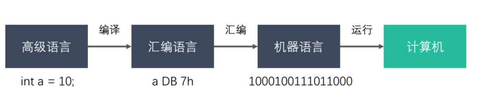
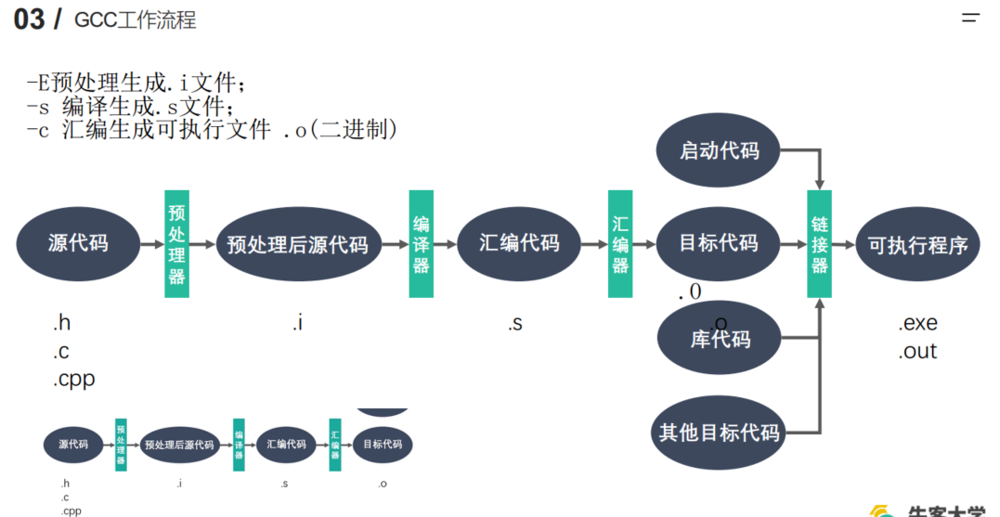

# 第一章 Linux系统编程

## 1.1 Linux开发环境搭建

- 远程服务器准备/虚拟机安装Linux系统
- Xshell 远程连接
  > xshell 安装运行后闪退
  >
  > 找到【flexnet licensing service】服务然后停止，右击属性，把启动类型改成禁止就可以
  >
  > [https://blog.csdn.net/qq_34231823/article/details/120260491](https://blog.csdn.net/qq_34231823/article/details/120260491)
- VS Code远程连接设置
  > 1. 安装远程服务ssh：sudo apt install openssh-server;
  > 2. xshell中新建会话：主机为云服务器的公网IP或者填Linux系统IP地址
  > 3. Xftp 用于与服务器文件传输
  > 4. 远程连接
  >    - 安装Remote Development
  >    - 设置config
  >    - 设置免密登录:   
  >
  >         将本机公钥发送给虚拟机 .ssh/目录下
  >         
  >         vim authorized_keys 将本机公钥复制到该文件，保存退出
  
  ## 1.2 GCC

**简介**
> GNU C Compiler
> 是由GUN开发的编程语言编译器
> 安装： `sudo apt install gcc g++`
>       ` gcc/g++ -v/--version`

