# 第4章 Linux网络编程

- [第4章 Linux网络编程](#第4章-linux网络编程)
  - [4.1 网络结构模式](#41-网络结构模式)
      - [C/S结构](#cs结构)
      - [B/S 结构](#bs-结构)
  - [4.2 MAC地址、IP地址](#42-mac地址ip地址)
      - [MAC地址](#mac地址)
      - [IP地址](#ip地址)
      - [子网掩码](#子网掩码)
  - [4.3 端口](#43-端口)
      - [简介](#简介)
  - [4.4 网络模型](#44-网络模型)
      - [OSI 七层参考模型](#osi-七层参考模型)
      - [TCP/IP 四层模型](#tcpip-四层模型)
      - [协议](#协议)
      - [封装](#封装)
      - [分用](#分用)
      - [网络通信过程](#网络通信过程)

## 4.1 网络结构模式

#### C/S结构

- **简介**
  *客户机-服务器结构模式；客户机通过局域网与服务器相连，接受用户的请求，并通过网络向服务器提出请求，对数据库进行操作。服务器接受客户机的请求，将数据提交给客户机，客户机将数据进行计算并将结果呈现给用户。*

- **优点**
  
  *1. 能充分发挥客户端 PC 的处理能力，很多工作可以在客户端处理后再提交给服务器，所以 **C/S 结构客户端响应速度快**
  2. 操作界面漂亮、形式多样，可以充分满足客户自身的个性化要求；
  3. C/S 结构的管理信息系统具有较强的事务处理能力，能实现复杂的业务流程；
  4. **安全性较高**，C/S 一般面向相对固定的用户群，程序更加注重流程，它可以对权限进行多层次校验，提供了更安全的存取模式，对信息安全的控制能力很强，一般高度机密的信息系统采用 C/S 结构适宜*

- **缺点**
  *1. 客户端需要安装专用的客户端软件。首先涉及到安装的工作量，其次任何一台电脑出问题，如病毒、硬件损坏，都需要进行安装或维护。系统软件升级时，每一台客户机需要重新安装，其**维护和升级成本非常高***
  *2. **对客户端的操作系统一般也会有限制，不能够跨平台***

#### B/S 结构

- **简介**
  *浏览器-服务器结构模式；这种模式统一了客户端，将系统功能实现的核心部分集中到服
务器上，简化了系统的开发、维护和使用，服务器安装Oracle等数据库。浏览器通过Web Server 同数据
库进行数据交互*

- **优点**
  
  *B/S 架构最大的优点是总体拥有成本低、维护方便、 分布性强、开发简单，可以不用安装任何专门的软
件就能实现在任何地方进行操作，客户端零维护，系统的扩展非常容易*

- **缺点**
  *1. **通信开销大、系统和数据的安全性较难保障**;
  2. 个性特点明显降低，无法实现具有个性化的功能要求；
  3. 协议一般是固定的：http/https
  4. **客户端服务器端的交互是请求-响应模式，通常动态刷新页面，响应速度明显降低***

## 4.2 MAC地址、IP地址

#### MAC地址

**网卡**
网卡又称为**网络适配器或网络接口卡NIC**，是一块被设计用来允许计算机在计算机网络上进行通讯的计算机硬件；
其拥有 MAC 地址，属于 OSI 模型的第2层（数据链路层），它使得用户可以通过电缆或无线相互连接。
**每一个网卡都有一个被称为 MAC 地址的独一无二的 48 位串行号**。
网卡的主要功能：1.数据的封装与解封装、2.链路管理、3.数据编码与译码

**MAC地址**
*MAC 地址（Media Access Control Address），也称为**局域网地址、以太网地址、物理地址或硬件地址**，
**它是一个用来确认网络设备位置的位址，由网络设备制造商生产时烧录在网卡中。用于在网络中唯一标识一个网卡**，
MAC 地址的长度为 48 位（6个字节），通常表示为 12 个 16 进制数，如：00-16-EA-AE-3C-40 就是一个MAC 地址，
其中前 3 个字节，16 进制数 00-16-EA 代表网络硬件制造商的编号，而后3个字节，16进制数 AE-3C-40 代表该制造商所制造的某个网络产品（如网卡）的系列号；
MAC 地址就如同身份证上的身份证号码，具有唯一性*

#### IP地址

**IP协议**
IP协议是为计算机网络相互连接进行通信而设计的协议；
实际上是一套由软件程序组成的协议软件，它把各种不同“帧”统一转换成“IP 数据报”格式

**IP地址**
IP 地址（Internet Protocol Address）是指**互联网协议地址**，**它为互联网上的每一个网络和每一台主机分配一个逻辑地址**，以此来屏蔽物理地址的差异

**IP地址编址方式**
IP地址=网络号+主机号
| 类别 | 最大网络数 |IP地址范围  | 单个网段最大主机数  |  私有IP地址范围 |
| :----: | :----: | :--------: | :---------------: | :----------:   |
|A |126(2^7-2)|  1.0.0.1-126.255.255.254 |16777214 | 10.0.0.0-10.255.255.255|
|B |16384(2^14)  |128.0.0.1-191.255.255.254 | 65534 |172.16.0.0-172.31.255.255|
|C |2097152(2^21)|92.0.0.1-223.255.255.254 | 254 |192.168.0.0-192.168.255.255|   

**A类IP地址:** A 类 IP 地址就由 1 字节的网络地址和 3 字节主机地址组成，**网络地址的最高位必须是“0”**
A 类 IP 地址中网络的标识长度为 8 位，主机标识的长度为 24 位
A 类 IP 地址 地址范围 1.0.0.1 - 126.255.255.254 二进制表示为：00000001 00000000 00000000 00000001 - **01111111** 11111111 11111111 11111110
**网络数=2^7-1-1=126 (127.0.0.1为本机地址)**
最后一个是广播地址;A 类 IP 地址的子网掩码为 255.0.0.0，**每个网络支持的最大主机数为 256 的 3 次方 - 2 = 16777214 台**(去除广播地址和0地址)

**B类IP地址：** B 类 IP 地址就由 2 字节的网络地址和 2 字节主机地址组成，**网络地址的最高位必须是“10”**
B 类 IP地址中网络的标识长度为 16 位，主机标识的长度为 16 位
B 类 IP 地址地址范围 128.0.0.1 - 191.255.255.254 二进制表示为：10000000 00000000 00000000 00000001 -** 10111111** 11111111 11111111 11111110
**网络数=2^6 * 2^8 = 2^14**
最后一个是广播地址，B 类 IP 地址的子网掩码为 255.255.0.0，每个网络支持的最大主机数为 256 的 2 次方 - 2 = 65534 台

**C类IP地址**C 类 IP 地址就由 3 字节的网络地址和 1 字节主机地址组成，**网络地址的最高位必须是“110”**
C 类 IP 地址中网络的标识长度为 24 位，主机标识的长度为 8 位
C 类 IP 地址范围 192.0.0.1-223.255.255.254 二进制表示为: 11000000 00000000 0000000000000001 - **11011111** 11111111 11111111 11111110
**网络数=2^5 * 2^16 = 2^21**
C类IP地址的子网掩码为 255.255.255.0，每个网络支持的最大主机数为 256 - 2 = 254 台

**特殊地址**
*- 每一个字节都为 0 的地址（ “0.0.0.0” ）对应于当前主机*
*- IP 地址中的每一个字节都为 1 的 IP 地址（ “255.255.255.255” ）是当前子网的广播地址*
*- IP地址中不能以十进制 “127” 作为开头，该类地址中数字 127.0.0.1 到 127.255.255.255 用于回路测试，如：127.0.0.1可以代表本机IP地址*

#### 子网掩码
子网掩码（subnet mask）结合 IP 地址一起使用，将某个 IP 地址划分成网络地址和主机地址两部分
子网掩码是一个 32 位的 2 进制数，其对应网络地址的所有位都置为 1，对应于主机地址的所有位置都为 0
求网络地址：子网掩码和ip按位与
求主机id：子网掩码取反，和ip按位与（或者就是网络地址0的位数）

## 4.3 端口

#### 简介
可以认为是设备与外界通讯交流的出口，标识计算机中进程的唯一编号
端口可分为虚拟端口和物理端口，其中**虚拟端口指计算机内部或交换机路由器内的端口，不可见**，是特指TCP/IP协议中的端口，是逻辑意义上的端口。例如计算机中的 80 端口；
**物理端口又称为接口，是可见端口**，计算机背板的 RJ45 网口，交换机路由器集线器等 RJ45 端口
一个 IP地址的端口可以有 65536（即：2^16）个，范围是从 0 到65535（2^16-1）

## 4.4 网络模型

#### OSI 七层参考模型
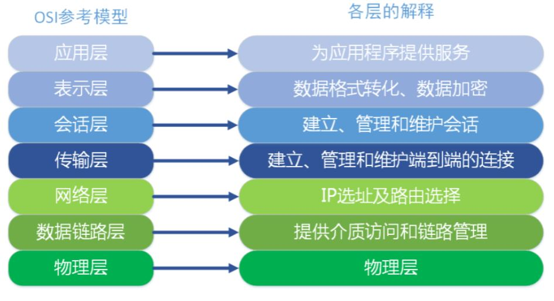
1. 物理层：主要定义物理设备标准，如网线的接口类型、光纤的接口类型;
它的主要作用是传输比特流（数模转换与模数转换）。这一层的数据叫做比特。
2. 数据链路层：**建立逻辑连接、进行硬件地址寻址、差错校验等功能**。
定义了如何让格式化数据以帧为单位进行传输，以及如何让控制对物理介质的访问。将比特组合成字节进而组合成帧，用MAC地
址访问介质。
3. 网络层：**进行逻辑地址寻址**
4. 传输层：定义了一些传输数据的协议和端口号（ WWW 端口 80 等），
   如：TCP（传输控制协议，传输效率低，可靠性强，用于传输可靠性要求高，数据量大的数据），UDP（用户数据报协议，与TCP 特性恰恰相反，用于传输可靠性要求不高，数据量小的数据，如 QQ 聊天数据就是通过这种方式传输的）。 主要是将从下层接收的数据进行分段和传输，到达目的地址后再进行重组。常常把这一层数据叫做段

5. 会话层：**通过传输层（端口号：传输端口与接收端口）建立数据传输的通路**。主要在你的系统之间
发起会话或者接受会话请求。
6. 表示层：数据的表示、安全、压缩。**主要是进行对接收的数据进行解释、加密与解密、压缩与解压
缩**等（也就是把计算机能够识别的东西转换成人能够能识别的东西（如图片、声音等）

7. 应用层：网络服务与最终用户的一个接口。这一层*为用户的应用程序（例如电子邮件、文件传输和
终端仿真）提供网络服务*

**物数网传会表应**

#### TCP/IP 四层模型

**简介**
TCP/IP协议族是一个四层协议系统，自底而上分别是数据链路层(网络接口层)、网络层、传输层和应用层。
每一层完成不同的功能，且通过若干协议来实现，上层协议使用下层协议提供的服务。
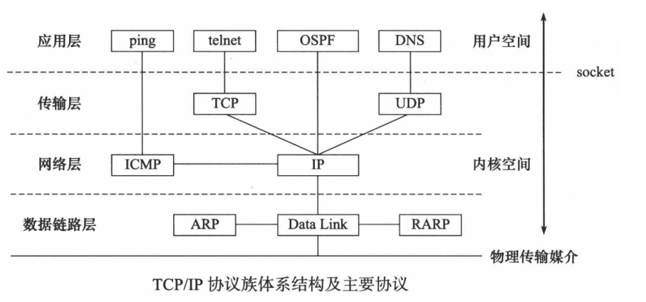

#### 协议
协议，网络协议的简称，网络协议是通信计算机双方必须共同遵从的一组约定

**常见协议**

1. 应用层常见的协议有：FTP协议（File Transfer Protocol 文件传输协议）、HTTP协议（Hyper TextTransfer Protocol 超文本传输协议）、NFS（Network File System 网络文件系统）
2. 传输层常见协议有：TCP协议（Transmission Control Protocol 传输控制协议）、UDP协议（UserDatagram Protocol 用户数据报协议）
3. 网络层常见协议有：IP 协议（Internet Protocol 因特网互联协议）、ICMP 协议（Internet ControlMessage Protocol 因特网控制报文协议）、IGMP 协议（Internet Group Management Protocol 因特网组管理协议）
4. 网络接口层常见协议有：ARP协议（Address Resolution Protocol 地址解析协议）、RARP协议（Reverse Address Resolution Protocol 反向地址解析协议)
   
**UDP协议** 

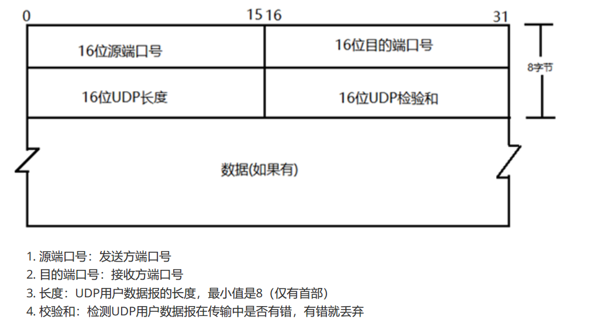  

**TCP协议**  

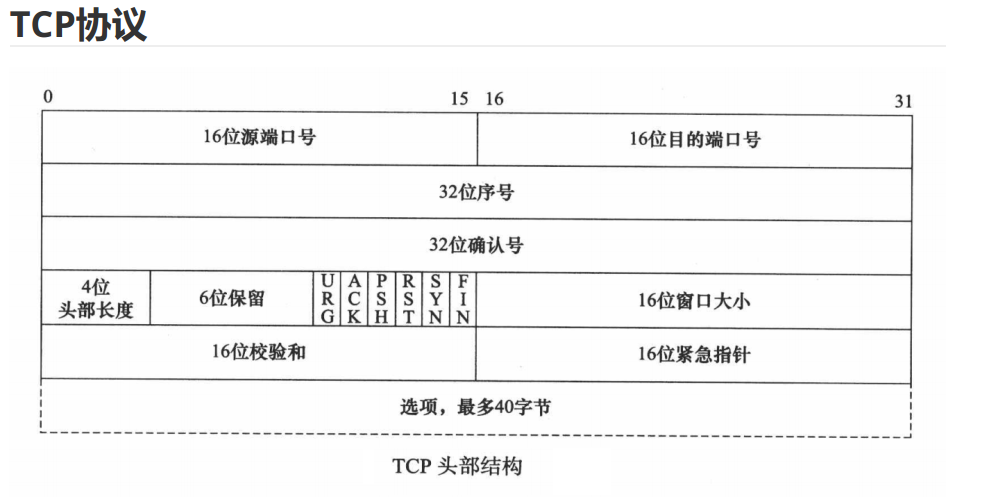
1. 源端口号：发送方端口号
2. 目的端口号：接收方端口号
3. 序列号：本报文段的数据的第一个字节的序号
4. 确认序号：期望收到对方下一个报文段的第一个数据字节的序号
5. 首部长度（数据偏移）：TCP 报文段的数据起始处距离 TCP 报文段的起始处有多远，即首部长度。单位：32位，即以 4 字节为计算单位
6. 保留：占 6 位，保留为今后使用，目前应置为 0
7. 紧急 URG ：此位置 1 ，表明紧急指针字段有效，它告诉系统此报文段中有紧急数据，应尽快传送
8. 确认 ACK：仅当 ACK=1 时确认号字段才有效，TCP 规定，在连接建立后所有传达的报文段都必须把 ACK 置1
9. 推送 PSH：当两个应用进程进行交互式的通信时，有时在一端的应用进程希望在键入一个命令后立即就能够收到对方的响应。在这种情况下，TCP 就可以使用推送（push）操作，这时，发送方TCP 把 PSH 置 1，并立即创建一个报文段发送出去，接收方收到 PSH = 1 的报文段，就尽快地（即“推送”向前）交付给接收应用进程，而不再等到整个缓存都填满后再向上交付
10. 复位 RST：用于复位相应的 TCP 连接
11. 同步 SYN：仅在三次握手建立 TCP 连接时有效。当 SYN = 1 而 ACK = 0 时，表明这是一个连接请求报文段，对方若同意建立连接，则应在相应的报文段中使用 SYN = 1 和 ACK = 1。因此，SYN 置1 就表示这是一个连接请求或连接接受报文12. 终止 FIN：用来释放一个连接。当 FIN = 1 时，表明此报文段的发送方的数据已经发送完毕，并要求释放运输连接
13. 窗口：指发送本报文段的一方的接收窗口（而不是自己的发送窗口）
14. 校验和：校验和字段检验的范围包括首部和数据两部分，在计算校验和时需要加上 12 字节的伪头部
15. 紧急指针：仅在 URG = 1 时才有意义，它指出本报文段中的紧急数据的字节数（紧急数据结束后就是普通数据），即指出了紧急数据的末尾在报文中的位置，注意：即使窗口为零时也可发送紧急数据
16. 选项：长度可变，最长可达 40 字节，当没有使用选项时，TCP 首部长度是 20 字节
    
**IP协议**
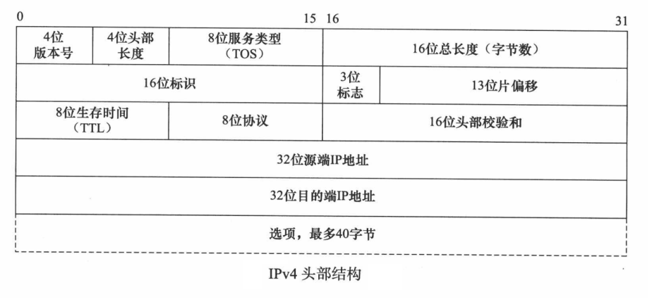

1. 版本：IP 协议的版本。通信双方使用过的 IP 协议的版本必须一致，目前最广泛使用的 IP 协议版本号为 4（即IPv4)
2. 首部长度：单位是 32 位（4 字节）
3. 服务类型：一般不适用，取值为 0
4. 总长度：指首部加上数据的总长度，单位为字节
5. 标识（identification）：IP 软件在存储器中维持一个计数器，每产生一个数据报，计数器就加 1，并将此值赋给标识字段
6. 标志（flag）：目前只有两位有意义。标志字段中的最低位记为 MF。MF = 1 即表示后面“还有分片”的数据报。MF = 0 表示这已是若干数据报片中的最后一个。标志字段中间的一位记为 DF，意思是“不能分片”，只有当 DF = 0 时才允许分片
7. 片偏移：指出较长的分组在分片后，某片在源分组中的相对位置，也就是说，相对于用户数据段的起点，该片从何处开始。片偏移以 8 字节为偏移单位。
8. 生存时间：TTL，表明是数据报在网络中的寿命，即为“跳数限制”，由发出数据报的源点设置这个字段。路由器在转发数据之前就把 TTL 值减一，当 TTL 值减为零时，就丢弃这个数据报。
9. 协议：指出此数据报携带的数据时使用何种协议，以便使目的主机的 IP 层知道应将数据部分上交给哪个处理过程，常用的 ICMP(1)，IGMP(2)，TCP(6)，UDP(17)，IPv6（41）
10. 首部校验和：只校验数据报的首部，不包括数据部分。
11. 源地址：发送方 IP 地址
12. 目的地址：接收方 IP 地址

**以太网帧协议**

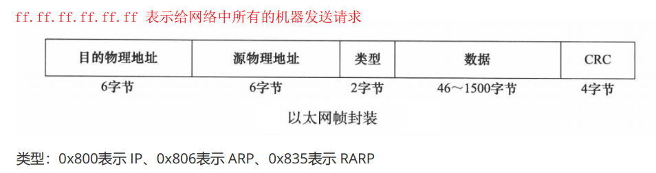

**ARP协议**
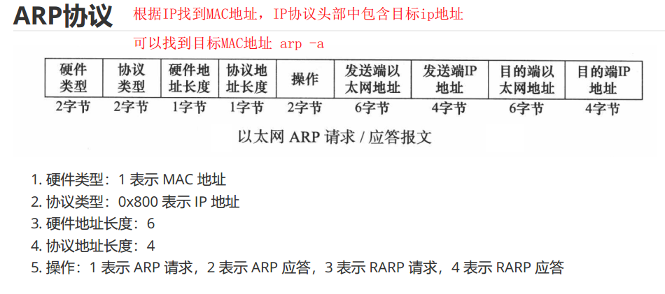

#### 封装

**上层协议是通过封装（encapsulation）使用下层协议提供的服务的应**
每层协议都将在上层数据的基础上加上自己的头部信息（有时还包括尾部信息），以实现该层的功能，这个过程就称为封装
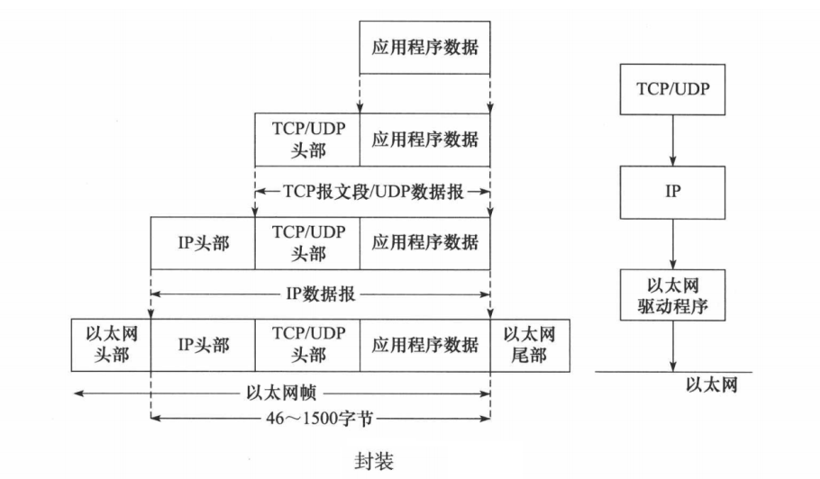

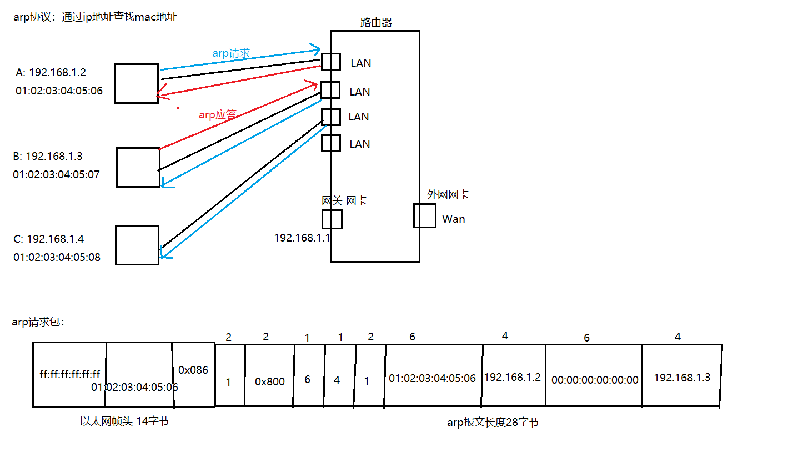

#### 分用
当帧到达目的主机时，将沿着协议栈自底向上依次传递。**各层协议依次处理帧中本层负责的头部数据，
以获取所需的信息，并最终将处理后的帧交给目标应用程序**。这个过程称为分用（demultiplexing）
分用是依靠头部信息中的类型字段实现的

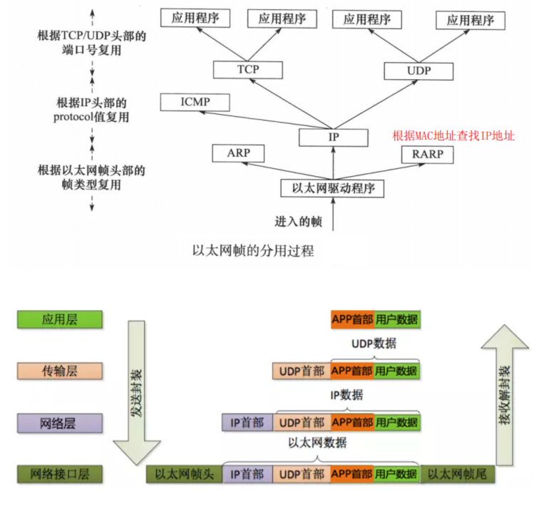

#### 网络通信过程

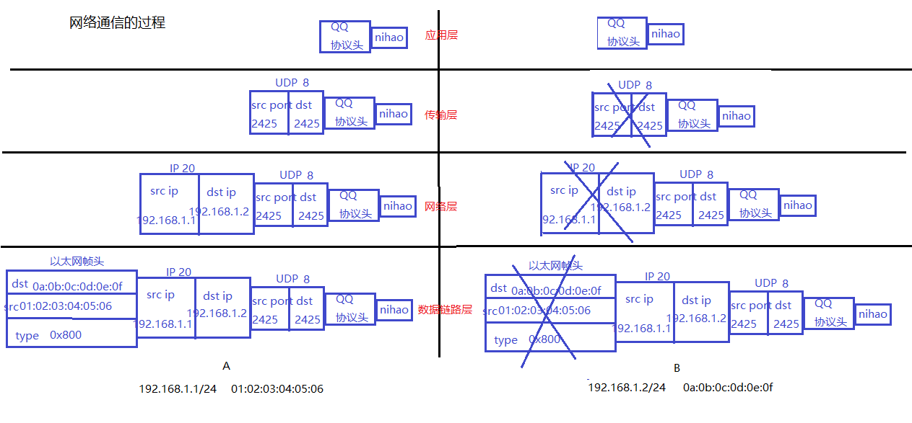