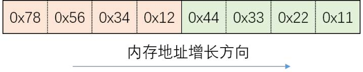
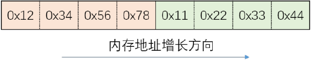
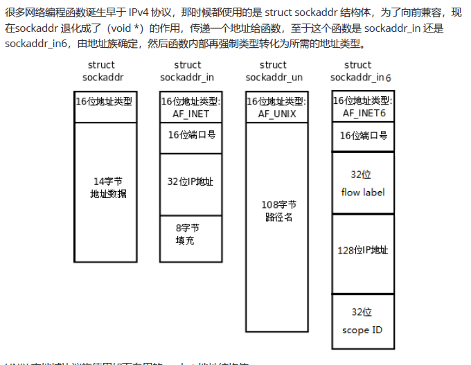
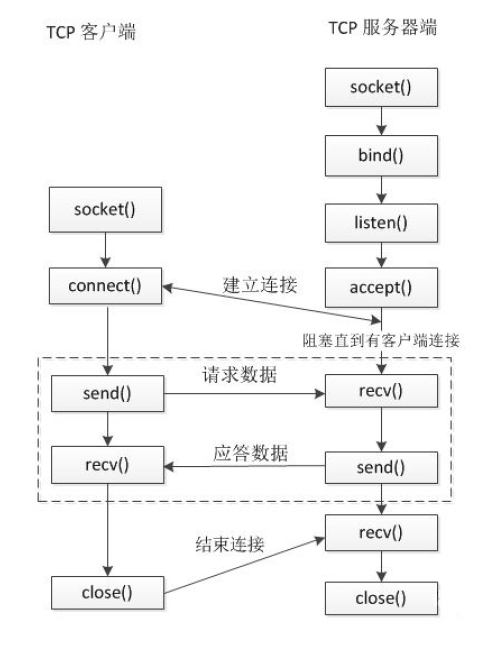
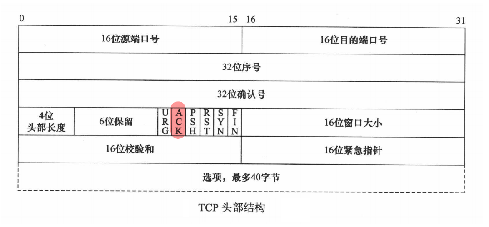
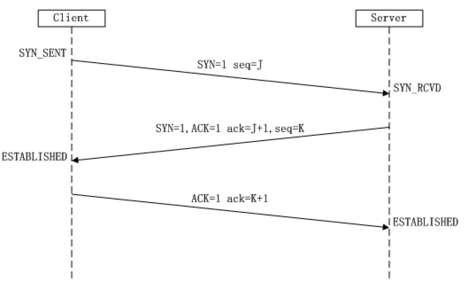

# 第4章 Linux网络编程

- [第4章 Linux网络编程](#第4章-linux网络编程)
  - [4.1 网络结构模式](#41-网络结构模式)
      - [C/S结构](#cs结构)
      - [B/S 结构](#bs-结构)
  - [4.2 MAC地址、IP地址](#42-mac地址ip地址)
      - [MAC地址](#mac地址)
      - [IP地址](#ip地址)
      - [子网掩码](#子网掩码)
  - [4.3 端口](#43-端口)
      - [简介](#简介)
  - [4.4 网络模型](#44-网络模型)
      - [OSI 七层参考模型](#osi-七层参考模型)
      - [TCP/IP 四层模型](#tcpip-四层模型)
      - [协议](#协议)
      - [封装](#封装)
      - [分用](#分用)
      - [网络通信过程](#网络通信过程)
  - [4.5 socket通信基础](#45-socket通信基础)
      - [socket 介绍](#socket-介绍)
      - [字节序](#字节序)
      - [socket 地址](#socket-地址)
        - [通用 socket 地址](#通用-socket-地址)
        - [专用 socke](#专用-socke)
        - [IP地址转换（字符串ip-整数 ，主机、网络字节序的转换）](#ip地址转换字符串ip-整数-主机网络字节序的转换)
      - [TCP通信流程](#tcp通信流程)
      - [套接字函数](#套接字函数)
      - [tcp套接字通信的实现](#tcp套接字通信的实现)
      - [TCP 三次握手](#tcp-三次握手)

## 4.1 网络结构模式

#### C/S结构

- **简介**
  *客户机-服务器结构模式；客户机通过局域网与服务器相连，接受用户的请求，并通过网络向服务器提出请求，对数据库进行操作。服务器接受客户机的请求，将数据提交给客户机，客户机将数据进行计算并将结果呈现给用户。*

- **优点**
  
  *1. 能充分发挥客户端 PC 的处理能力，很多工作可以在客户端处理后再提交给服务器，所以 **C/S 结构客户端响应速度快**
  2. 操作界面漂亮、形式多样，可以充分满足客户自身的个性化要求；
  3. C/S 结构的管理信息系统具有较强的事务处理能力，能实现复杂的业务流程；
  4. **安全性较高**，C/S 一般面向相对固定的用户群，程序更加注重流程，它可以对权限进行多层次校验，提供了更安全的存取模式，对信息安全的控制能力很强，一般高度机密的信息系统采用 C/S 结构适宜*

- **缺点**
  *1. 客户端需要安装专用的客户端软件。首先涉及到安装的工作量，其次任何一台电脑出问题，如病毒、硬件损坏，都需要进行安装或维护。系统软件升级时，每一台客户机需要重新安装，其**维护和升级成本非常高***
  *2. **对客户端的操作系统一般也会有限制，不能够跨平台***

#### B/S 结构

- **简介**
  *浏览器-服务器结构模式；这种模式统一了客户端，将系统功能实现的核心部分集中到服
务器上，简化了系统的开发、维护和使用，服务器安装Oracle等数据库。浏览器通过Web Server 同数据
库进行数据交互*

- **优点**
  
  *B/S 架构最大的优点是总体拥有成本低、维护方便、 分布性强、开发简单，可以不用安装任何专门的软
件就能实现在任何地方进行操作，客户端零维护，系统的扩展非常容易*

- **缺点**
  *1. **通信开销大、系统和数据的安全性较难保障**;
  2. 个性特点明显降低，无法实现具有个性化的功能要求；
  3. 协议一般是固定的：http/https
  4. **客户端服务器端的交互是请求-响应模式，通常动态刷新页面，响应速度明显降低***


## 4.2 MAC地址、IP地址

#### MAC地址

**网卡**
网卡又称为**网络适配器或网络接口卡NIC**，是一块被设计用来允许计算机在计算机网络上进行通讯的计算机硬件；
其拥有 MAC 地址，属于 OSI 模型的第2层（数据链路层），它使得用户可以通过电缆或无线相互连接。
**每一个网卡都有一个被称为 MAC 地址的独一无二的 48 位串行号**。
网卡的主要功能：1.数据的封装与解封装、2.链路管理、3.数据编码与译码

**MAC地址**
*MAC 地址（Media Access Control Address），也称为**局域网地址、以太网地址、物理地址或硬件地址**，
**它是一个用来确认网络设备位置的位址，由网络设备制造商生产时烧录在网卡中。用于在网络中唯一标识一个网卡**，
MAC 地址的长度为 48 位（6个字节），通常表示为 12 个 16 进制数，如：00-16-EA-AE-3C-40 就是一个MAC 地址，
其中前 3 个字节，16 进制数 00-16-EA 代表网络硬件制造商的编号，而后3个字节，16进制数 AE-3C-40 代表该制造商所制造的某个网络产品（如网卡）的系列号；
MAC 地址就如同身份证上的身份证号码，具有唯一性*

#### IP地址

**IP协议**
IP协议是为计算机网络相互连接进行通信而设计的协议；
实际上是一套由软件程序组成的协议软件，它把各种不同“帧”统一转换成“IP 数据报”格式

**IP地址**
IP 地址（Internet Protocol Address）是指**互联网协议地址**，**它为互联网上的每一个网络和每一台主机分配一个逻辑地址**，以此来屏蔽物理地址的差异

**IP地址编址方式**
IP地址=网络号+主机号
| 类别 | 最大网络数 |IP地址范围  | 单个网段最大主机数  |  私有IP地址范围 |
| :----: | :----: | :--------: | :---------------: | :----------:   |
|A |126(2^7-2)|  1.0.0.1-126.255.255.254 |16777214 | 10.0.0.0-10.255.255.255|
|B |16384(2^14)  |128.0.0.1-191.255.255.254 | 65534 |172.16.0.0-172.31.255.255|
|C |2097152(2^21)|92.0.0.1-223.255.255.254 | 254 |192.168.0.0-192.168.255.255|   

**A类IP地址:** A 类 IP 地址就由 1 字节的网络地址和 3 字节主机地址组成，**网络地址的最高位必须是“0”**
A 类 IP 地址中网络的标识长度为 8 位，主机标识的长度为 24 位
A 类 IP 地址 地址范围 1.0.0.1 - 126.255.255.254 二进制表示为：00000001 00000000 00000000 00000001 - **01111111** 11111111 11111111 11111110
**网络数=2^7-1-1=126 (127.0.0.1为本机地址)**
最后一个是广播地址;A 类 IP 地址的子网掩码为 255.0.0.0，**每个网络支持的最大主机数为 256 的 3 次方 - 2 = 16777214 台**(去除广播地址和0地址)

**B类IP地址：** B 类 IP 地址就由 2 字节的网络地址和 2 字节主机地址组成，**网络地址的最高位必须是“10”**
B 类 IP地址中网络的标识长度为 16 位，主机标识的长度为 16 位
B 类 IP 地址地址范围 128.0.0.1 - 191.255.255.254 二进制表示为：10000000 00000000 00000000 00000001 -** 10111111** 11111111 11111111 11111110
**网络数=2^6 * 2^8 = 2^14**
最后一个是广播地址，B 类 IP 地址的子网掩码为 255.255.0.0，每个网络支持的最大主机数为 256 的 2 次方 - 2 = 65534 台

**C类IP地址**C 类 IP 地址就由 3 字节的网络地址和 1 字节主机地址组成，**网络地址的最高位必须是“110”**
C 类 IP 地址中网络的标识长度为 24 位，主机标识的长度为 8 位
C 类 IP 地址范围 192.0.0.1-223.255.255.254 二进制表示为: 11000000 00000000 0000000000000001 - **11011111** 11111111 11111111 11111110
**网络数=2^5 * 2^16 = 2^21**
C类IP地址的子网掩码为 255.255.255.0，每个网络支持的最大主机数为 256 - 2 = 254 台

**特殊地址**
*- 每一个字节都为 0 的地址（ “0.0.0.0” ）对应于当前主机*
*- IP 地址中的每一个字节都为 1 的 IP 地址（ “255.255.255.255” ）是当前子网的广播地址*
*- IP地址中不能以十进制 “127” 作为开头，该类地址中数字 127.0.0.1 到 127.255.255.255 用于回路测试，如：127.0.0.1可以代表本机IP地址*

#### 子网掩码
子网掩码（subnet mask）结合 IP 地址一起使用，将某个 IP 地址划分成网络地址和主机地址两部分
子网掩码是一个 32 位的 2 进制数，其对应网络地址的所有位都置为 1，对应于主机地址的所有位置都为 0
求网络地址：子网掩码和ip按位与
求主机id：子网掩码取反，和ip按位与（或者就是网络地址0的位数）

## 4.3 端口

#### 简介
可以认为是设备与外界通讯交流的出口，标识计算机中进程的唯一编号
端口可分为虚拟端口和物理端口，其中**虚拟端口指计算机内部或交换机路由器内的端口，不可见**，是特指TCP/IP协议中的端口，是逻辑意义上的端口。例如计算机中的 80 端口；
**物理端口又称为接口，是可见端口**，计算机背板的 RJ45 网口，交换机路由器集线器等 RJ45 端口
一个 IP地址的端口可以有 65536（即：2^16）个，范围是从 0 到65535（2^16-1）

## 4.4 网络模型

#### OSI 七层参考模型

1. 物理层：主要定义物理设备标准，如网线的接口类型、光纤的接口类型;
它的主要作用是传输比特流（数模转换与模数转换）。这一层的数据叫做比特。
2. 数据链路层：**建立逻辑连接、进行硬件地址寻址、差错校验等功能**。
定义了如何让格式化数据以帧为单位进行传输，以及如何让控制对物理介质的访问。将比特组合成字节进而组合成帧，用MAC地
址访问介质。
3. 网络层：**进行逻辑地址寻址**
4. 传输层：定义了一些传输数据的协议和端口号（ WWW 端口 80 等），
   如：TCP（传输控制协议，传输效率低，可靠性强，用于传输可靠性要求高，数据量大的数据），UDP（用户数据报协议，与TCP 特性恰恰相反，用于传输可靠性要求不高，数据量小的数据，如 QQ 聊天数据就是通过这种方式传输的）。 主要是将从下层接收的数据进行分段和传输，到达目的地址后再进行重组。常常把这一层数据叫做段

5. 会话层：**通过传输层（端口号：传输端口与接收端口）建立数据传输的通路**。主要在你的系统之间
发起会话或者接受会话请求。
6. 表示层：数据的表示、安全、压缩。**主要是进行对接收的数据进行解释、加密与解密、压缩与解压
缩**等（也就是把计算机能够识别的东西转换成人能够能识别的东西（如图片、声音等）

7. 应用层：网络服务与最终用户的一个接口。这一层*为用户的应用程序（例如电子邮件、文件传输和
终端仿真）提供网络服务*

**物数网传会表应**

#### TCP/IP 四层模型

**简介**
TCP/IP协议族是一个四层协议系统，自底而上分别是数据链路层(网络接口层)、网络层、传输层和应用层。
每一层完成不同的功能，且通过若干协议来实现，上层协议使用下层协议提供的服务。


#### 协议
协议，网络协议的简称，网络协议是通信计算机双方必须共同遵从的一组约定

**常见协议**

1. 应用层常见的协议有：FTP协议（File Transfer Protocol 文件传输协议）、HTTP协议（Hyper TextTransfer Protocol 超文本传输协议）、NFS（Network File System 网络文件系统）
2. 传输层常见协议有：TCP协议（Transmission Control Protocol 传输控制协议）、UDP协议（UserDatagram Protocol 用户数据报协议）
3. 网络层常见协议有：IP 协议（Internet Protocol 因特网互联协议）、ICMP 协议（Internet ControlMessage Protocol 因特网控制报文协议）、IGMP 协议（Internet Group Management Protocol 因特网组管理协议）
4. 网络接口层常见协议有：ARP协议（Address Resolution Protocol 地址解析协议）、RARP协议（Reverse Address Resolution Protocol 反向地址解析协议)
   
**UDP协议** 

  

**TCP协议**  


1. 源端口号：发送方端口号
2. 目的端口号：接收方端口号
3. 序列号：本报文段的数据的第一个字节的序号
4. 确认序号：期望收到对方下一个报文段的第一个数据字节的序号
5. 首部长度（数据偏移）：TCP 报文段的数据起始处距离 TCP 报文段的起始处有多远，即首部长度。单位：32位，即以 4 字节为计算单位
6. 保留：占 6 位，保留为今后使用，目前应置为 0
7. 紧急 URG ：此位置 1 ，表明紧急指针字段有效，它告诉系统此报文段中有紧急数据，应尽快传送
8. 确认 ACK：仅当 ACK=1 时确认号字段才有效，TCP 规定，在连接建立后所有传达的报文段都必须把 ACK 置1
9. 推送 PSH：当两个应用进程进行交互式的通信时，有时在一端的应用进程希望在键入一个命令后立即就能够收到对方的响应。在这种情况下，TCP 就可以使用推送（push）操作，这时，发送方TCP 把 PSH 置 1，并立即创建一个报文段发送出去，接收方收到 PSH = 1 的报文段，就尽快地（即“推送”向前）交付给接收应用进程，而不再等到整个缓存都填满后再向上交付
10. 复位 RST：用于复位相应的 TCP 连接
11. 同步 SYN：仅在三次握手建立 TCP 连接时有效。当 SYN = 1 而 ACK = 0 时，表明这是一个连接请求报文段，对方若同意建立连接，则应在相应的报文段中使用 SYN = 1 和 ACK = 1。因此，SYN 置1 就表示这是一个连接请求或连接接受报文12. 终止 FIN：用来释放一个连接。当 FIN = 1 时，表明此报文段的发送方的数据已经发送完毕，并要求释放运输连接
13. 窗口：指发送本报文段的一方的接收窗口（而不是自己的发送窗口）
14. 校验和：校验和字段检验的范围包括首部和数据两部分，在计算校验和时需要加上 12 字节的伪头部
15. 紧急指针：仅在 URG = 1 时才有意义，它指出本报文段中的紧急数据的字节数（紧急数据结束后就是普通数据），即指出了紧急数据的末尾在报文中的位置，注意：即使窗口为零时也可发送紧急数据
16. 选项：长度可变，最长可达 40 字节，当没有使用选项时，TCP 首部长度是 20 字节
    
**IP协议**


1. 版本：IP 协议的版本。通信双方使用过的 IP 协议的版本必须一致，目前最广泛使用的 IP 协议版本号为 4（即IPv4)
2. 首部长度：单位是 32 位（4 字节）
3. 服务类型：一般不适用，取值为 0
4. 总长度：指首部加上数据的总长度，单位为字节
5. 标识（identification）：IP 软件在存储器中维持一个计数器，每产生一个数据报，计数器就加 1，并将此值赋给标识字段
6. 标志（flag）：目前只有两位有意义。标志字段中的最低位记为 MF。MF = 1 即表示后面“还有分片”的数据报。MF = 0 表示这已是若干数据报片中的最后一个。标志字段中间的一位记为 DF，意思是“不能分片”，只有当 DF = 0 时才允许分片
7. 片偏移：指出较长的分组在分片后，某片在源分组中的相对位置，也就是说，相对于用户数据段的起点，该片从何处开始。片偏移以 8 字节为偏移单位。
8. 生存时间：TTL，表明是数据报在网络中的寿命，即为“跳数限制”，由发出数据报的源点设置这个字段。路由器在转发数据之前就把 TTL 值减一，当 TTL 值减为零时，就丢弃这个数据报。
9. 协议：指出此数据报携带的数据时使用何种协议，以便使目的主机的 IP 层知道应将数据部分上交给哪个处理过程，常用的 ICMP(1)，IGMP(2)，TCP(6)，UDP(17)，IPv6（41）
10. 首部校验和：只校验数据报的首部，不包括数据部分。
11. 源地址：发送方 IP 地址
12. 目的地址：接收方 IP 地址

**以太网帧协议**


**ARP协议**


#### 封装

**上层协议是通过封装（encapsulation）使用下层协议提供的服务的应**
每层协议都将在上层数据的基础上加上自己的头部信息（有时还包括尾部信息），以实现该层的功能，这个过程就称为封装


#### 分用
当帧到达目的主机时，将沿着协议栈自底向上依次传递。**各层协议依次处理帧中本层负责的头部数据，
以获取所需的信息，并最终将处理后的帧交给目标应用程序**。这个过程称为分用（demultiplexing）
分用是依靠头部信息中的类型字段实现的


#### 网络通信过程


## 4.5 socket通信基础

#### socket 介绍

> 所谓 socket（套接字），就是对**网络中不同主机上的应用进程之间进行双向通信的端点的抽象**
> 
> 从所处的地位来讲，套接字上联应用进程，下联网络协议栈，是应用程序通过网络协议进行通信的接口，是应用程序与网络协议根进行交互的接口
> 
> 通信时其中一个网络应用程序将要传输的一段信息写入它所在主机的socket 中，该 socket 通过与网络接口卡（NIC）相连的传输介质将这段信息送到另外一台主机的 socket 中，使对方能够接收到这段信息。**socket 是由 IP 地址和端口结合的，提供向应用层进程传送数据包的机制**
>
> socket 本身有“插座”的意思，在 Linux 环境下，用于表示进程间网络通信的特殊文件类型。本质为内核借助缓冲区形成的伪文件。既然是文件，那么理所当然的，我们可以使用文件描述符引用套接字。与管道类似的，Linux 系统将其封装成文件的目的是为了统一接口，使得读写套接字和读写文件的操作一致。**区别是管道主要应用于本地进程间通信，而套接字多应用于网络进程间数据的传递**


```c++
// 套接字通信分两部分：
- 服务器端：被动接受连接，一般不会主动发起连接
- 客户端：主动向服务器发起连接
socket是一套通信的接口，Linux 和 Windows 都有，但是有一些细微的差别。
```
#### 字节序

**简介**
> 现代 CPU 的累加器一次都能装载（至少）**4 字节**（这里考虑 32 位机），即一个整数。**那么这4字节在内存中排列的顺序将影响它被累加器装载成的整数的值**，这就是字节序问题。在各种计算机体系结构中，对于字节、字等的存储机制有所不同，因而引发了计算机通信领域中一个很重要的问题，即通信双方交流的信息单元（比特、字节、字、双字等等）应该以什么样的顺序进行传送。如
> 
> 套接字通信分两部分：
> - 服务器端：被动接受连接，一般不会主动发起连接
> - 客户端：主动向服务器发起连接
> 
> socket是一套通信的接口，Linux 和 Windows 都有，但是有一些细微的差别。果不达成一致的规则，通信双方将无法进行正确的编码/译码从而导致通信失败
> 
> 字节序，顾名思义字节的顺序，**就是大于一个字节类型的数据在内存中的存放顺序**(一个字节的数据当然就无需谈顺序的问题了)。字节序分为大端字节序（Big-Endian） 和小端字节序（Little-Endian）
>
> **大端字节序**是指一个整数的最高位字节（23 ~ 31 bit）存储在内存的低地址处，低位字节（0 ~ 7 bit）存储在内存的高地址处；
> **小端字节序**则是指整数的高位字节存储在内存的高地址处，而低位字节则存储在内存的低地址处。

**字节序举例**

- 小端字节序
0x 01 02 03 04 - ff = 255 *(一个字节刚好存放两个16进制数据)*
内存的方向 ----->
内存的低位 -----> 内存的高位
04 03 02 01
0x 11 22 33 44 12 34 56 78



- 大端字节序
0x 01 02 03 04
内存的方向 ----->
内存的低位 -----> 内存的高位
01 02 03 04
0x 12 34 56 78 11 22 33 44



```c++
/*  
    字节序：字节在内存中存储的顺序。
    小端字节序：数据的高位字节存储在内存的高位地址，低位字节存储在内存的低位地址
    大端字节序：数据的低位字节存储在内存的高位地址，高位字节存储在内存的低位地址
*/

// 通过代码检测当前主机的字节序
#include <stdio.h>

int main() {

    union {
        short value;    // 2字节
        char bytes[sizeof(short)];  // char[2]
    } test;

    test.value = 0x0102;
    if((test.bytes[0] == 1) && (test.bytes[1] == 2)) {
        printf("大端字节序\n");
       
    } else if((test.bytes[0] == 2) && (test.bytes[1] == 1)) {
        printf("小端字节序\n");
       
    } else {
        printf("未知\n");
    }

    return 0;
}
```

**字节序转换函数**
> 当格式化的数据在两台使用不同字节序的主机之间直接传递时，接收端必然错误的解释之。
> 解决题的方法是：发送端总是把要发送的数据转换成大端字节序数据后再发送
> 而接收端知道对方传送过来的数据总是采用大端字节序，所以接收端可以根据自身采用的字节序决定是否对接收到的数据进行转换（小端机转换，大端机不转换）
> 
> **网络字节顺序**是 TCP/IP 中规定好的一种数据表示格式，它与具体的 CPU 类型、操作系统等无关，从而可以保证数据在不同主机之间传输时能够被正确解释，**网络字节顺序采用大端排序方式**
> BSD Socket提供了封装好的转换接口，方便程序员使用。包括从主机字节序到网络字节序的转换函数：
htons、htonl；从网络字节序到主机字节序的转换函数：ntohs、ntohl

```c++
h - host 主机，主机字节序
to - 转换成什么
n - network 网络字节序
s - short unsigned short
l - long unsigned int
```
```c++
/*

    网络通信时，需要将主机字节序转换成网络字节序（大端），
    另外一段获取到数据以后根据情况将网络字节序转换成主机字节序。

    // 转换端口
    uint16_t htons(uint16_t hostshort);		// 主机字节序 - 网络字节序
    uint16_t ntohs(uint16_t netshort);		// 主机字节序 - 网络字节序

    // 转IP
    uint32_t htonl(uint32_t hostlong);		// 主机字节序 - 网络字节序
    uint32_t ntohl(uint32_t netlong);		// 主机字节序 - 网络字节序

    s - short unsigned short
    l - long unsigned int

*/

#include <stdio.h>
#include <arpa/inet.h>

int main() {

    // htons 转换端口
    unsigned short a = 0x0102;
    printf("a : %x\n", a);
    unsigned short b = htons(a);
    printf("b : %x\n", b);

    printf("=======================\n");

    // htonl  转换IP
    // (int *)buf 将首地址转化为 指针
    char buf[4] = {192, 168, 1, 100};
    int num = *(int *)buf;
    int sum = htonl(num);
    printf("sum=%d\n",sum);
    
    unsigned char *p = (char *)&sum;

    printf("%d %d %d %d\n", *p, *(p+1), *(p+2), *(p+3));

    printf("=======================\n");

    // ntohl
    unsigned char buf1[4] = {1, 1, 168, 192};
    int num1 = *(int *)buf1;
    int sum1 = ntohl(num1);
    unsigned char *p1 = (unsigned char *)&sum1;
    printf("%d %d %d %d\n", *p1, *(p1+1), *(p1+2), *(p1+3));
    
     // ntohs
    return 0;
}

/*
    panan@ecs-kc1-large-2-linux-20220314145535:~/Linux/lesson31$ ./bytetrans 
    a : 102
    b : 201
    =======================
    sum=-1062731420
    100 1 168 192
    =======================
    192 168 1 1
*/
```

#### socket 地址

##### 通用 socket 地址

socket 网络编程接口中表示 socket 地址的是结构体 sockaddr，其定义如下：
```c++
#include <bits/socket.h>
struct sockaddr {
  sa_family_t sa_family;
  char sa_data[14];
};
typedef unsigned short int sa_family_t;
```
sa_family 成员是地址族类型（sa_family_t）的变量。地址族类型通常与协议族类型对应。常见的协议族（protocol family，也称 domain）和对应的地址族入下所示：
|协议族  |地址族 |描述 |
|:----:|:----:|:----|
|PF_UNIX |AF_UNIX| UNIX本地域协议族|
|PF_INET |AF_INET |TCP/IPv4协议族|
|PF_INET6 | AF_INET6| TCP/IPv6协议族|

**宏 PF_\* 和 AF_\*** 都定义在 bits/socket.h 头文件中，且后者与前者有完全相同的值，所以二者通常混用  

sa_data 成员用于存放 socket 地址值。但是，不同的协议族的地址值具有不同的含义和长度，如下所示：

|协议族|地址值含义和长度|
|:----:|:-----|
|PF_UNIX |文件的路径名，长度可达到108字节|
|PF_INET |16 bit 端口号和 32 bit IPv4 地址，共 6 字节|
|PF_INET6 |16 bit 端口号，32 bit 流标识，128 bit IPv6 地址，32 bit 范围 ID，共 26 字节|

由上表可知，14 字节的 sa_data 根本无法容纳多数协议族的地址值。因此，Linux 定义了下面这个新的通用的 socket 地址结构体，这个结构体不仅提供了足够大的空间用于存放地址值，而且是内存对齐的

```c++
#include <bits/socket.h>
struct sockaddr_storage
{
  sa_family_t sa_family;
  unsigned long int __ss_align;
  char __ss_padding[ 128 - sizeof(__ss_align) ];
};
typedef unsigned short int sa_family_t;
```

##### 专用 socke



UNIX 本地域协议族使用如下专用的 socket 地址结构体：

```c++
#include <sys/un.h>
struct sockaddr_un
{
  sa_family_t sin_family;
  char sun_path[108];
};
```

TCP/IP 协议族有 sockaddr_in 和 sockaddr_in6 两个专用的 socket 地址结构体，它们分别用于 IPv4 和IPv6：

```c++
#include <netinet/in.h>
struct sockaddr_in
{
    sa_family_t sin_family; /* __SOCKADDR_COMMON(sin_) */
    in_port_t sin_port; /* Port number. */
    struct in_addr sin_addr; /* Internet address. */
    /* Pad to size of `struct sockaddr'. */
    unsigned char sin_zero[sizeof (struct sockaddr) - __SOCKADDR_COMMON_SIZE -
    sizeof (in_port_t) - sizeof (struct in_addr)];
};
struct in_addr
{
    in_addr_t s_addr;
};
struct sockaddr_in6
{
    sa_family_t sin6_family;
    in_port_t sin6_port; /* Transport layer port # */
    uint32_t sin6_flowinfo; /* IPv6 flow information */
    struct in6_addr sin6_addr; /* IPv6 address */
    uint32_t sin6_scope_id; /* IPv6 scope-id */
};
typedef unsigned short uint16_t;
typedef unsigned int uint32_t;
typedef uint16_t in_port_t;
typedef uint32_t in_addr_t;
#define __SOCKADDR_COMMON_SIZE (sizeof (unsigned short int))

```
所有专用 socket 地址（以及 sockaddr_storage）类型的变量在实际使用时都需要转化为通用 socket 地址类型 sockaddr（强制转化即可），因为所有 socket 编程接口使用的地址参数类型都是 sockaddr。

##### IP地址转换（字符串ip-整数 ，主机、网络字节序的转换）
> 通常，人们习惯用可读性好的字符串来表示 IP 地址，比如用点分十进制字符串表示 IPv4 地址，以及用十六进制字符串表示 IPv6 地址。但编程中我们需要先把它们转化为整数（二进制数）方能使用。而记录日志时则相反，我们要把整数表示的 IP 地址转化为可读的字符串


```c++

#include <arpa/inet.h>
// p:点分十进制的IP字符串，n:表示network，网络字节序的整数
int inet_pton(int af, const char *src, void *dst);
    af:地址族： AF_INET  AF_INET6
    src:需要转换的点分十进制的IP字符串
    dst:转换后的结果保存在这个里面

// 将网络字节序的整数，转换成点分十进制的IP地址字符串
const char *inet_ntop(int af, const void *src, char *dst, socklen_t size);
    af:地址族： AF_INET  AF_INET6
    src: 要转换的ip的整数的地址
    dst: 转换成IP地址字符串保存的地方
    size：第三个参数的大小（数组的大小）
    返回值：返回转换后的数据的地址（字符串），和 dst 是一样的

```
```c++
#include <stdio.h>
#include <arpa/inet.h>

int main() {

    // 创建一个ip字符串,点分十进制的IP地址字符串
    char buf[] = "192.168.1.4";
    unsigned int num = 0;

    // 将点分十进制的IP字符串转换成网络字节序的整数
    inet_pton(AF_INET, buf, &num);
    unsigned char * p = (unsigned char *)&num;
    printf("%d %d %d %d\n", *p, *(p+1), *(p+2), *(p+3));


    // 将网络字节序的IP整数转换成点分十进制的IP字符串
    char ip[16] = "";
    const char * str =  inet_ntop(AF_INET, &num, ip, 16);
    printf("str : %s\n", str);
    printf("ip : %s\n", str);
    printf("%d\n", ip == str);

    return 0;
}
```

#### TCP通信流程

**TCP与UDP**

```c++
// TCP 和 UDP -> 传输层的协议
UDP:用户数据报协议，面向无连接，可以单播，多播，广播， 面向数据报，不可靠

TCP:传输控制协议，面向连接的，可靠的，基于字节流，仅支持单播传输

               UDP                                TCP
是否创建连接    无连接                              面向连接
是否可靠        不可靠                             可靠的
连接的对象个数  一对一、一对多、多对一、多对多        支持一对一
传输的方式      面向数据报                          面向字节流
首部开销        8个字节                            最少20个字节
适用场景      实时应用（视频会议，直播）            可靠性高的应用（文件传输）
```


**服务器端 （被动接受连接的角色）**

> 1. 创建一个用于监听的套接字
    - 监听：监听有客户端的连接
    - 套接字：这个套接字其实就是一个文件描述符
> 2. 将这个监听文件描述符和本地的IP和端口绑定（IP和端口就是服务器的地址信息）
    - 客户端连接服务器的时候使用的就是这个IP和端口
> 3. 设置监听，监听的fd开始工作
> 4. 阻塞等待，当有客户端发起连接，解除阻塞，接受客户端的连接，会得到一个和客户端通信的套接字（fd）*一个新的fd*
> 5. 通信
    - 接收数据
    - 发送数据
> 6. 通信结束，断开连接

**客户端**
> 1. 创建一个用于通信的套接字（fd）
> 2. 连接服务器，需要指定连接的服务器的 IP 和 端口
> 3. 连接成功了，客户端可以直接和服务器通信
    - 接收数据
    - 发送数据
> 4. 通信结束，断开连接

####  套接字函数

```c++
#include <sys/types.h>
#include <sys/socket.h>
#include <arpa/inet.h> // 包含了这个头文件，上面两个就可以省略
int socket(int domain, int type, int protocol);
    - 功能：创建一个套接字
    - 参数：
        - domain: 协议族
        AF_INET : ipv4
        AF_INET6 : ipv6
        AF_UNIX, AF_LOCAL : 本地套接字通信（进程间通信）
    - type: 通信过程中使用的协议类型
        SOCK_STREAM : 流式协议
        SOCK_DGRAM : 报式协议
    - protocol : 具体的一个协议。一般写0
        - SOCK_STREAM : 流式协议默认使用 TCP
        - SOCK_DGRAM : 报式协议默认使用 UDP
    - 返回值：
        - 成功：返回文件描述符，操作的就是内核缓冲区。
        - 失败：-1
int bind(int sockfd, const struct sockaddr *addr, socklen_t addrlen); // socket命名
    - 功能：绑定，将fd 和本地的IP + 端口进行绑定
    - 参数：
        - sockfd : 通过socket函数得到的文件描述符
        - addr : 需要绑定的socket地址，这个地址封装了ip和端口号的信息
        - addrlen : 第二个参数结构体占的内存大小
int listen(int sockfd, int backlog); // /proc/sys/net/core/somaxconn
    - 功能：监听这个socket上的连接
    - 参数：
        - sockfd : 通过socket()函数得到的文件描述符
        - backlog : 未连接的和已经连接的和的最大值， 5
int accept(int sockfd, struct sockaddr *addr, socklen_t *addrlen);
    - 功能：接收客户端连接，默认是一个阻塞的函数，阻塞等待客户端连接
    - 参数：
        - sockfd : 用于监听的文件描述符
        - addr : 传出参数，记录了连接成功后客户端的地址信息（ip，port）
        - addrlen : 指定第二个参数的对应的内存大小
    - 返回值：
        - 成功 ：用于通信的文件描述符
        - -1 ： 失败
int connect(int sockfd, const struct sockaddr *addr, socklen_t addrlen);
      - 功能： 客户端连接服务器
      - 参数：
          - sockfd : 用于通信的文件描述符
          - addr : 客户端要连接的服务器的地址信息
          - addrlen : 第二个参数的内存大小
      - 返回值：成功 0， 失败 -1

ssize_t write(int fd, const void *buf, size_t count); // 写数据
ssize_t read(int fd, void *buf, size_t count); // 读数据
```

#### tcp套接字通信的实现

**server.c**
```c++
// TCP 通信的服务器端

#include <stdio.h>
#include <arpa/inet.h>
#include <unistd.h>
#include <string.h>
#include <stdlib.h>

int main() {

    // 1.创建socket(用于监听的套接字)
    int lfd = socket(AF_INET, SOCK_STREAM, 0);

    if(lfd == -1) {
        perror("socket");
        exit(-1);
    }

    // 2.绑定
    // TCP/IP 协议族有 sockaddr_in 和 sockaddr_in6 两个专用的 socket 地址结构体
    struct sockaddr_in saddr;
    saddr.sin_family = AF_INET;

    // inet_pton(AF_INET, "192.168.193.128", saddr.sin_addr.s_addr);
    // 计算机有多个网卡，对应可能有多个IP 0 表示任意一个
    saddr.sin_addr.s_addr = INADDR_ANY;  // 0.0.0.0
    saddr.sin_port = htons(9999);
    /*
        为了向前兼容，现在sockaddr 退化成了（void *）的作用，传递一个地址给函数，
        至于这个函数是 sockaddr_in 还是sockaddr_in6，由地址族确定，
        然后函数内部再强制类型转化为所需的地址类型。
    */
    int ret = bind(lfd, (struct sockaddr *)&saddr, sizeof(saddr));

    if(ret == -1) {
        perror("bind");
        exit(-1);
    }

    // 3.监听
    ret = listen(lfd, 8);
    if(ret == -1) {
        perror("listen");
        exit(-1);
    }

    // 4.接收客户端连接
    struct sockaddr_in clientaddr;
    int len = sizeof(clientaddr);
    int cfd = accept(lfd, (struct sockaddr *)&clientaddr, &len);
    
    if(cfd == -1) {
        perror("accept");
        exit(-1);
    }

    // 输出客户端的信息
    char clientIP[16];
    // 将网络字节序的整数，转换成点分十进制的IP地址字符串
    inet_ntop(AF_INET, &clientaddr.sin_addr.s_addr, clientIP, sizeof(clientIP));
    // 将网络字节序-> 主机字节序
    unsigned short clientPort = ntohs(clientaddr.sin_port);
    printf("client ip is %s, port is %d\n", clientIP, clientPort);

    // 5.通信
    char recvBuf[1024] = {0};
    while(1) {
        
        // 获取客户端的数据 从通信的文件描述符 
        // 若客户端没有数据发送则阻塞
        int num = read(cfd, recvBuf, sizeof(recvBuf));
        if(num == -1) {
            perror("read");
            exit(-1);
        } else if(num > 0) {
            printf("recv client data : %s\n", recvBuf);
        } else if(num == 0) {
            // 表示客户端断开连接
            printf("clinet closed...");
            break;
        }

        char * data = "hello,i am server";
        // 给客户端发送数据
        //write(cfd, data, strlen(data));
        // 给客户端发送接收到的数据  回射服务器
        write(cfd, recvBuf, strlen(recvBuf));
    }
   
    // 关闭文件描述符
    close(cfd);
    close(lfd);

    return 0;
}
```
**client.c**

```c++
// TCP通信的客户端

#include <stdio.h>
#include <arpa/inet.h>
#include <unistd.h>
#include <string.h>
#include <stdlib.h>

int main() {

    // 1.创建套接字
    int fd = socket(AF_INET, SOCK_STREAM, 0);
    if(fd == -1) {
        perror("socket");
        exit(-1);
    }
 
    // 2.连接服务器端  connect()
    struct sockaddr_in serveraddr;
    serveraddr.sin_family = AF_INET;
    //  p:点分十进制的IP字符串，n:表示network，网络字节序的整数
    //  将IP字符串转化为网络字节序的整数
    //  192.168.0.171 为本机ip地址
    inet_pton(AF_INET, "192.168.0.171", &serveraddr.sin_addr.s_addr);

    // htons() 主机字节序->网络字节序  设置端口
    serveraddr.sin_port = htons(9999);
    int ret = connect(fd, (struct sockaddr *)&serveraddr, sizeof(serveraddr));

    if(ret == -1) {
        perror("connect");
        exit(-1);
    }

    
    // 3. 通信
    char recvBuf[1024] = {0};
    while(1) {

        //char * data = "hello,i am client";
        // fgets()  reads in at most one less than size characters from stream and stores them into the buffer pointed to by s.  
        // Reading stops after an EOF or a newline.  
        // If a newline is read, it is stored into the buffer.  A terminating null byte ('\0') is stored after the last character in the buffer.
        
        // char  data[100] ;
        // fgets(data,100,stdin);

        char * data="i am client!";

        // 给客户端发送数据
        write(fd, data , strlen(data));

        sleep(1);
        
        int len = read(fd, recvBuf, sizeof(recvBuf));
        if(len == -1) {
            perror("read");
            exit(-1);
        } else if(len > 0) {
            printf("recv server data : %s\n", recvBuf);
        } else if(len == 0) {
            // 表示服务器端断开连接
            printf("server closed...");
            break;
        }

    }

    // 关闭连接
    close(fd);

    return 0;
}
```
#### TCP 三次握手

> TCP 提供了一种可靠、面向连接、字节流、传输层的服务，采用三次握手建立一个连接。采用四次挥手来关闭一个连接
> 三次握手的目的是保证双方互相之间建立了连接。
> 三次握手发生在客户端连接的时候，当调用connect()，底层会通过TCP协议进行三次握手。




- 16 位端口号（port number）：告知主机报文段是来自哪里（源端口）以及传给哪个上层协议或应用程序（目的端口）的。进行 TCP 通信时，客户端通常使用系统自动选择的临时端口号。

- 32 位序号（sequence number）：一次 TCP 通信（从 TCP 连接建立到断开）过程中某一个传输方向上的字节流的每个字节的编号。假设主机 A 和主机 B 进行 TCP 通信，A 发送给 B 的第一个TCP 报文段中，序号值被系统初始化为某个随机值 ISN（Initial Sequence Number，初始序号值）。那么在该传输方向上（从 A 到 B），后续的 TCP 报文段中序号值将被系统设置成 ISN 加上该报文段所携带数据的第一个字节在整个字节流中的偏移。例如，某个 TCP 报文段传送的数据是字节流中的第 1025 ~ 2048 字节，那么该报文段的序号值就是 ISN + 1025。另外一个传输方向（从B 到 A）的 TCP 报文段的序号值也具有相同的含义。
 
- 32 位确认号（acknowledgement number）：用作对另一方发送来的 TCP 报文段的响应。其值是收到的 TCP 报文段的序号值 + 标志位长度（SYN，FIN） + 数据长度 。假设主机 A 和主机 B 进行TCP 通信，那么 A 发送出的 TCP 报文段不仅携带自己的序号，而且包含对 B 发送来的 TCP 报文段的确认号。反之，B 发送出的 TCP 报文段也同样携带自己的序号和对 A 发送来的报文段的确认序号
 
- 4 位头部长度（head length）：标识该 TCP 头部有多少个 32 bit(4 字节)。因为 4 位最大能表示15，所以 TCP 头部最长是60 字节。

- 6 位标志位包含如下几项：
    - URG 标志，表示紧急指针（urgent pointer）是否有效。

    - ACK 标志，表示确认号是否有效。我们称携带 ACK 标志的 TCP 报文段为确认报文段。

    - PSH 标志，提示接收端应用程序应该立即从 TCP 接收缓冲区中读走数据，为接收后续数据腾出空间（如果应用程序不将接收到的数据读走，它们就会一直停留在 TCP 接收缓冲区中）。

    - RST 标志，表示要求对方重新建立连接。我们称携带 RST 标志的 TCP 报文段为复位报文段。

    - SYN 标志，表示请求建立一个连接。我们称携带 SYN 标志的 TCP 报文段为同步报文段。

    - FIN 标志，表示通知对方本端要关闭连接了。我们称携带 FIN 标志的 TCP 报文段为结束报文段。

    - 16 位窗口大小（window size）：是 TCP 流量控制的一个手段。这里说的窗口，指的是接收通告窗口（Receiver Window，RWND）。它告诉对方本端的 TCP 接收缓冲区还能容纳多少字节的数据，这样对方就可以控制发送数据的速度。

    - 16 位校验和（TCP checksum）：由发送端填充，接收端对 TCP 报文段执行 CRC 算法以校验TCP 报文段在传输过程中是否损坏。注意，这个校验不仅包括 TCP 头部，也包括数据部分。这也是 TCP 可靠传输的一个重要保障。

    - 16 位紧急指针（urgent pointer）：是一个正的偏移量。它和序号字段的值相加表示最后一个紧急数据的下一个字节的序号。因此，确切地说，这个字段是紧急指针相对当前序号的偏移，不妨称之为紧急偏移。TCP 的紧急指针是发送端向接收端发送紧急数据的方法。



```c++
第一次握手：
    1.客户端将SYN标志位置为1
    2.生成一个随机的32位的序号seq=J ， 这个序号后边是可以携带数据（数据的大小）
第二次握手：
    1.服务器端接收客户端的连接： ACK=1
    2.服务器会回发一个确认序号： ack=客户端的序号 + 数据长度 + SYN/FIN(按一个字节算)
    3.服务器端会向客户端发起连接请求： SYN=1
    4.服务器会生成一个随机序号：seq = K
第三次握手：
    1.客户单应答服务器的连接请求：ACK=1
    2.客户端回复收到了服务器端的数据：ack=服务端的序号 + 数据长度 + SYN/FIN(按一个字节算)
```
