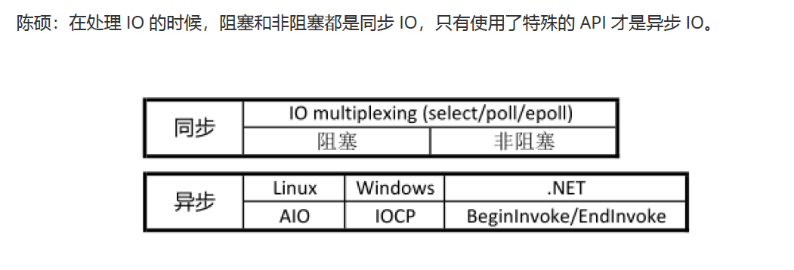
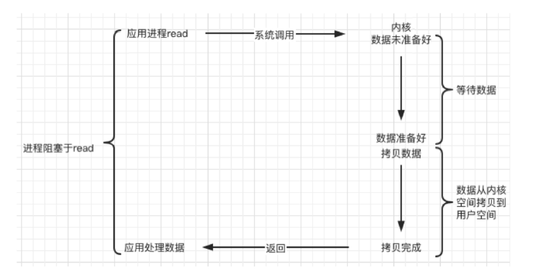
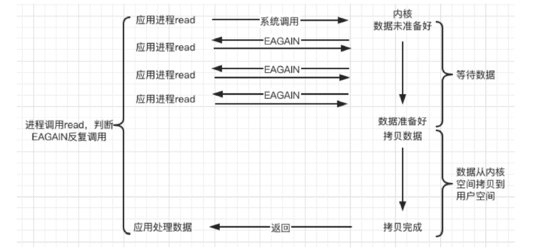
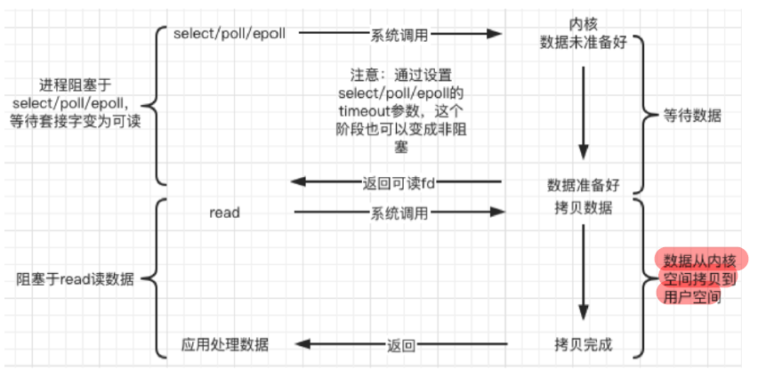
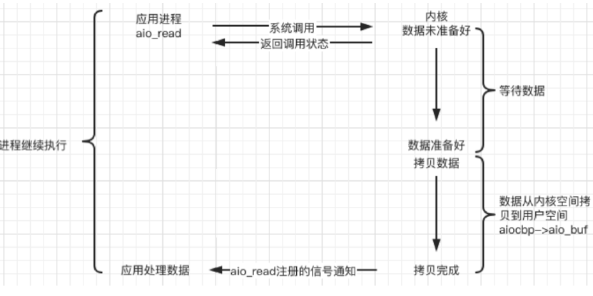

# 第5章 项目实战与总结

## 阻塞/非阻塞、同步/异步(网络IO)

> 典型的一次IO的两个阶段是什么？数据就绪 和 数据读写

> 数据就绪：根据系统IO操作的就绪状态
- 阻塞:强调的是程序在等待调用结果（消息，返回值）时的状态. 阻塞调用是指调用结果返回之前，当前
线程会被挂起。调用线程只有在得到结果之后才会返回
- 非阻塞:非阻塞调用指在不能立刻得到结果之前，该调用不会阻塞当前线程。
  
> 数据读写：根据应用程序和内核的交互方式

- 同步:所谓同步，就是在发出一个"调用"时，在没有得到结果之前，该“调用”就
不返回。但是一旦调用返回，就得到返回值了
- 异步:"调用"在发出之后，这个调用就直接返回了，所以没有返回结果
  

  
> 一个典型的网络IO接口调用，分为两个阶段，分别是“数据就绪” 和 “数据读写”，数据就绪阶段分为
> 阻塞和非阻塞，表现得结果就是，阻塞当前线程或是直接返回。
>
> 同步表示A向B请求调用一个网络IO接口时（或者调用某个业务逻辑API接口时），数据的读写都是由请求方A自己来完成的（不管是阻塞还是非阻塞）；
> 异步表示A向B请求调用一个网络IO接口时（或者调用某个业务逻辑API接口时），向B传入请求的事件以及事件发生时通知的方式，A就可以处理其它逻辑了，当B监听到事件处理完成后，会用事先约定好的通知方式，通知A处理结果。

- 同步阻塞
- 同步非阻塞
- 异步阻塞
- 异步非阻塞



## Unix/Linux上的五种IO模型

**陈硕：在处理 IO 的时候，阻塞和非阻塞都是同步 IO，只有使用了特殊的 API 才是异步 IO**

### 1. 阻塞 blocking
> 调用者调用了某个函数，等待这个函数返回，期间什么也不做，不停的去检查这个函数有没有返回，必须等这个函数返回才能进行下一步动作。 
> 
> 阻塞并不是函数的行为，而是取决于文件描述符的属性




### 2. 非阻塞 non-blocking（NIO）

> 非阻塞等待，每隔一段时间就去检测IO事件是否就绪。没有就绪就可以做其他事。非阻塞I/O执行系统调用总是立即返回，不管事件是否已经发生，若事件没有发生，则返回-1，此时可以根据 errno 区分这两种情况，对于accept，recv 和 send，事件未发生时，errno 通常被设置成 EAGAIN




### 3. IO复用（IO multiplexing）

> Linux 用 select/poll/epoll 函数实现 IO 复用模型，这些函数也会使进程阻塞，
> 但是和阻塞IO所不同的是这些函数可以同时阻塞多个IO操作。
> 而且可以同时对多个读操作、写操作的IO函数进行检测。直到有数据可读或可写时，才真正调用IO操作函数

> 处理高并发需要多进程或者多线程
IO复用是为了在单进程（线程）一次检测多个客户端事件，
并不是为了提高程序处理多个客户端能力




### 4. 信号驱动（signal-driven）

> Linux 用套接口进行信号驱动 IO，安装一个信号处理函数，进程继续运行并不阻塞，当IO事件就绪，进程收到SIGIO 信号，然后处理 IO 事件。


> **内核在第一个阶段是异步，在第二个阶段是同步**；与非阻塞IO的区别在于它提供了消息通知机制，不需要用户进程不断的轮询检查，减少了系统API的调用次数，提高了效率


### 5. 异步（asynchronous）

> Linux中，可以调用 aio_read 函数告诉内核描述字缓冲区指针和缓冲区的大小、文件偏移及通知的方式，然后立即返回，当内核将数据拷贝到缓冲区后，再通知应用程序。



```c++
/* Asynchronous I/O control block. */
struct aiocb
{
    int aio_fildes; /* File desriptor. */
    int aio_lio_opcode; /* Operation to be performed. */
    int aio_reqprio; /* Request priority offset. */
    volatile void *aio_buf; /* Location of buffer. */
    size_t aio_nbytes; /* Length of transfer. */
    struct sigevent aio_sigevent; /* Signal number and value. */

    /* Internal members. */
    struct aiocb *__next_prio;
    int __abs_prio;
    int __policy;
    int __error_code;
    __ssize_t __return_value;

    #ifndef __USE_FILE_OFFSET64
        __off_t aio_offset; /* File offset. */
        char __pad[sizeof (__off64_t) - sizeof (__off_t)];
    #else
        __off64_t aio_offset; /* File offset. */
    #endif
        char __glibc_reserved[32];
};
 ```
