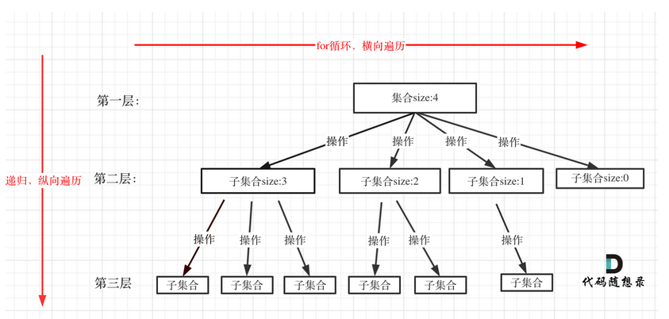
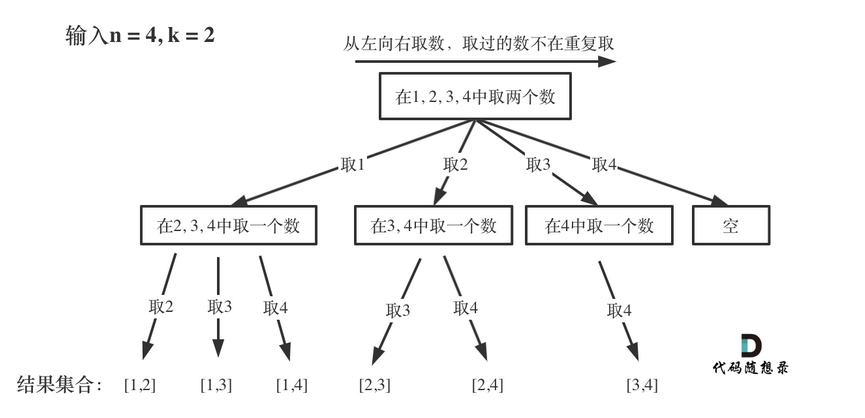
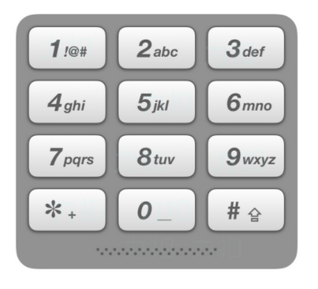
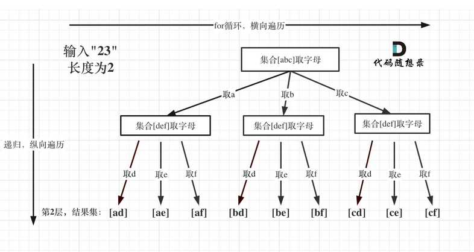

# 第3章 回溯算法
- [第3章 回溯算法](#第3章-回溯算法)
  - [回溯法介绍](#回溯法介绍)
    - [简介](#简介)
    - [回溯法模板](#回溯法模板)
  - [回溯法解决的问题](#回溯法解决的问题)
    - [组合](#组合)
    - [不同集合的组合问题](#不同集合的组合问题)


## 回溯法介绍

### 简介
回溯法也可以叫做回溯搜索法，它是一种搜索的方式。  
回溯是递归的副产品，只要有递归就会有回溯。  
回溯的本质是穷举，穷举所有可能，然后选出我们想要的答案，如果想让回溯法高效一些，可以加一些剪枝的操作，但也改不了回溯法就是穷举的本质。  

> 回溯法解决的问题都可以抽象为树形结构，所有回溯法的问题都可以抽象为树形结构！
因为回溯法解决的都是在集合中递归查找子集，集合的大小就构成了树的宽度，递归的深度，都构成的树的深度。

回溯法，一般可以解决如下几种问题：
> 组合问题：N个数里面按一定规则找出k个数的集合
> 
> 切割问题：一个字符串按一定规则有几种切割方式
> 
> 子集问题：一个N个数的集合里有多少符合条件的子集
> 
> 排列问题：N个数按一定规则全排列，有几种排列方式
> 
> 棋盘问题：N皇后，解数独等等

### 回溯法模板

- 回溯函数模板返回值以及参数 `void backtracking(参数)`
- 回溯函数终止条件
    ```c++
    if (终止条件) {
        存放结果;
        return;
    }
    ```
- 回溯搜索的遍历过程
  


```c++
for (选择：本层集合中元素（树中节点孩子的数量就是集合的大小）) {
    处理节点;
    backtracking(路径，选择列表); // 递归
    回溯，撤销处理结果
}
```

> 可以从图中看出for循环可以理解是横向遍历，backtracking（递归）就是纵向遍历，这样就把这棵树全遍历完了，一般来说，搜索叶子节点就是找的其中一个结果了。

```c++
void backtracking(参数) {
    if (终止条件) {
        存放结果;
        return;
    }

    for (选择：本层集合中元素（树中节点孩子的数量就是集合的大小）) {
        处理节点;
        backtracking(路径，选择列表); // 递归
        回溯，撤销处理结果
    }
}
 ```

 ## 回溯法解决的问题

 ### 组合

[77. 组合](https://leetcode-cn.com/problems/combinations/)

给定两个整数 n 和 k，返回范围 [1, n] 中所有可能的 k 个数的组合。

你可以按 任何顺序 返回答案。

**把组合问题抽象为如下树形结构：**



- 递归函数的返回值以及参数
```c++
vector<vector<int>> result; // 存放符合条件结果的集合
vector<int> path; // 用来存放符合条件单一结果
void backtracking(int n, int k, int startIndex) 
 ```
每次从集合中选取元素，可选择的范围随着选择的进行而收缩，调整可选择的范围，就是要靠startIndex。

- 回溯函数终止条件
> path这个数组的大小如果达到k，说明我们找到了一个子集大小为k的组合了，在图中path存的就是根节点到叶子节点的路径。

```c++
if (path.size() == k) {
    result.push_back(path);
    return;
}
 ```

- 单层搜索的过程
> 回溯法的搜索过程就是一个树型结构的遍历过程，在图中，可以看出for循环用来横向遍历，递归的过程是纵向遍历。

```c++
for (int i = startIndex; i <= n; i++) { // 控制树的横向遍历
    path.push_back(i); // 处理节点 
    backtracking(n, k, i + 1); // 递归：控制树的纵向遍历，注意下一层搜索要从i+1开始
    path.pop_back(); // 回溯，撤销处理的节点
}
 ```
**剪枝策略**

图中每一个节点（图中为矩形），就代表本层的一个for循环，那么每一层的for循环从第二个数开始遍历的话，都没有意义，都是无效遍历。

所以，可以剪枝的地方就在递归中每一层的for循环所选择的起始位置。

**如果for循环选择的起始位置之后的元素个数 已经不足 我们需要的元素个数了，那么就没有必要搜索了**

接下来看一下优化过程如下：
1. 已经选择的元素个数：path.size();
2. 还需要的元素个数为: k - path.size();
3. 在集合n中至多要从该起始位置 : n - (k - path.size()) + 1，开始遍历

```c++
class Solution {
private:
    vector<vector<int>> result;
    vector<int> path;
    void backtracking(int n, int k, int startIndex) {
        if (path.size() == k) {
            result.push_back(path);
            return;
        }
        for (int i = startIndex; i <= n - (k - path.size()) + 1; i++) { // 优化的地方
            path.push_back(i); // 处理节点
            backtracking(n, k, i + 1);
            path.pop_back(); // 回溯，撤销处理的节点
        }
    }
public:

    vector<vector<int>> combine(int n, int k) {
        backtracking(n, k, 1);
        return result;
    }
};
 ```
 [216. 组合总和 III](https://leetcode-cn.com/problems/combination-sum-iii/)

找出所有相加之和为 n 的 k 个数的组合，且满足下列条件：  
只使用数字1到9  
每个数字 最多使用一次   
返回 所有可能的有效组合的列表 。该列表不能包含相同的组合两次，组合可以以任何顺序返回。

```c++
class Solution {
private:
    vector<int> path;
    vector<vector<int>> result;

    void backtracking(int k,int n,int start_index){
        if(path.size()==k){
            if(n==0) result.push_back(path);
            return;
        }

        for(int i=start_index;i<=9-(k-path.size())+1&&n>0;++i){
            path.push_back(i);
            backtracking(k,n-i,i+1);
            path.pop_back();
        }
    }
public:
    vector<vector<int>> combinationSum3(int k, int n) {
        backtracking(k,n,1);
        return result;
    }
};
 ```
### 不同集合的组合问题

[17.电话号码的字母组合](https://leetcode-cn.com/problems/letter-combinations-of-a-phone-number)

给定一个仅包含数字 2-9 的字符串，返回所有它能表示的字母组合。答案可以按 任意顺序 返回。
给出数字到字母的映射如下（与电话按键相同）。注意 1 不对应任何字母。





```c++
class Solution {
private:
    vector<string> result;
    unordered_map<char,string> m;
    void backtracking(string& digits ,int index,string str){
        if(str.size()==digits.size()){
            result.push_back(str);
            return;
        }
        string letter=m[digits[index]];
        for(int i=0;i<letter.size();++i){
            backtracking(digits,index+1,str+letter[i]);
        }

    }
public:
   
    vector<string> letterCombinations(string digits) {
        int len=digits.size();
        if(len==0) return result;
        string str="";
        m={
            {'0',""},{'1',""},
            {'2',"abc"},{'3',"def"},{'4',"ghi"},
            {'5',"jkl"},{'6',"mno"},{'7',"pqrs"},
            {'8',"tuv"},{'9',"wxyz"}
        };
        
        backtracking(digits,0,str);
        return result;
    }
};
 ```
**总结：** 用回溯法解决问题，先把问题抽象为树型结构，确定横向遍历与纵向遍历内容
