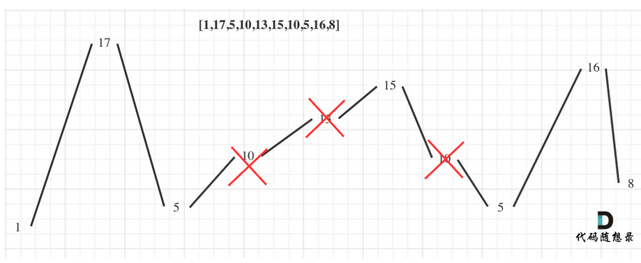

# 第4章 贪心算法

## 贪心算法概述
贪心的本质是选择每一阶段的局部最优，从而达到全局最优。
一般数学证明有如下两种方法：
- 数学归纳法
- 反证法

## 贪心一般解题步骤
1. 将问题分解为若干个子问题
2. 找出适合的贪心策略
3. 求解每一个子问题的最优解
4. 将局部最优解堆叠成全局最优解

## 贪心算法常见案例

### 分发饼干
[455. 分发饼干](https://leetcode-cn.com/problems/assign-cookies)
假设你是一位很棒的家长，想要给你的孩子们一些小饼干。但是，每个孩子最多只能给一块饼干。

对每个孩子 i，都有一个胃口值 g[i]，这是能让孩子们满足胃口的饼干的最小尺寸；并且每块饼干 j，都有一个尺寸 s[j] 。如果 s[j] >= g[i]，我们可以将这个饼干 j 分配给孩子 i ，这个孩子会得到满足。你的目标是尽可能满足越多数量的孩子，并输出这个最大数值。
 
示例 1:
输入: g = [1,2,3], s = [1,1]
输出: 1
解释: 
你有三个孩子和两块小饼干，3个孩子的胃口值分别是：1,2,3。
虽然你有两块小饼干，由于他们的尺寸都是1，你只能让胃口值是1的孩子满足。
所以你应该输出1。

思路：
1. 这里的局部最优就是大饼干喂给胃口大的，充分利用饼干尺寸喂饱一个，全局最优就是喂饱尽可能多的小孩。
2. 小饼干先喂饱小胃口

```c++
class Solution {
public:
    int findContentChildren(vector<int>& g, vector<int>& s) {
        sort(g.begin(),g.end());
        sort(s.begin(),s.end());
        int index=0,count=0;
        for(int i=0;i<s.size();++i){
            if(s[i]>=g[index]){
                ++index;
                ++count;
            }
            if(index==g.size()) break;
        }
        return count;
    }
};
 ```

### 摆动序列
[376.摆动序列](https://leetcode-cn.com/problems/wiggle-subsequence)

如果连续数字之间的差严格地在正数和负数之间交替，则数字序列称为 摆动序列 。第一个差（如果存在的话）可能是正数或负数。仅有一个元素或者含两个不等元素的序列也视作摆动序列。

    例如， [1, 7, 4, 9, 2, 5] 是一个 摆动序列 ，因为差值 (6, -3, 5, -7, 3) 是正负交替出现的。
    相反，[1, 4, 7, 2, 5] 和 [1, 7, 4, 5, 5] 不是摆动序列，第一个序列是因为它的前两个差值都是正数，第二个序列是因为它的最后一个差值为零。

子序列 可以通过从原始序列中删除一些（也可以不删除）元素来获得，剩下的元素保持其原始顺序。

给你一个整数数组 nums ，返回 nums 中作为 摆动序列 的 最长子序列的长度 。

示例 1：

    输入：nums = [1,7,4,9,2,5]
    输出：6
    解释：整个序列均为摆动序列，各元素之间的差值为 (6, -3, 5, -7, 3) 。

示例 2：

    输入：nums = [1,17,5,10,13,15,10,5,16,8]
    输出：7
    解释：这个序列包含几个长度为 7 摆动序列。
    其中一个是 [1, 17, 10, 13, 10, 16, 8] ，各元素之间的差值为 (16, -7, 3, -3, 6, -8) 。

示例 3：

    输入：nums = [1,2,3,4,5,6,7,8,9]
    输出：2


**贪心思想：** 

    局部最优：删除单调坡度上的节点（不包括单调坡度两端的节点），那么这个坡度就可以有两个局部峰值。

    整体最优：整个序列有最多的局部峰值，从而达到最长摆动序列。



实际操作上，其实连删除的操作都不用做，因为题目要求的是最长摆动子序列的长度，所以只需要统计数组的峰值数量就可以了（相当于是删除单一坡度上的节点，然后统计长度）

这就是贪心所贪的地方，让峰值尽可能的保持峰值，然后删除单一坡度上的节点。

```c++
class Solution {
public:
    int wiggleMaxLength(vector<int>& nums) {
        if (nums.size() <= 1) return nums.size();
        int curDiff = 0; // 当前一对差值
        int preDiff = 0; // 前一对差值
        int result = 1;  // 记录峰值个数，序列默认序列最右边有一个峰值
        for (int i = 0; i < nums.size() - 1; i++) {
            curDiff = nums[i + 1] - nums[i];
            // 出现峰值
            if ((curDiff > 0 && preDiff <= 0) || (preDiff >= 0 && curDiff < 0)) {
                result++;
                preDiff = curDiff;
            }
        }
        return result;
    }
};
 ```

**动态规划：**
很容易可以发现，对于我们当前考虑的这个数，要么是作为山峰（即nums[i] > nums[i-1]），要么是作为山谷（即nums[i] < nums[i - 1]）。

    设dp状态dp[i][0]，表示考虑前i个数，第i个数作为山峰的摆动子序列的最长长度
    设dp状态dp[i][1]，表示考虑前i个数，第i个数作为山谷的摆动子序列的最长长度

则转移方程为：

    dp[i][0] = max(dp[i][0], dp[j][1] + 1)，其中0 < j < i且nums[j] < nums[i]，表示将nums[i]接到前面某个山谷后面，作为山峰。
    dp[i][1] = max(dp[i][1], dp[j][0] + 1)，其中0 < j < i且nums[j] > nums[i]，表示将nums[i]接到前面某个山峰后面，作为山谷。

初始状态：

由于一个数可以接到前面的某个数后面，也可以以自身为子序列的起点，所以初始状态为：dp[0][0] = dp[0][1] = 1。

```c++

class Solution {
public:
    int dp[1005][2];
    int wiggleMaxLength(vector<int>& nums) {
        memset(dp, 0, sizeof dp);
        dp[0][0] = dp[0][1] = 1;

        for (int i = 1; i < nums.size(); ++i)
        {
            dp[i][0] = dp[i][1] = 1;

            for (int j = 0; j < i; ++j)
            {
                if (nums[j] > nums[i]) dp[i][1] = max(dp[i][1], dp[j][0] + 1);
            }

            for (int j = 0; j < i; ++j)
            {
                if (nums[j] < nums[i]) dp[i][0] = max(dp[i][0], dp[j][1] + 1);
            }
        }
        return max(dp[nums.size() - 1][0], dp[nums.size() - 1][1]);
    }
};
 ```
    时间复杂度：$O(n^2)$
    空间复杂度：$O(n)$

进阶

可以用两棵线段树来维护区间的最大值

    每次更新dp[i][0]，则在tree1的nums[i]位置值更新为dp[i][0]
    每次更新dp[i][1]，则在tree2的nums[i]位置值更新为dp[i][1]
    则dp转移方程中就没有必要j从0遍历到i-1，可以直接在线段树中查询指定区间的值即可。

时间复杂度：$O(n\log n)$

空间复杂度：$O(n)$