# 第2章 数据结构基础

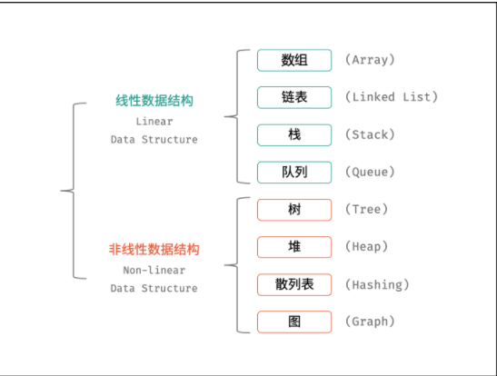

- [第2章 数据结构基础](#第2章-数据结构基础)
  - [2.1 数组](#21-数组)
      - [移除链表元素](#移除链表元素)
      - [翻转链表](#翻转链表)
      - [链表相交节点问题 链表相交](#链表相交节点问题-链表相交)
      - [链表环入口问题 环形链表](#链表环入口问题-环形链表)
  - [2.3 哈希表](#23-哈希表)
      - [理论基础](#理论基础)
      - [常见的三种哈希结构](#常见的三种哈希结构)
      - [常见案例](#常见案例)
  - [2.4 字符串](#24-字符串)
      - [理论基础](#理论基础-1)
      - [字符串与数值的转化](#字符串与数值的转化)
      - [KMP算法](#kmp算法)
  - [2.5 栈与队列](#25-栈与队列)
      - [容器以及容器适配器](#容器以及容器适配器)
      - [vector](#vector)
      - [stack](#stack)
      - [deque](#deque)
      - [queue队列](#queue队列)
      - [priority_queue优先队列](#priority_queue优先队列)
        - [操作基本和队列相同](#操作基本和队列相同)
        - [定义:](#定义)
        - [实例](#实例)
        - [堆的实现](#堆的实现)
      - [典型题目](#典型题目)
  - [2.6 树](#26-树)
      - [树的生成](#树的生成)
      - [二叉树的遍历](#二叉树的遍历)
      - [广度优先搜索（层次遍历）](#广度优先搜索层次遍历)
      - [深度优先搜索](#深度优先搜索)
      - [翻转二叉树](#翻转二叉树)
      - [对称二叉树](#对称二叉树)
      - [二叉树的最小深度](#二叉树的最小深度)
      - [完全二叉的节点个数](#完全二叉的节点个数)
      - [平衡二叉树](#平衡二叉树)

## 2.1 数组

1. **基础**
*数组是将相同类型的元素存储于连续内存空间的数据结构，其长度不可变如下图所示，构建此数组需要在初始化时给定长度，并对数组每个索引元素赋值，代码如下*：

    ```c++
    // 初始化一个长度为 5 的数组 array
    int array[5];
    int array[] = {2, 3, 1, 0, 2};
    // 初始化可变数组
    vector<int> array;
    // 向尾部添加元素
    array.push_back(2);
    array.push_back(3);
    ```

2. **二分查找的实现**
    ***使用二分查找应该注意是否有序以及无重复元素**
    理解区间定义，处理好边界问题；
    写二分法，区间的定义一般为两种*，`左闭右闭即[left, right]，或者左闭右开即[left, right)`
    ***左闭右闭即[left, right]***
    `while (left <= right) 要使用 <= ，因为left == right是有意义的，所以使用 <=`  
    `if (nums[middle] > target) right 要赋值为 middle - 1，因为当前这个nums[middle]一定不是target，那么接下来要查找的左区间结束下标位置就是 middle - 1`

    ```c++
    int search(vector<int>& nums, int target) {
        int left = 0;
        int right = nums.size() - 1; // 定义target在左闭右闭的区间里，[left, right]
        while (left <= right) { // 当left==right，区间[left, right]依然有效，所以用 <=
            int middle = left + ((right - left) / 2);// 防止溢出 等同于(left + right)/2
            if (nums[middle] > target) {
                right = middle - 1; // target 在左区间，所以[left, middle - 1]
            } else if (nums[middle] < target) {
                left = middle + 1; // target 在右区间，所以[middle + 1, right]
            } else { // nums[middle] == target
                return middle; // 数组中找到目标值，直接返回下标
            }
        }
        // 未找到目标值
        return -1;
    }
    ```

    ***如果定义 target 是在一个在左闭右开的区间里，也就是[left, right) ，那么二分法的边界处理方式则截然不同:***

    `while (left < right)，这里使用 < ,因为left == right在区间[left, right)是没有意义的`  

    `if (nums[middle] > target) right 更新为 middle，因为当前nums[middle]不等于target，去左区间继续寻找，而寻找区间是左闭右开区间，所以right更新为middle，即：下一个查询区间不会去比较nums[middle]`

    ```c++
    int search(vector<int>& nums, int target) {
        int left = 0;
        int right = nums.size(); // 定义target在左闭右开的区间里，即：[left, right)
        while (left < right) { // 因为left == right的时候，在[left, right)是无效的空间，所以使用 <
            int middle = left + ((right - left) >> 1);
            if (nums[middle] > target) {
                right = middle; // target 在左区间，在[left, middle)中
            } else if (nums[middle] < target) {
                left = middle + 1; // target 在右区间，在[middle + 1, right)中
            } else { // nums[middle] == target
                return middle; // 数组中找到目标值，直接返回下标
            }
        }
        // 未找到目标值
        return -1;
    }
    ```

    [leetcode35 查找插入位置](https://leetcode-cn.com/problems/search-insert-position/)
    *难点在与循环之后插入位置处理，应该从target所在区间角度考虑理解返回值*
    **版本1**

    ```c++
    int searchInsert(vector<int>& nums, int target) {
        int n = nums.size();
        int left = 0;
        int right = n - 1; // 定义target在左闭右闭的区间里，[left, right]
        while (left <= right) { // 当left==right，区间[left, right]依然有效
            int middle = left + ((right - left) / 2);// 防止溢出 等同于(left + right)/2
            if (nums[middle] > target) {
                right = middle - 1; // target 在左区间，所以[left, middle - 1]
            } else if (nums[middle] < target) {
                left = middle + 1; // target 在右区间，所以[middle + 1, right]
            } else { // nums[middle] == target
                return middle;
            }
        }
        // 分别处理如下四种情况
        // 目标值在数组所有元素之前  [0, -1]
        // 目标值等于数组中某一个元素  return middle;
        // 目标值插入数组中的位置 [left, right]，return  right + 1
        // 目标值在数组所有元素之后的情况 [left, right]， return right + 1
        return right + 1;
    }
    ```

    若最后一次查找执行为
    `if (nums[middle] > target) middle=right+1为插入位置
    else if (nums[middle] < target)  left|=middle+1=right+1（while条件为<=)为插入位置
    故 return right+1;`
    **版本2**

    ```c++
    int searchInsert(vector<int>& nums, int target) {
        int n = nums.size();
        int left = 0;
        int right = n; // 定义target在左闭右开的区间里，[left, right)  target
        while (left < right) { // 因为left == right的时候，在[left, right)是无效的空间
            int middle = left + ((right - left) >> 1);
            if (nums[middle] > target) {
                right = middle; // target 在左区间，在[left, middle)中
            } else if (nums[middle] < target) {
                left = middle + 1; // target 在右区间，在 [middle+1, right)中
            } else { // nums[middle] == target
                return middle; // 数组中找到目标值的情况，直接返回下标
            }
        }
        // 分别处理如下四种情况
        // 目标值在数组所有元素之前 [0,0)
        // 目标值等于数组中某一个元素 return middle
        // 目标值插入数组中的位置 [left, right) ，return right 即可
        // 目标值在数组所有元素之后的情况 [left, right)，return right 即可
        return right;
    }
    ```

    **二分法查找边界问题**
    
    *注意重复元素*
    **寻找右边界**
    ```c++
    // 二分查找，寻找target的右边界（不包括target）
    // 如果rightBorder为没有被赋值（即target在数组范围的左边，例如数组[3,3]，target为2），为了处理情况一
    int getRightBorder(vector<int>& nums, int target) {
        int left = 0;
        int right = nums.size() - 1; // 定义target在左闭右闭的区间里，[left, right]
        int rightBorder = -2; // 记录一下rightBorder没有被赋值的情况
        while (left <= right) { // 当left==right，区间[left, right]依然有效
            int middle = left + ((right - left) / 2);// 防止溢出 等同于(left + right)/2
            if (nums[middle] > target) {
                right = middle - 1; // target 在左区间，所以[left, middle - 1]
            } else { // 当nums[middle] == target的时候，更新left，这样才能得到target的右边界
                left = middle + 1;
                rightBorder = left;
            }
        }
        return rightBorder;
    }
    ```
    **寻找左边界**

    ```c++
    // 二分查找，寻找target的左边界leftBorder（不包括target）
    // 如果leftBorder没有被赋值（即target在数组范围的右边，例如数组[3,3],target为4），为了处理情况一
    int getLeftBorder(vector<int>& nums, int target) {
        int left = 0;
        int right = nums.size() - 1; // 定义target在左闭右闭的区间里，[left, right]
        int leftBorder = -2; // 记录一下leftBorder没有被赋值的情况
        while (left <= right) {
            int middle = left + ((right - left) / 2);
            if (nums[middle] >= target) { // 寻找左边界，就要在nums[middle] == target的时候更新right
                right = middle - 1;
                leftBorder = right;
            } else {
                left = middle + 1;
            }
        }
        return leftBorder;
    }
    ```
3. **数组元素的移除** *（双指针）*
   [leetcode209 最小长度子数组](https://leetcode-cn.com/problems/minimum-size-subarray-sum/)
   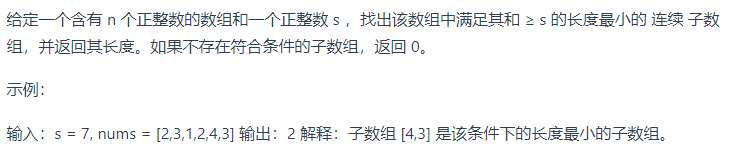

   ```c++
    class Solution 
    public:
        int minSubArrayLen(int s, vector<int>& nums) {
            int result = INT32_MAX;
            int sum = 0; // 滑动窗口数值之和
            int i = 0; // 滑动窗口起始位置
            int subLength = 0; // 滑动窗口的长度
            for (int j = 0; j < nums.size(); j++) {
                sum += nums[j];
                // 注意这里使用while，每次更新 i（起始位置），并不断比较子序列是否符合条件
                while (sum >= s) {
                    subLength = (j - i + 1); // 取子序列的长度
                    result = result < subLength ? result : subLength;
                    sum -= nums[i++]; // 这里体现出滑动窗口的精髓之处，不断变更i（子序列的起始位置）
                }
            }
            // 如果result没有被赋值的话，就返回0，说明没有符合条件的子序列
            return result == INT32_MAX ? 0 : result;
        }
    };
    ```

## 2.2 链表

#### 理论基础

*链表以节点为单位，每个元素都是一个独立对象，在内存空间的存储是非连续的。链表的节点对象具有两个成员变量*

```c++
struct ListNode {
    int val;        // 节点值
    ListNode *next; // 后继节点引用
    ListNode(int x) : val(x), next(NULL) {}
};
ListNode* creatList(vector<int> v){
    ListNode* pHead= new ListNode(-1),*r;
    r=pHead;
    for(auto data:v){
        ListNode* s=new ListNode(data);
        r->next=s;
        r=s;
    }
    return pHead->next;
}
```

#### 移除链表元素

*设置虚拟头节点处理，统一操作*

```c++
class Solution {
public:
    ListNode* removeElements(ListNode* head, int val) {
        ListNode* dummyHead = new ListNode(0); // 设置一个虚拟头结点
        dummyHead->next = head; // 将虚拟头结点指向head，这样方面后面做删除操作
        ListNode* cur = dummyHead;
        while (cur->next != NULL) {
            if(cur->next->val == val) {
                ListNode* tmp = cur->next;
                cur->next = cur->next->next;
                delete tmp;
            } else {
                cur = cur->next;
            }
        }
        head = dummyHead->next;
        delete dummyHead;
        return head;
    }
};
```

#### 翻转链表

*两种思路：从头翻转 或者从尾部开始翻转*

```c++
#方案1 双指针
ListNode* pre=NULL,*cur=pHead;
while(cur){
    ListNode* temp=cur->next;
    cur->next=pre;
    pre=cur;
    cur=temp;
}
return pre;
递归实现
class Solution {
public:
    ListNode* reverse(ListNode* pre,ListNode* cur){
        if(cur == NULL) return pre;
        ListNode* temp = cur->next;
        cur->next = pre;
        // 可以和双指针法的代码进行对比，如下递归的写法，其实就是做了这两步
        // pre = cur;
        // cur = temp;
        return reverse(cur,temp);
    }
    ListNode* reverseList(ListNode* head) {
        // 和双指针法初始化是一样的逻辑
        // ListNode* cur = head;
        // ListNode* pre = NULL;
        return reverse(NULL, head);
    }

};

#方案2 从尾部开始翻转
ListNode* reverseList(ListNode* head){
    if(!head) return NULL:
    if(!head->next) return head;//递归出口的判断
    
    head=reverseList(head->next);
    head->next->next=head;
    head->next=NULL;
}
```

[leetcode24 两两交换链表中节点](https://leetcode-cn.com/problems/swap-nodes-in-pairs/submissions/)
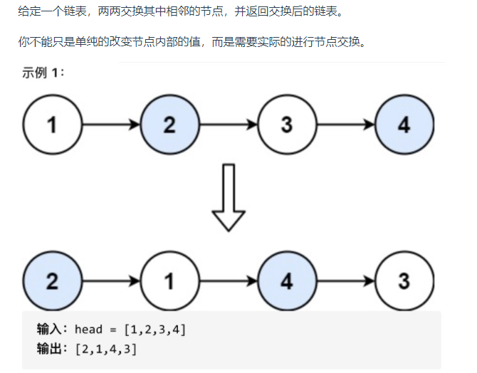
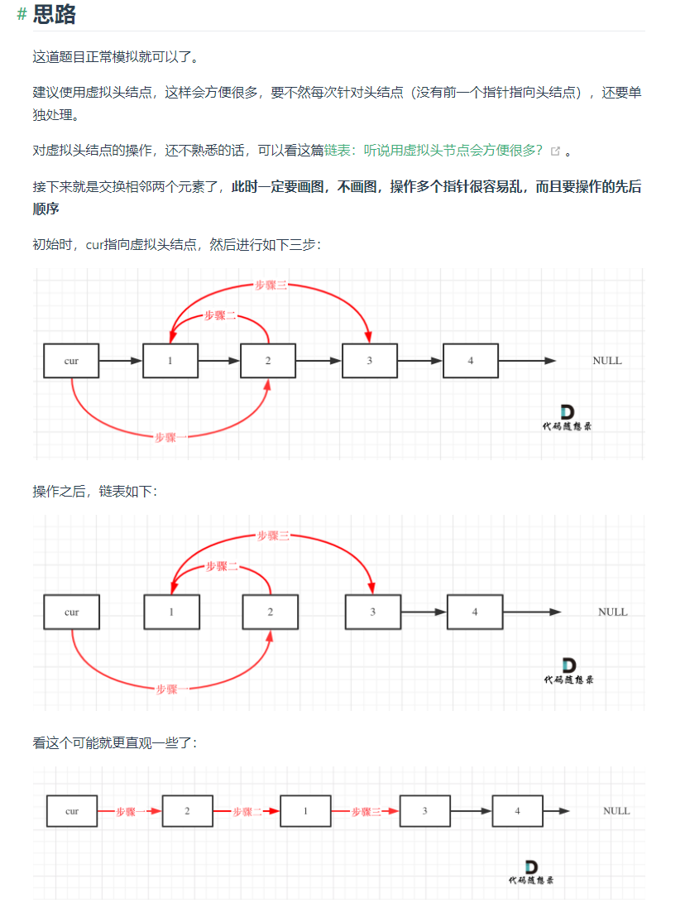

```c++
class Solution {
public:
    ListNode* swapPairs(ListNode* head) {
        ListNode* dummyHead = new ListNode(0); // 设置一个虚拟头结点
        dummyHead->next = head; // 将虚拟头结点指向head，这样方面后面做删除操作
        ListNode* cur = dummyHead;
        while(cur->next != nullptr && cur->next->next != nullptr) {
            ListNode* tmp = cur->next; // 记录临时节点
            ListNode* tmp1 = cur->next->next->next; // 记录临时节点

            cur->next = cur->next->next;    // 步骤一
            cur->next->next = tmp;          // 步骤二
            cur->next->next->next = tmp1;   // 步骤三

            cur = cur->next->next; // cur移动两位，准备下一轮交换
        }
        return dummyHead->next;
    }
};
```

#### 链表相交节点问题 [链表相交](https://leetcode-cn.com/problems/intersection-of-two-linked-lists-lcci/)

*两链表相加遍历思想*

#### 链表环入口问题 [环形链表](https://leetcode-cn.com/problems/linked-list-cycle-ii/)

*step2=2\*step1 第二次相遇在入口处*

## 2.3 哈希表

#### 理论基础

**哈希表是根据关键码的值而直接进行访问的数据结构**
*一般哈希表都是用来快速判断一个元素是否出现集合里*

*例如要查询一个名字是否在这所学校里。
要枚举的话时间复杂度是$O(n)$，但如果使用哈希表的话， 只需要$O(1)$就可以做到。
我们只需要初始化把这所学校里学生的名字都存在哈希表里，在查询的时候通过索引直接就可以知道这位同学在不在这所学校里了。
将学生姓名映射到哈希表上就涉及到了hash function ，也就是**哈希函数***
**哈希函数**

*一般哈希碰撞有两种解决方法， 拉链法和线性探测法*

#### 常见的三种哈希结构

- 数组
- set （集合）
- map(映射)

|        集合        | 底层实现 | 是否有序 | 数值是否可以重复 | 能否更改数值 |  查询效率   |  增删效率   |
| :----------------: | :------: | :------: | :--------------: | :----------: | :---------: | :---------: |
|      std::set      |  红黑树  |   有序   |        否        |      否      | $O(\log n)$ | $O(\log n)$ |
|   std::multiset    |  红黑树  |   有序   |        是        |      否      | $O(\log n)$ | $O(\log n)$ |
| std::unordered_set |  哈希表  |   无序   |        否        |      否      |   $O(1)$    |   $O(1)$    |

*std::unordered_set底层实现为哈希表，std::set 和std::multiset 的底层实现是红黑树，红黑树是一种平衡二叉搜索树，所以key值是有序的，但key不可以修改，改动key值会导致整棵树的错乱，所以只能删除和增加*

|        映射        | 底层实现 | 是否有序 | 数值是否可以重复 | 能否更改数值 |  查询效率   |  增删效率   |
| :----------------: | :------: | :------: | :--------------: | :----------: | :---------: | :---------: |
|      std::map      |  红黑树  | key有序  |   key不可重复    | key不可修改  | $O(\log n)$ | $O(\log n)$ |
|   std::multimap    |  红黑树  | key有序  |    key可重复     | key不可修改  | $O(\log n)$ | $O(\log n)$ |
| std::unordered_map |  哈希表  | key无序  |   key不可重复    | key不可修改  |   $O(1)$    |   $O(1)$    |
*std::unordered_map 底层实现为哈希表，std::map 和std::multimap 的底层实现是红黑树。同理，std::map 和std::multimap 的key也是有序的（这个问题也经常作为面试题，考察对语言容器底层的理解）*  

**1. 当我们要使用集合来解决哈希问题的时候，优先使用unordered_set，因为它的查询和增删效率是最优的，如果需要集合是有序的，那么就用set，如果要求不仅有序还要有重复数据的话，那么就用multiset**

1. 那么再来看一下map ，在map 是一个key value 的数据结构，map中，对key是有限制，对value没有限制的，因为key的存储方式使用红黑树实现的。**

*虽然std::set、std::multiset 的底层实现是红黑树，不是哈希表，但是std::set、std::multiset 依然使用哈希函数来做映射，只不过底层的符号表使用了红黑树来存储数据，所以使用这些数据结构来解决映射问题的方法，我们依然称之为哈希法。 map也是一样的道理

这里在说一下，一些C++的经典书籍上 例如STL源码剖析，说到了hash_set hash_map，这个与unordered_set，unordered_map又有什么关系呢？*

实际上功能都是一样一样的， 但是unordered_set在C++11的时候被引入标准库了，而hash_set并没有，所以建议还是使用unordered_set比较好，这就好比一个是官方认证的，hash_set，hash_map 是C++11标准之前民间高手自发造的轮子*

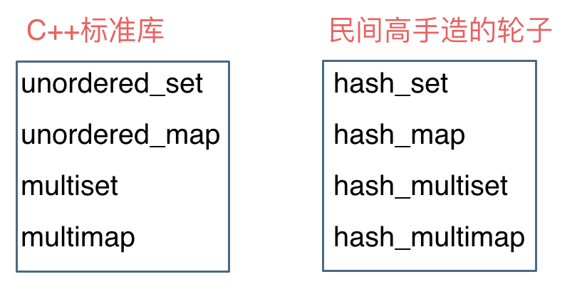
**总结：当我们遇到了要快速判断一个元素是否出现集合里的时候，就要考虑哈希法**

**但是哈希法也是牺牲了空间换取了时间，因为我们要使用额外的数组，set或者是map来存放数据，才能实现快速的查找**

#### 常见案例

[leetcode242 有效的字母异位词](https://leetcode-cn.com/problems/valid-anagram/)  **map的简单使用**

```c++
/*
给定两个字符串 s 和 t ，编写一个函数来判断 t 是否是 s 的字母异位词。
示例 1: 输入: s = "anagram", t = "nagaram" 输出: true
示例 2: 输入: s = "rat", t = "car" 输出: false
说明: 你可以假设字符串只包含小写字母
*/
bool isAnagram(string s, string t) {
    unordered_map<char,int> map;
    for(auto c:s) ++map[c];
    //for(auto c:map) cout<<c.first<<" "<<c.second<<endl;
    for(auto c:t){
        if(map[c]>0) --map[c];
        else return false;
    }
    for(auto it:map){
        if(it.second!=0) return false;
    }
    return true;
}
```

*也可以用数组实现，直接使用set，map不仅占用空间比数组大，*
*而且速度要比数组慢，把数值映射到key上都要做hash计算的*
[leetcode349 两个数组的交集](https://leetcode-cn.com/problems/intersection-of-two-arrays/)  **unordeered_set以及set迭代器的使用**

```c++
/*
给定两个数组 nums1 和 nums2 ，返回 它们的交集 
输出结果中的每个元素一定是 唯一 的。我们可以 不考虑输出结果的顺序
输入：nums1 = [1,2,2,1], nums2 = [2,2]
输出：[2]
*/
class Solution {
public:
    vector<int> intersection(vector<int>& nums1, vector<int>& nums2) {
        unordered_set<int> result_set; // 存放结果
        unordered_set<int> nums_set(nums1.begin(), nums1.end());
        for (int num : nums2) {
            // 发现nums2的元素 在nums_set里又出现过
            if (nums_set.find(num) != nums_set.end()) {
                result_set.insert(num);
            }
        }
        return vector<int>(result_set.begin(), result_set.end());
    }
};
```

[leetcode1 两个数组之和](https://leetcode-cn.com/problems/two-sum/)
*给定一个整数数组 nums 和一个目标值 target，请你在该数组中找出和为目标值的那 两个 整数，并返回他们的数组下标
你可以假设每种输入只会对应一个答案。但是，数组中同一个元素不能使用两遍
示例:
给定 nums = [2, 7, 11, 15], target = 9
因为 nums[0] + nums[1] = 2 + 7 = 9
所以返回 [0, 1]*
**思路**
*本题呢，则要使用map，那么来看一下使用数组和set来做哈希法的局限。
数组的大小是受限制的，而且如果元素很少，而哈希值太大会造成内存空间的浪费。
set是一个集合，里面放的元素只能是一个key，而两数之和这道题目，不仅要判断y是否存在而且还要记录y的下标位置，
因为要返回x 和 y的下标。所以set 也不能用。
此时就要选择另一种数据结构：map ，map是一种key value的存储结构，
可以用key保存数值，用value在保存数值所在的下标。*

```c++
class Solution {
public:
    vector<int> twoSum(vector<int>& nums, int target) {
        unordered_map<int,int> map_num ;
        vector<int> v;
        for(int i=0;i<nums.size();++i){
            if(map_num.find(target-nums[i])!=map_num.end()){
                v.push_back(map_num[target-nums[i]]);
                v.push_back(i);
            }
            map_num.emplace(nums[i],i);
        }
        
        return v;
    }
};
```

[leetcode383 赎金信](https://leetcode-cn.com/problems/ransom-note/)

*给定一个赎金信 (ransom) 字符串和一个杂志(magazine)字符串，判断第一个字符串 ransom 能不能由第二个字符串 magazines 里面的字符构成。如果可以构成，返回 true ；否则返回 false。
(题目说明：为了不暴露赎金信字迹，要从杂志上搜索各个需要的字母，组成单词来表达意思。杂志字符串中的每个字符只能在赎金信字符串中使用一次。)
注意：
你可以假设两个字符串均只含有小写字母。
canConstruct("a", "b") -> false
canConstruct("aa", "ab") -> false
canConstruct("aa", "aab") -> true*
**思路**
*在本题的情况下，使用map的空间消耗要比数组大一些的，因为map要维护红黑树或者哈希表，而且还要做哈希函数，是费时的！数据量大的话就能体现出来差别了。 所以数组更加简单直接有效*
**其他题目**
[leetcode15 三数之和](https://leetcode-cn.com/problems/3sum/) **双指针**
[leetcode18 四数之和](https://leetcode-cn.com/problems/4sum/) **双指针**

## 2.4 字符串

#### 理论基础

- 双指针法翻转字符串
[leetcode344 反转字符串](<https://leetcode-cn.com/problems/reverse-string/>)
  
- 局部反转+整体反转
[剑指Offer58-II.左旋转字符](https://leetcode-cn.com/problems/zuo-xuan-zhuan-zi-fu-chuan-lcof/)

- KMP算法 实现strStr()
[leetcode28 实现strStr()](https://leetcode-cn.com/problems/implement-strstr/)  

    *实现 strStr() 函数。
    给定一个 haystack 字符串和一个 needle 字符串，在 haystack 字符串中找出 needle 字符串出现的第一个位置 (从0开始)。如果不存在，则返回  -1。
    示例 1: 输入: haystack = "hello", needle = "ll" 输出: 2
    示例 2: 输入: haystack = "aaaaa", needle = "bba" 输出: -1*

    ```c++
    class Solution {
    public:
        string reverseLeftWords(string s, int n) {
            reverse(s.begin(), s.begin() + n);
            reverse(s.begin() + n, s.end());
            reverse(s.begin(), s.end());
            return s;
        }
    };
    ```
#### 字符串与数值的转化
**熟悉to_string(),stoi(),stod()**

```c++
string s="3.1415";
int a= 12345;
doulble d= stod(s);
string str=to_string(a);
```
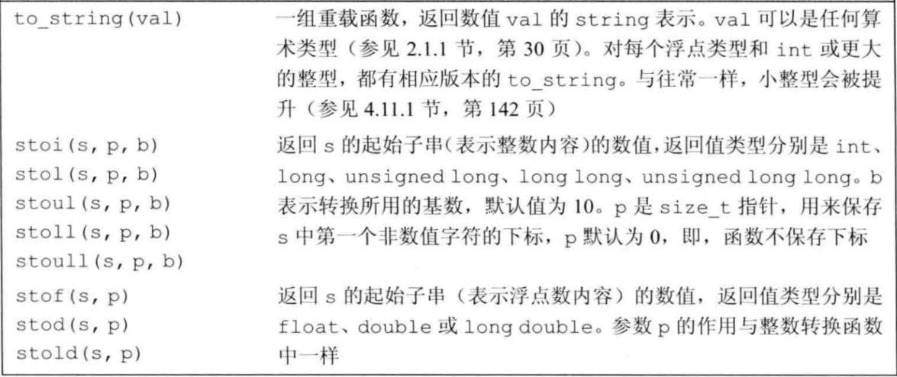   

**参考 c++primer 9.5.5**
#### KMP算法

KMP的主要思想是当出现字符串不匹配时，可以知道一部分之前已经匹配的文本内容，可以利用这些信息避免从头再去做匹配了
**1. 前缀表**

*作用:前缀表是用来回退的，它记录了模式串与主串(文本串)不匹配的时候，模式串应该从哪里开始重新匹配。
记录下标i之前（包括i）的字符串中，有多大长度的相同前缀后缀*

**前缀**:是指不包含最后一个字符的所有以第一个字符开头的连续子串；
**后缀**:是指不包含第一个字符的所有以最后一个字符结尾的连续子串
**最长相等前后缀**


**2. 前缀表与next数组**  

**next数组就可以是前缀表，常用的两种实现:**
*1.把前缀表统一减一
2.右移一位，初始位置为-1之后作为next数组*

**构造next[]**

构造next数组其实就是计算模式串s，前缀表的过程。 主要有如下三步(以前缀表统一减一为例)：

1. 初始化
2. 处理前后缀不相同的情况
3. 处理前后缀相同的情况

- 初始化

    定义两个指针i和j，**j指向前缀起始位置，i指向后缀起始位置**
    然后还要对next数组进行初始化赋值，如下：

    ```c++
    int j = -1;
    next[0] = j;
    ```

    *j 为什么要初始化为 -1呢，因为之前说过 前缀表要统一减一的操作仅仅是其中的一种实现，
    我们这里选择j初始化为-1，下文我还会给出j不初始化为-1的实现代码。
    next[i] 表示 i（包括i）之前最长相等的前后缀长度（其实就是 j）
    所以初始化next[0] = j 。*    
   
- 处理前后缀不相同的情况
    因为j初始化为-1，那么i就从1开始，进行s[i] 与 s[j+1]的比较。
    所以遍历模式串s的循环下标i 要从 1开始，代码如下：
    `for (int i = 1; i < s.size(); i++) {`
    如果 s[i] 与 s[j+1]不相同，也就是遇到 前后缀末尾不相同的情况，就要向前回退
    next[j]就是记录着j（包括j）之前的子串的相同前后缀的长度
    那么 s[i] 与 s[j+1] 不相同，就要找 j+1前一个元素在next数组里的值（就是next[j]）

    ```c++
    while (j >= 0 && s[i] != s[j + 1]) { // 前后缀不相同了
        j = next[j]; // 向前回退
    }
    ```

- 处理前后缀相同的情况
*如果 s[i] 与 s[j + 1] 相同，那么就同时向后移动i 和j 说明找到了相同的前后缀，
同时还要将j（前缀的长度）赋给next[i], 因为next[i]要记录相同前后缀的长度*

    ```c++
    if (s[i] == s[j + 1]) { // 找到相同的前后缀
        j++;
    }
    next[i] = j;
    ```

**整体代码如下**

```c++
void getNext(int* next, const string& s){
    int j = -1;
    next[0] = j;
    for(int i = 1; i < s.size(); i++) { // 注意i从1开始
        while (j >= 0 && s[i] != s[j + 1]) { // 前后缀不相同了
            j = next[j]; // 向前回退
        }
        if (s[i] == s[j + 1]) { // 找到相同的前后缀
            j++;
        }
        next[i] = j; // 将j（前缀的长度）赋给next[i]
    }
}
```

next[]构造过程
![构造next[]数组](images/next[]构造.gif)

**3. 利用next数组来做匹配**

```c++
int j = -1; // 因为next数组里记录的起始位置为-1
for (int i = 0; i < s.size(); i++) { // 注意i就从0开始
    while(j >= 0 && s[i] != t[j + 1]) { // 不匹配
        j = next[j]; // j 寻找之前匹配的位置
    }
    if (s[i] == t[j + 1]) { // 匹配，j和i同时向后移动
        j++; // i的增加在for循环里
    }
    if (j == (t.size() - 1) ) { // 文本串s里出现了模式串t
        return (i - t.size() + 1);
    }
}
```

**前缀表统一减一 C++代码实现**

```c++
class Solution {
public:
    void getNext(int* next, const string& s) {
        int j = -1;
        next[0] = j;
        for(int i = 1; i < s.size(); i++) { // 注意i从1开始
            while (j >= 0 && s[i] != s[j + 1]) { // 前后缀不相同了
                j = next[j]; // 向前回退
            }
            if (s[i] == s[j + 1]) { // 找到相同的前后缀
                j++;
            }
            next[i] = j; // 将j（前缀的长度）赋给next[i]
        }
    }
    int strStr(string haystack, string needle) {
        if (needle.size() == 0) {
            return 0;
        }
        int next[needle.size()];
        getNext(next, needle);
        int j = -1; // // 因为next数组里记录的起始位置为-1
        for (int i = 0; i < haystack.size(); i++) { // 注意i就从0开始
            while(j >= 0 && haystack[i] != needle[j + 1]) { // 不匹配
                j = next[j]; // j 寻找之前匹配的位置
            }
            if (haystack[i] == needle[j + 1]) { // 匹配，j和i同时向后移动
                j++; // i的增加在for循环里
            }
            if (j == (needle.size() - 1) ) { // 文本串s里出现了模式串t
                return (i - needle.size() + 1);
            }
        }
        return -1;
    }
};

```

**前缀表（不减一不右移）C++实现**

```c++
class Solution {
public:
    void getNext(int* next, const string& s) {
        int j = 0;
        next[0] = 0;
        for(int i = 1; i < s.size(); i++) {
            while (j > 0 && s[i] != s[j]) {
                j = next[j - 1];
            }
            if (s[i] == s[j]) {
                j++;
            }
            next[i] = j;
        }
    }
    int strStr(string haystack, string needle) {
        if (needle.size() == 0) {
            return 0;
        }
        int next[needle.size()];
        getNext(next, needle);
        int j = 0;
        for (int i = 0; i < haystack.size(); i++) {
            while(j > 0 && haystack[i] != needle[j]) {
                j = next[j - 1];
            }
            if (haystack[i] == needle[j]) {
                j++;
            }
            if (j == needle.size() ) {
                return (i - needle.size() + 1);
            }
        }
        return -1;
    }
};
```
[leetcode459 重复的子字符串](https://leetcode-cn.com/problems/repeated-substring-pattern/)  

*给定一个非空的字符串，判断它是否可以由它的一个子串重复多次构成。给定的字符串只含有小写英文字母，并且长度不超过10000。
示例 1:
输入: "abab"
输出: True
解释: 可由子字符串 "ab" 重复两次构成。*
**思路**
*next[]为相等前后缀表统一减一;
next[len-1]!=-1 最长串存在相等前后缀
abcabcabc
len_s-(next[len_s-1]+1)为一个周期
若len为周期倍数，返回true*

```c++
class Solution {
public:
    void getNext (int* next, const string& s){
        next[0] = -1;
        int j = -1;
        for(int i = 1;i < s.size(); i++){
            while(j >= 0 && s[i] != s[j+1]) {
                j = next[j];
            }
            if(s[i] == s[j+1]) {
                j++;
            }
            next[i] = j;
        }
    }
    bool repeatedSubstringPattern (string s) {
        if (s.size() == 0) {
            return false;
        }
        int next[s.size()];
        getNext(next, s);
        int len = s.size();
        if (next[len - 1] != -1 && len % (len - (next[len - 1] + 1)) == 0) {
            return true;
        }
        return false;
    }
};
```

## 2.5 栈与队列

#### 容器以及容器适配器

**熟悉 vector,deque的简单使用**
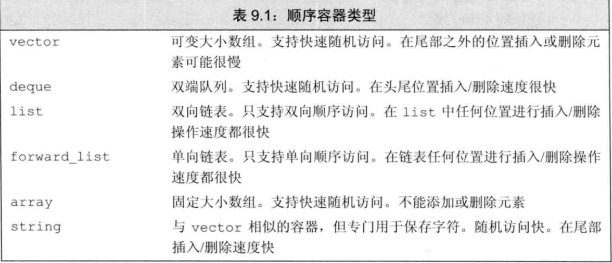

**顺序容器的相关操作**
- 向容器中添加元素
  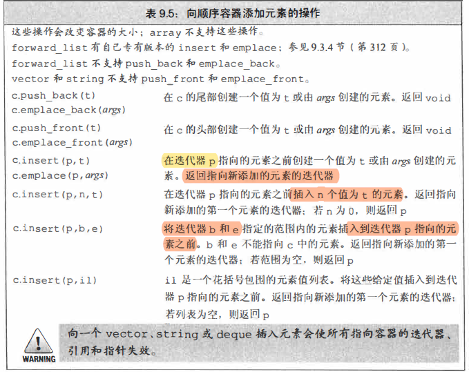

- 删除容器中元素
  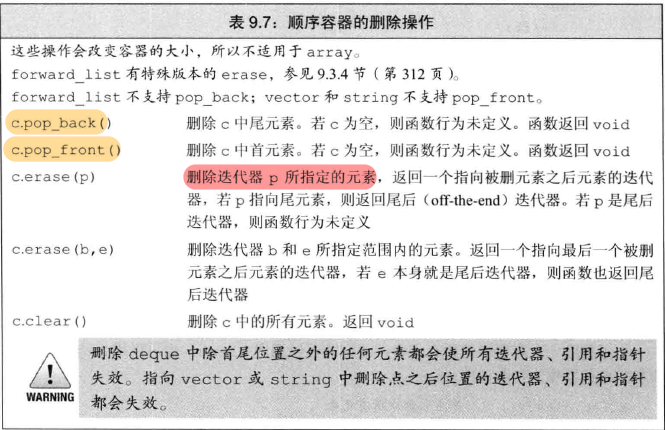
- 访问容器中元素
  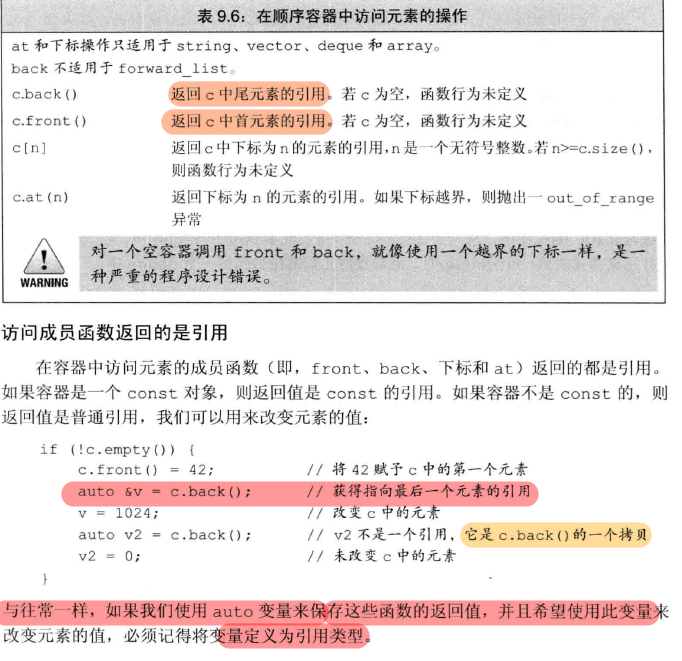
- 迭代器
  ```c++
  //获取容器的迭代器
  c.begin()
  c.end()
  ```
**容器适配器：** 
- **stack**
- **queue**
- **priority_queue**
  
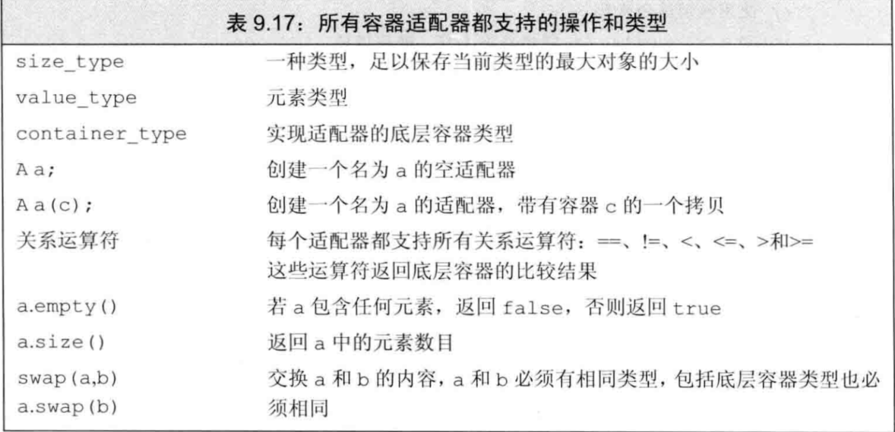


#### vector

```c++
优点：
A、支持随机访问，访问效率高和方便，它像数组一样被访问，即支持[ ] 操作符和vector.at()。
B、节省空间，因为它是连续存储，在存储数据的区域都是没有被浪费的，但是要明确一点vector 大多情况下并不是满存的，在未存储的区域实际是浪费的。
缺点：
A、在内部进行插入、删除操作效率非常低。
B、只能在vector 的最后进行push 和pop ，不能在vector 的头进行push 和pop 。
C、 当动态添加的数据超过vector 默认分配的大小时要进行内存的重新分配、拷贝与释放，这个操作非常消耗能。
定义：vector<数据类型>名称
v.push_back():压入到最后一个
v.pop_back()：弹出最后一个
v.size():向量长度
```

#### stack

```c++
定义：stack<数据类型>名称
s.pop(): 栈顶元素出栈
s.push(value): 元素入栈
s.top(): 返回栈顶元素，元素不弹出
```

#### deque
```c++
deque双端队列
随机访问每个元素，所需要的时间为常量
弹出队首元素：q.pop_back()无返回值
弹出队尾元素：q.pop_front()无返回值
压入队尾：q.push_back(x)
压入队首：q.push_front(x)
取队首：q.front()
取队尾：q.back()
```

#### queue队列
```C++
定义：queue<数据类型> 队列名称
queue入队，如例：q.push(x)；将x 接到队列的末端。
queue出队，如例：q.pop()；弹出队列的第一个元素，注意，并不会返回被弹出元素的值。
访问queue队首元素，如例：q.front()，即最早被压入队列的元素。
访问queue队尾元素，如例：q.back()，即最后被压入队列的元素。
判断queue队列空，如例：q.empty()，当队列空时，返回true。
访问队列中的元素个数，如例：q.size()。
```
#### priority_queue优先队列

##### 操作基本和队列相同
```c++
top 访问队头元素
empty 队列是否为空
size 返回队列内元素个数
push 插入元素到队尾 (并排序)
emplace 原地构造一个元素并插入队列
pop 弹出队头元素
swap 交换内容
```
##### 定义: 

`priority_queue<Type, Container, Functional>`

*Type 就是数据类型，
Container 就是容器类型（Container必须是用数组实现的容器，比如vector,deque等等，但不能用 list。STL里面默认用的是vector），
Functional 就是比较的方式，当需要用自定义的数据类型时才需要传入这三个参数，使用基本数据类型时，只需要传入数据类型，默认是大顶堆*

```c++
//升序队列
priority_queue <int,vector<int>,greater<int> > q;
//降序队列
priority_queue <int,vector<int>,less<int> >q;

// greater和less是std实现的两个仿函数
// 就是使一个类的使用看上去像一个函数。其实现就是类中实现一个operator()，
// 这个类就有了类似函数的行为，就是一个仿函数类了

```
##### 实例

1. 基本类型例子
    
```c++
#include<iostream>
#include <queue>
using namespace std;
int main() 
{
    //对于基础类型 默认是大顶堆
    priority_queue<int> a; 
    //等同于 priority_queue<int, vector<int>, less<int> > a;
    
    priority_queue<int, vector<int>, greater<int> > c;  //这样就是小顶堆
    priority_queue<string> b;

    for (int i = 0; i < 5; i++) 
    {
        a.push(i);
        c.push(i);
    }
    while (!a.empty()) 
    {
        cout << a.top() << ' ';
        a.pop();
    } 
    cout << endl;

    while (!c.empty()) 
    {
        cout << c.top() << ' ';
        c.pop();
    }
    cout << endl;

    b.push("abc");
    b.push("abcd");
    b.push("cbd");
    while (!b.empty()) 
    {
        cout << b.top() << ' ';
        b.pop();
    } 
    cout << endl;
    return 0;
}

```

2. pari的比较，先比较第一个元素，第一个相等比较第二个(默认构建大顶堆)

```c++
#include <iostream>
#include <queue>
#include <vector>
using namespace std;
int main() 
{
    priority_queue<pair<int, int> > a;
    pair<int, int> b(1, 2);
    pair<int, int> c(1, 3);
    pair<int, int> d(2, 5);
    a.push(d);
    a.push(c);
    a.push(b);
    while (!a.empty()) 
    {
        cout << a.top().first << ' ' << a.top().second << '\n';
        a.pop();
    }
}
/* 输出
2 5
1 3
1 2
*/
```
3. 对于自定义类型

**运算符重载**

**重写仿函数**

```c++
#include <iostream>
#include <queue>
using namespace std;

//方法1
struct tmp1 //运算符重载<
{
    int x;
    tmp1(int a) {x = a;}
    bool operator<(const tmp1& a) const
    {
        return x < a.x; //大顶堆
    }
};

//方法2
struct tmp2 //重写仿函数
{  
    // 默认是less函数
    // 返回true时，a的优先级低于b的优先级（a排在b的后面）
    bool operator() (tmp1 a, tmp1 b) 
    {
        return a.x < b.x; //大顶堆
    }
};


//方法3 小顶堆
struct tmp3 //重写仿函数
{  
    // 默认是less函数
    // 返回true时，a的优先级低于b的优先级（a排在b的后面）
    bool operator() (tmp1 a, tmp1 b) 
    {
        return a.x > b.x; //小顶堆
    }
};

int main() 
{
    tmp1 a(1);
    tmp1 b(2);
    tmp1 c(3);
    priority_queue<tmp1> d;
    d.push(b);
    d.push(c);
    d.push(a);
    while (!d.empty()) 
    {
        cout << d.top().x << '\n';
        d.pop();
    }
    cout << endl;

    priority_queue<tmp1, vector<tmp1>, tmp2> f;
    f.push(c);
    f.push(b);
    f.push(a);
    while (!f.empty()) 
    {
        cout << f.top().x << '\n';
        f.pop();
    }


}

```
##### 堆的实现

**尝试用泛型编程实现堆**

```c++
#include<iostream>
#include<vector>

using namespace std;
class Heap {
private:
    int N = 0;
    vector<int> heap;// 这个没有意义的是
public:

    Heap() {
        N = 0;
    }
    // 获取最大值
    int top() {
        return heap[0];
    }

    // 数据首先插入末尾 ,然后上浮
    void push(int k) {
        heap.push_back(k); // 直接放到后面, 然后上浮
        this->N++;
        swim(heap.size() - 1);
        // print();
    }

    // 删除最大值, 最后一位放到开头, 然后在下沉
    void pop() {
        heap[0] = heap.back(); // 最后一位上位, 然后在下沉
        heap.pop_back();
        this->N--;
        sink(0);
        // print();
    }

    // 下面是小根堆
    // 上浮, 在每次插入数据的时候
    void swim(int pos) {
        while (pos > 0 && heap[(pos - 1) / 2] < heap[pos]) {  // 子节点大于父节点 
            swap(heap[(pos - 1) / 2], heap[pos]); // 交换两个位置
            pos = (pos - 1) / 2; // 节点切换到上一层 
        }
    }

    // 下沉, 在每次删除数据的时候
    void sink(int pos) {
        int i;
        while (2 * pos + 2 < N) { //2pos是子节点
            i = 2 * pos + 1;
            if (i < N && heap[i] < heap[i + 1]) i++; // i指向子节点中最大的
            if (heap[pos] >= heap[i]) break; // 已经找到pos应该的位置了
            swap(heap[pos], heap[i]);
            pos = i;
        }
    }

    void print() {
        cout << "打印heap所有值" << endl;
        for (const auto& num : heap) {
            cout << num << " ";
        }cout << endl;
    }
};

void test() {
    Heap * heap=new Heap();
    int a[] = { 1,2,3,4 };
    int b = 3;
    heap->push(a[0]); heap->print();
    heap->push(a[1]); heap->print();
    heap->push(a[2]); heap->print();
    heap->push(a[3]); heap->print();


    heap->pop(); heap->print();
    heap->pop(); heap->print();
    heap->pop(); heap->print();
    cout << heap->top() << endl;
}

int main() {
    test();


    return 0;
}
```
#### 典型题目

**利用deque构造单调队列**
[leetcode239 滑动窗口最大值](https://leetcode-cn.com/problems/sliding-window-maximum/)

给定一个数组 nums，有一个大小为 k 的滑动窗口从数组的最左侧移动到数组的最右侧。你只可以看到在滑动窗口内的 k 个数字。滑动窗口每次只向右移动一位。
返回滑动窗口中的最大值。
```c++
输入：nums = [1,3,-1,-3,5,3,6,7], k = 3
输出：[3,3,5,5,6,7]
解释：
滑动窗口的位置                最大值
---------------               -----
[1  3  -1] -3  5  3  6  7       3
 1 [3  -1  -3] 5  3  6  7       3
 1  3 [-1  -3  5] 3  6  7       5
 1  3  -1 [-3  5  3] 6  7       5
 1  3  -1  -3 [5  3  6] 7       6
 1  3  -1  -3  5 [3  6  7]      7
 ```

队列没有必要维护窗口里的所有元素，只需要维护有可能成为窗口里最大值的元素就可以了，同时保证队里里的元素数值是由大到小的   
维护元素单调递减的队列就叫做单调队列，即单调递减或单调递增的队列

```c++
class MyQueue { //单调队列（从大到小）
public:
    deque<int> que; // 使用deque来实现单调队列
    // 每次弹出的时候，比较当前要弹出的数值是否等于队列出口元素的数值，如果相等则弹出。
    // 同时pop之前判断队列当前是否为空。
    void pop(int value) {
        if (!que.empty() && value == que.front()) {
            que.pop_front();
        }
    }
    // 如果push的数值大于入口元素的数值，那么就将队列后端的数值弹出，直到push的数值小于等于队列入口元素的数值为止。
    // 这样就保持了队列里的数值是单调从大到小的了。
    void push(int value) {
        while (!que.empty() && value > que.back()) {
            que.pop_back();
        }
        que.push_back(value);

    }
    // 查询当前队列里的最大值 直接返回队列前端也就是front就可以了。
    int front() {
        return que.front();
    }
};
```

**构造堆或者利用priority_queue**
[leetcode347 前 K 个高频元素](https://leetcode-cn.com/problems/top-k-frequent-elements/)
给你一个整数数组 nums 和一个整数 k ，请你返回其中出现频率前 k 高的元素。你可以按 任意顺序 返回答案

输入: nums = [1,1,1,2,2,3], k = 2
输出: [1,2]

```c++
// 时间复杂度：O(nlogk)
// 空间复杂度：O(n)
class Solution {
public:
    // 小顶堆
    class comparision{
    public:
        bool operator()(const pair<int,int>& a,const pair<int,int>& b){// 默认重载< 操作符，数据大反而优先级小
            return a.second>b.second;
        }
    };
    vector<int> topKFrequent(vector<int>& nums, int k) {
        unordered_map<int,int> map_nums;
        // 统计频率
        for(int c:nums){
            map_nums[c]++;
        }

        priority_queue<pair<int,int>,vector<pair<int,int>>,comparision> que;
        for(auto iter=map_nums.begin();iter!=map_nums.end();++iter){
            que.push(*iter);
            if(que.size()>k){
                que.pop();
            }
        }
        vector<int> result;
        while(que.size()>0){
            result.push_back(que.top().first);
            que.pop();
        }
        return result;
    }
};
 ```

```c++
// 时间复杂度：O(nlogk)
// 空间复杂度：O(n)
class Solution {
public:
    // 小顶堆
    class mycomparison {
    public:
        bool operator()(const pair<int, int>& lhs, const pair<int, int>& rhs) {
            return lhs.second > rhs.second;
        }
    };
    vector<int> topKFrequent(vector<int>& nums, int k) {
        // 要统计元素出现频率
        unordered_map<int, int> map; // map<nums[i],对应出现的次数>
        for (int i = 0; i < nums.size(); i++) {
            map[nums[i]]++;
        }

        // 对频率排序
        // 定义一个小顶堆，大小为k
        priority_queue<pair<int, int>, vector<pair<int, int>>, mycomparison> pri_que;

        // 用固定大小为k的小顶堆，扫面所有频率的数值
        for (unordered_map<int, int>::iterator it = map.begin(); it != map.end(); it++) {
            pri_que.push(*it);
            if (pri_que.size() > k) { // 如果堆的大小大于了K，则队列弹出，保证堆的大小一直为k
                pri_que.pop();
            }
        }

        // 找出前K个高频元素，因为小顶堆先弹出的是最小的，所以倒序来输出到数组
        vector<int> result(k);
        for (int i = k - 1; i >= 0; i--) {
            result[i] = pri_que.top().first;
            pri_que.pop();
        }
        return result;

    }
};
 ```
## 2.6 树

#### 树的生成

**定义**

```c++
struct TreeNode{
    int val;
    TreeNode* left;
    TreeNode* right;
    TreeNode(int x):val(x),left(NULL),right(NULL){}
} ;

 ```
**构建二叉树**:生成TreeNode数组思想

```c++
// 根据数组构造二叉树
TreeNode* construct_binary_tree(const vector<int>& vec) {
    vector<TreeNode*> vecTree (vec.size(), NULL);
    TreeNode* root = NULL;
    // 把输入数值数组，先转化为二叉树节点数组
    for (int i = 0; i < vec.size(); i++) {
        TreeNode* node = NULL;
        if (vec[i] != -1) node = new TreeNode(vec[i]); // 用 -1 表示null
        vecTree[i] = node;
        if (i == 0) root = node;
    }
    // 遍历一遍，根据规则左右孩子赋值就可以了
    // 注意这里 结束规则是 i * 2 + 2 < vec.size()，避免空指针
    for (int i = 0; i * 2 + 2 < vec.size(); i++) {
        if (vecTree[i] != NULL) {
            // 线性存储转连式存储关键逻辑
            vecTree[i]->left = vecTree[i * 2 + 1];
            vecTree[i]->right = vecTree[i * 2 + 2];
        }
    }
    
    return root;
}
 ```
#### 二叉树的遍历

- 递归实现
  - 确定确定递归函数的参数和返回值
  - 确定终止条件
  - 确定单层递归的逻辑
  
**先序遍历**

```c++
class Solution {
public:
    void traversal(TreeNode* cur, vector<int>& vec) {
        if (cur == NULL) return;
        vec.push_back(cur->val);    // 中
        traversal(cur->left, vec);  // 左
        traversal(cur->right, vec); // 右
    }
    vector<int> preorderTraversal(TreeNode* root) {
        vector<int> result;
        traversal(root, result);
        return result;
    }
};
 ```
**迭代遍历**
> 前序遍历可以利用栈实现
> 
```c++
class Solution {
public:
    vector<int> preorderTraversal(TreeNode* root) {
        stack<TreeNode*> st;
        vector<int> result;
        if (root == NULL) return result;
        st.push(root);
        while (!st.empty()) {
            TreeNode* node = st.top();                       // 中
            st.pop();
            result.push_back(node->val);
            if (node->right) st.push(node->right);           // 右（空节点不入栈）
            if (node->left) st.push(node->left);             // 左（空节点不入栈）
        }
        return result;
    }
};
 ```
 > 中序遍历（迭代法）
 >
 > 因为前序遍历的顺序是中左右，先访问的元素是中间节点，要处理的元素也是中间节点，所以刚刚才能写出相对简洁的代码，因为要访问的元素和要处理的元素顺序是一致的，都是中间节点
 >
 > 中序遍历是左中右，先访问的是二叉树顶部的节点，然后一层一层向下访问，直到到达树左面的最底部，再开始处理节点（也就是在把节点的数值放进result数组中），这就造成了处理顺序和访问顺序是不一致的
 >
 > **在使用迭代法写中序遍历，就需要借用指针的遍历来帮助访问节点，栈则用来处理节点上的元素**

 ```c++
class Solution {
public:
    vector<int> inorderTraversal(TreeNode* root) {
        vector<int> result;
        stack<TreeNode*> st;
        TreeNode* cur = root;
        while (cur != NULL || !st.empty()) {
            if (cur != NULL) { // 指针来访问节点，访问到最底层
                st.push(cur); // 将访问的节点放进栈
                cur = cur->left;                // 左
            } else {
                cur = st.top(); // 从栈里弹出的数据，就是要处理的数据（放进result数组里的数据）
                st.pop();
                result.push_back(cur->val);     // 中
                cur = cur->right;               // 右
            }
        }
        return result;
    }
};

 ```

 > 后序遍历
 > 先序遍历是中左右，后续遍历是左右中，那么我们只需要调整一下先序遍历的代码顺序，就变成中右左的遍历顺序，然后在反转result数组，输出的结果顺序就是左右中了
 > 前序遍历的访问顺序与处理顺序一致的特点

 ```c++
 class Solution {
public:
    vector<int> postorderTraversal(TreeNode* root) {
        stack<TreeNode*> st;
        vector<int> result;
        if (root == NULL) return result;
        st.push(root);
        while (!st.empty()) {
            TreeNode* node = st.top();
            st.pop();
            result.push_back(node->val);
            if (node->left) st.push(node->left); // 相对于前序遍历，这更改一下入栈顺序 （空节点不入栈）
            if (node->right) st.push(node->right); // 空节点不入栈
        }
        reverse(result.begin(), result.end()); // 将结果反转之后就是左右中的顺序了
        return result;
    }
};
```
**二叉树的统一迭代**
> 统一风格写法思想：
> 
> 我们以中序遍历为例，仅仅使用栈的话，无法同时解决访问节点（遍历节点）和处理节点（将元素放进结果集）不一致的情况。
> 那我们就将访问的节点放入栈中，把要处理的节点也放入栈中但是要做标记。
> 要处理的节点放入栈之后，紧接着放入一个空指针作为标记。 这种方法也可以叫做**标记法**

**中序遍历**
 ```c++
 class Solution {
public:
    vector<int> inorderTraversal(TreeNode* root) {
        vector<int> result;
        stack<TreeNode*> st;
        if (root != NULL) st.push(root);
        while (!st.empty()) {
            TreeNode* node = st.top();
            if (node != NULL) {
                st.pop(); // 将该节点弹出，避免重复操作，下面再将右中左节点添加到栈中
                if (node->right) st.push(node->right);  // 添加右节点（空节点不入栈）

                st.push(node);                          // 添加中节点
                st.push(NULL); // 中节点访问过，但是还没有处理，加入空节点做为标记。

                if (node->left) st.push(node->left);    // 添加左节点（空节点不入栈）
            } else { // 只有遇到空节点的时候，才将下一个节点放进结果集
                st.pop();           // 将空节点弹出
                node = st.top();    // 重新取出栈中元素
                st.pop();
                result.push_back(node->val); // 加入到结果集
            }
        }
        return result;
    }
};
 ```
```c++
if(node != NULL){
}else{}
 ```
**注意该结构是标记法的核心体现**
**在if()中利用栈记录结点的处理顺序**
**在else{}则是标记的判断结果，可以进行处理**

```c++
// 前序遍历
class Solution {
public:
    vector<int> preorderTraversal(TreeNode* root) {
        vector<int> result;
        stack<TreeNode*> st;
        if (root != NULL) st.push(root);
        while (!st.empty()) {
            TreeNode* node = st.top();
            if (node != NULL) {
                st.pop();
                if (node->right) st.push(node->right);  // 右
                if (node->left) st.push(node->left);    // 左
                st.push(node);                          // 中
                st.push(NULL);
            } else {
                st.pop();
                node = st.top();
                st.pop();
                result.push_back(node->val);
            }
        }
        return result;
    }
};
 ```
```c++
// 后序遍历

class Solution {
public:
    vector<int> postorderTraversal(TreeNode* root) {
        vector<int> result;
        stack<TreeNode*> st;
        if (root != NULL) st.push(root);
        while (!st.empty()) {
            TreeNode* node = st.top();
            if (node != NULL) {
                st.pop();
                st.push(node);                          // 中
                st.push(NULL);

                if (node->right) st.push(node->right);  // 右
                if (node->left) st.push(node->left);    // 左

            } else {
                st.pop();
                node = st.top();
                st.pop();
                result.push_back(node->val);
            }
        }
        return result;
    }
};
```
**广度优先搜索与深度优先搜索在算法章节详细介绍**


[107 二叉树的层序遍历](https://leetcode-cn.com/problems/binary-tree-level-order-traversal-ii/)

> 给你二叉树的根节点 root ，返回其节点值 自底向上的层序遍历 ,（即按从叶子节点所在层到根节点所在的层，逐层从左向右遍历）
> 
> root = [3,9,20,null,null,15,7]
> 
> 输出：[[15,7],[9,20],[3]]
#### 广度优先搜索（层次遍历）

```c++

class Solution {
public:
    vector<vector<int>> levelOrderBottom(TreeNode* root) {
        vector<vector<int>> vec;
        queue<TreeNode*> q;
        if(!root) return vec;
        q.push(root);
        while(!q.empty()){
            int size=q.size();
            vector<int> v;
            while(size--){
                TreeNode* temp=q.front();
                q.pop();
                if(temp&&temp->left) q.push(temp->left);
                if(temp&&temp->right) q.push(temp->right);
                v.push_back(temp->val);
            }
            vec.push_back(v);
        }
        reverse(vec.begin(),vec.end());
        return vec;
    }
};
 ```

#### 深度优先搜索
> 我们对树进行深度优先搜索，在搜索过程中，我们总是先访问右子树。那么对于每一层来说，我们在这层见到的第一个结点一定是最右边的结点
> 
> 并未涉及回溯


```c++
class Solution {
public:
    vector<int> rightSideView(TreeNode* root) {
        unordered_map<int, int> rightmostValueAtDepth;
        int max_depth = -1;

        stack<TreeNode*> nodeStack;
        stack<int> depthStack;
        nodeStack.push(root);
        depthStack.push(0);

        while (!nodeStack.empty()) {
            TreeNode* node = nodeStack.top();nodeStack.pop();
            int depth = depthStack.top();depthStack.pop();

            if (node != NULL) {
            	// 维护二叉树的最大深度
                max_depth = max(max_depth, depth);

                // 如果不存在对应深度的节点我们才插入
                if (rightmostValueAtDepth.find(depth) == rightmostValueAtDepth.end()) {
                    rightmostValueAtDepth[depth] =  node -> val;
                }

                nodeStack.push(node -> left);
                nodeStack.push(node -> right);
                depthStack.push(depth + 1);
                depthStack.push(depth + 1);
            }
        }

        vector<int> rightView;
        for (int depth = 0; depth <= max_depth; ++depth) {
            rightView.push_back(rightmostValueAtDepth[depth]);
        }

        return rightView;
    }
};
 ```
[637. 二叉树的层平均值](https://leetcode-cn.com/problems/average-of-levels-in-binary-tree/)
> 给定一个非空二叉树的根节点 root , 以数组的形式返回每一层节点的平均值。与实际答案相差 10-5 以内的答案可以被接受。
> 输入：root = [3,9,20,null,null,15,7]
> 
> 输出：[3.00000,14.50000,11.00000]
> 
> 解释：第 0 层的平均值为 3,
> 
> 第 1 层的平均值为 14.5,
> 
> 第 2 层的平均值为 11 
> 
> 因此返回 [3, 14.5, 11] 。
```c++
class Solution {
public:
    vector<double> averageOfLevels(TreeNode* root) {
        auto counts = vector<int>();
        auto sums = vector<double>();
        dfs(root, 0, counts, sums);
        auto averages = vector<double>();
        int size = sums.size();
        for (int i = 0; i < size; i++) {
            averages.push_back(sums[i] / counts[i]);
        }
        return averages;
    }

    void dfs(TreeNode* root, int level, vector<int> &counts, vector<double> &sums) {
        if (root == nullptr) {
            return;
        }
        if (level < sums.size()) {
            sums[level] += root->val;
            counts[level] += 1;
        } else {// 回溯部分用于处理当前层 level>=sum.size()
            sums.push_back(1.0 * root->val);
            counts.push_back(1);
        }
        dfs(root->left, level + 1, counts, sums);
        dfs(root->right, level + 1, counts, sums);
    }
};
```
[111. 二叉树的最小深度](https://leetcode-cn.com/problems/minimum-depth-of-binary-tree/)
> 给定一个二叉树，找出其最小深度。
> 最小深度是从根节点到最近叶子节点的最短路径上的节点数量。
> 说明：叶子节点是指没有子节点的节点。
```c++
class Solution {
public:
    int minDepth(TreeNode *root) {
        if (root == nullptr) {
            return 0;
        }

        if (root->left == nullptr && root->right == nullptr) {
            return 1;
        }

        int min_depth = INT_MAX;
        if (root->left != nullptr) {
            min_depth = min(minDepth(root->left), min_depth);
        }
        if (root->right != nullptr) {
            min_depth = min(minDepth(root->right), min_depth);
        }

        return min_depth + 1;
    }
};
 ```   
 #### 翻转二叉树
 [226. 翻转二叉树](https://leetcode-cn.com/problems/invert-binary-tree/)

 > 给你一棵二叉树的根节点 root ，翻转这棵二叉树，并返回其根节点。
 > 输入：root = [4,2,7,1,3,6,9]
输出：[4,7,2,9,6,3,1]


> 思路：
> 可以发现想要翻转它，其实就把每一个节点的左右孩子交换一下就可以了。
> 关键在于遍历顺序，前中后序应该选哪一种遍历顺序？ 
> 遍历的过程中去翻转每一个节点的左右孩子就可以达到整体翻转的效果。
> 注意只要把每一个节点的左右孩子翻转一下，就可以达到整体翻转的效果
> 这道题目使用前序遍历和后序遍历都可以，唯独中序遍历不方便，因为中序遍历会把某些节点的左右孩子翻转了两次！建议拿纸画一画，就理解了


**递归法**
1. 确定递归函数的参数和返回值 
 `TreeNode* invertTree(TreeNode* root)`
   
2. 确定终止条件:当前节点为空的时候，就返回
`if (root == NULL) return root;`
3. 确定单层递归的逻辑
因为是先前序遍历，所以先进行交换左右孩子节点，然后反转左子树，反转右子树。

    ```c++
    swap(root->left, root->right);
    invertTree(root->left);
    invertTree(root->right);
    ```


**迭代法**

1. 栈替代递归 迭代法（前序遍历）

```c++
class Solution {
public:
    TreeNode* invertTree(TreeNode* root) {
        if (root == NULL) return root;
        stack<TreeNode*> st;
        st.push(root);
        while(!st.empty()) {
            TreeNode* node = st.top();              // 中
            st.pop();
            swap(node->left, node->right);
            if(node->right) st.push(node->right);   // 右
            if(node->left) st.push(node->left);     // 左
        }
        return root;
    }
};
 ```

2. 遍历的统一迭代法
   
```c++
class Solution {
public:
    TreeNode* invertTree(TreeNode* root) {
        stack<TreeNode*> st;
        if (root != NULL) st.push(root);
        while (!st.empty()) {
            TreeNode* node = st.top();
            if (node != NULL) {
                st.pop();
                if (node->right) st.push(node->right);  // 右
                if (node->left) st.push(node->left);    // 左
                st.push(node);                          // 中
                st.push(NULL);
            } else {
                st.pop();
                node = st.top();
                st.pop();
                swap(node->left, node->right);          // 节点处理逻辑
            }
        }
        return root;
    }
};
```

3. 广度优先遍历

也就是层序遍历，层数遍历也是可以翻转这棵树的，因为层序遍历也可以把每个节点的左右孩子都翻转一遍，代码如下 

```c++
class Solution {
public:
    TreeNode* invertTree(TreeNode* root) {
        queue<TreeNode*> que;
        if (root != NULL) que.push(root);
        while (!que.empty()) {
            int size = que.size();
            for (int i = 0; i < size; i++) {
                TreeNode* node = que.front();
                que.pop();
                swap(node->left, node->right); // 节点处理
                if (node->left) que.push(node->left);
                if (node->right) que.push(node->right);
            }
        }
        return root;
    }
};
```

**文中我指的是递归的中序遍历是不行的，因为使用递归的中序遍历，某些节点的左右孩子会翻转两次。**

如果非要使用递归中序的方式写，也可以，如下代码就可以避免节点左右孩子翻转两次的情况：

```c++
class Solution {
public:
    TreeNode* invertTree(TreeNode* root) {
        if (root == NULL) return root;
        invertTree(root->left);         // 左
        swap(root->left, root->right);  // 中
        invertTree(root->left);         // 注意 这里依然要遍历左孩子，因为中间节点已经翻转了
        return root;
    }
};
 ```
 
 #### 对称二叉树

[101. 对称二叉树](https://leetcode-cn.com/problems/symmetric-tree/)
 
 > 给定一个二叉树，检查它是否是镜像对称的。
 > 输入：root = [1,2,2,3,4,4,3]
输出：true

**思路**判断对称二叉树要比较的是哪两个节点，要比较的可不是左右节点！
对于二叉树是否对称，**要比较的是根节点的左子树与右子树是不是相互翻转的**，理解这一点就知道了其实我们要比较的是两个树（这两个树是根节点的左右子树），所以在递归遍历的过程中，也是要同时遍历两棵树。

那么遍历的顺序应该是什么样的呢？

本题遍历只能是“后序遍历”，因为我们要通过递归函数的返回值来判断两个子树的内侧节点和外侧节点是否相等。

**正是因为要遍历两棵树而且要比较内侧和外侧节点，所以准确的来说是一个树的遍历顺序是左右中，一个树的遍历顺序是右左中。**

1. 确定递归函数的参数和返回值
因为我们要比较的是根节点的两个子树是否是相互翻转的，进而判断这个树是不是对称树，所以要比较的是两个树，参数自然也是左子树节点和右子树节点。

`bool compare(TreeNode* left, TreeNode* right)`

2. 确定终止条件

```c++
if (left == NULL && right != NULL) return false;
else if (left != NULL && right == NULL) return false;
else if (left == NULL && right == NULL) return true;
else if (left->val != right->val) return false; // 注意这里我没有使用else
 ```

 3. 确定单层递归的逻辑

> 此时才进入单层递归的逻辑，单层递归的逻辑就是处理 左右节点都不为空，且数值相同的情况。

- 比较二叉树外侧是否对称：传入的是左节点的左孩子，右节点的右孩子。
- 比较内测是否对称，传入左节点的右孩子，右节点的左孩子。
- 如果左右都对称就返回true ，有一侧不对称就返回false 

```c++
class Solution {
public:
    bool compare(TreeNode* left, TreeNode* right) {
        // 首先排除空节点的情况
        if (left == NULL && right != NULL) return false;
        else if (left != NULL && right == NULL) return false;
        else if (left == NULL && right == NULL) return true;
        // 排除了空节点，再排除数值不相同的情况
        else if (left->val != right->val) return false;

        // 此时就是：左右节点都不为空，且数值相同的情况
        // 此时才做递归，做下一层的判断
        bool outside = compare(left->left, right->right);   // 左子树：左、 右子树：右
        bool inside = compare(left->right, right->left);    // 左子树：右、 右子树：左
        bool isSame = outside && inside;                    // 左子树：中、 右子树：中 （逻辑处理）
        return isSame;

    }
    bool isSymmetric(TreeNode* root) {
        if (root == NULL) return true;
        return compare(root->left, root->right);
    }
};
```

**迭代法**
```c++
class Solution {
public:
    bool isSymmetric(TreeNode* root) {
        if (root == NULL) return true;
        queue<TreeNode*> que;
        que.push(root->left);   // 将左子树头结点加入队列
        que.push(root->right);  // 将右子树头结点加入队列
        
        while (!que.empty()) {  // 接下来就要判断这两个树是否相互翻转
            TreeNode* leftNode = que.front(); que.pop();
            TreeNode* rightNode = que.front(); que.pop();
            if (!leftNode && !rightNode) {  // 左节点为空、右节点为空，此时说明是对称的
                continue;
            }

            // 左右一个节点不为空，或者都不为空但数值不相同，返回false
            if ((!leftNode || !rightNode || (leftNode->val != rightNode->val))) {
                return false;
            }
            que.push(leftNode->left);   // 加入左节点左孩子
            que.push(rightNode->right); // 加入右节点右孩子
            que.push(leftNode->right);  // 加入左节点右孩子
            que.push(rightNode->left);  // 加入右节点左孩子
        }
        return true;
    }
};
```


#### 二叉树的最小深度

[111. 二叉树的最小深度](https://leetcode-cn.com/problems/minimum-depth-of-binary-tree/)
> 给定一个二叉树，找出其最小深度。
最小深度是从根节点到最近叶子节点的最短路径上的节点数量。
说明：叶子节点是指没有子节点的节点。
输入：root = [3,9,20,null,null,15,7]
输出：2

**思路·**：
1. 常规方法考虑广度优先搜索（层次遍历）
2. 参考最大深度的递归求法，考虑当前节点只有单一分支的情况

```c++
class Solution {
public:
    int getDepth(TreeNode* node) {
        if (node == NULL) return 0;
        int leftDepth = getDepth(node->left);           // 左
        int rightDepth = getDepth(node->right);         // 右
                                                        // 中
        // 当一个左子树为空，右不为空，这时并不是最低点
        if (node->left == NULL && node->right != NULL) { 
            return 1 + rightDepth;
        }   
        // 当一个右子树为空，左不为空，这时并不是最低点
        if (node->left != NULL && node->right == NULL) { 
            return 1 + leftDepth;
        }
        int result = 1 + min(leftDepth, rightDepth);
        return result;
    }

    int minDepth(TreeNode* root) {
        return getDepth(root);
    }
};
 ```
 **求二叉树的最小深度和求二叉树的最大深度的差别主要在于处理左右孩子不为空的逻辑。**

 #### 完全二叉的节点个数

 [222. 完全二叉树的节点个数](https://leetcode-cn.com/problems/count-complete-tree-nodes/)

 > 给你一棵 完全二叉树 的根节点 root ，求出该树的节点个数。
完全二叉树 的定义如下：在完全二叉树中，除了最底层节点可能没填满外，其余每层节点数都达到最大值，并且最下面一层的节点都集中在该层最左边的若干位置。若最底层为第 h 层，则该层包含 1~ 2^h 个节点。

**思路**：

1. 常规的递归或者利用层序遍历迭代
2. $O(\log n × \log n)$时间复杂度的的
   
> 完全二叉树只有两种情况，情况一：就是满二叉树，情况二：最后一层叶子节点没有满。
对于情况一，可以直接用 2^树深度 - 1 来计算，注意这里根节点深度为1。
对于情况二，分别递归左孩子，和右孩子，递归到某一深度一定会有左孩子或者右孩子为满二叉树，然后依然可以按照情况1来计算

```c++
class Solution {
public:
    int countNodes(TreeNode* root) {
        if (root == nullptr) return 0;
        TreeNode* left = root->left;
        TreeNode* right = root->right;
        int leftHeight = 0, rightHeight = 0; // 这里初始为0是有目的的，为了下面求指数方便
        while (left) {  // 求左子树深度
            left = left->left;
            leftHeight++;
        }
        while (right) { // 求右子树深度
            right = right->right;
            rightHeight++;
        }
        if (leftHeight == rightHeight) {
            return (2 << leftHeight) - 1; // 注意(2<<1) 相当于2^2，所以leftHeight初始为0
        }
        return countNodes(root->left) + countNodes(root->right) + 1;
    }
};
 ```

#### 平衡二叉树
 