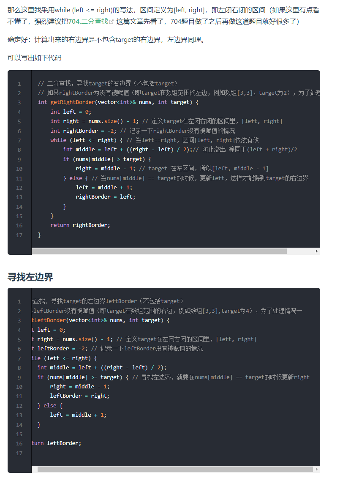

# 第2章 数据结构基础


- [第2章 数据结构基础](#第2章-数据结构基础)
  - [2.1 数组](#21-数组)
      - [移除链表元素](#移除链表元素)
      - [翻转链表](#翻转链表)
      - [链表相交节点问题 链表相交](#链表相交节点问题-链表相交)
      - [链表环入口问题 环形链表](#链表环入口问题-环形链表)
  - [2.3 哈希表](#23-哈希表)
      - [理论基础](#理论基础)
      - [常见的三种哈希结构](#常见的三种哈希结构)
      - [常见案例](#常见案例)
  - [2.4 字符串](#24-字符串)
      - [理论基础](#理论基础-1)
      - [KMP算法](#kmp算法)
  - [2.5 栈与队列](#25-栈与队列)

## 2.1 数组

1. **基础**
*数组是将相同类型的元素存储于连续内存空间的数据结构，其长度不可变如下图所示，构建此数组需要在初始化时给定长度，并对数组每个索引元素赋值，代码如下*：

    ```c++
    // 初始化一个长度为 5 的数组 array
    int array[5];
    int array[] = {2, 3, 1, 0, 2};
    // 初始化可变数组
    vector<int> array;
    // 向尾部添加元素
    array.push_back(2);
    array.push_back(3);
    ```

2. **二分查找的实现**
    ***使用二分查找应该注意是否有序以及无重复元素**
    理解区间定义，处理好边界问题；
    写二分法，区间的定义一般为两种*，`左闭右闭即[left, right]，或者左闭右开即[left, right)`
    ***左闭右闭即[left, right]***
    `while (left <= right) 要使用 <= ，因为left == right是有意义的，所以使用 <=`  
    `if (nums[middle] > target) right 要赋值为 middle - 1，因为当前这个nums[middle]一定不是target，那么接下来要查找的左区间结束下标位置就是 middle - 1`

    ```c++
    int search(vector<int>& nums, int target) {
        int left = 0;
        int right = nums.size() - 1; // 定义target在左闭右闭的区间里，[left, right]
        while (left <= right) { // 当left==right，区间[left, right]依然有效，所以用 <=
            int middle = left + ((right - left) / 2);// 防止溢出 等同于(left + right)/2
            if (nums[middle] > target) {
                right = middle - 1; // target 在左区间，所以[left, middle - 1]
            } else if (nums[middle] < target) {
                left = middle + 1; // target 在右区间，所以[middle + 1, right]
            } else { // nums[middle] == target
                return middle; // 数组中找到目标值，直接返回下标
            }
        }
        // 未找到目标值
        return -1;
    }
    ```

    ***如果定义 target 是在一个在左闭右开的区间里，也就是[left, right) ，那么二分法的边界处理方式则截然不同:***

    `while (left < right)，这里使用 < ,因为left == right在区间[left, right)是没有意义的`  

    `if (nums[middle] > target) right 更新为 middle，因为当前nums[middle]不等于target，去左区间继续寻找，而寻找区间是左闭右开区间，所以right更新为middle，即：下一个查询区间不会去比较nums[middle]`

    ```c++
    int search(vector<int>& nums, int target) {
        int left = 0;
        int right = nums.size(); // 定义target在左闭右开的区间里，即：[left, right)
        while (left < right) { // 因为left == right的时候，在[left, right)是无效的空间，所以使用 <
            int middle = left + ((right - left) >> 1);
            if (nums[middle] > target) {
                right = middle; // target 在左区间，在[left, middle)中
            } else if (nums[middle] < target) {
                left = middle + 1; // target 在右区间，在[middle + 1, right)中
            } else { // nums[middle] == target
                return middle; // 数组中找到目标值，直接返回下标
            }
        }
        // 未找到目标值
        return -1;
    }
    ```

    [leetcode35 查找插入位置](https://leetcode-cn.com/problems/search-insert-position/)
    *难点在与循环之后插入位置处理，应该从target所在区间角度考虑理解返回值*
    **版本1**

    ```c++
    int searchInsert(vector<int>& nums, int target) {
        int n = nums.size();
        int left = 0;
        int right = n - 1; // 定义target在左闭右闭的区间里，[left, right]
        while (left <= right) { // 当left==right，区间[left, right]依然有效
            int middle = left + ((right - left) / 2);// 防止溢出 等同于(left + right)/2
            if (nums[middle] > target) {
                right = middle - 1; // target 在左区间，所以[left, middle - 1]
            } else if (nums[middle] < target) {
                left = middle + 1; // target 在右区间，所以[middle + 1, right]
            } else { // nums[middle] == target
                return middle;
            }
        }
        // 分别处理如下四种情况
        // 目标值在数组所有元素之前  [0, -1]
        // 目标值等于数组中某一个元素  return middle;
        // 目标值插入数组中的位置 [left, right]，return  right + 1
        // 目标值在数组所有元素之后的情况 [left, right]， return right + 1
        return right + 1;
    }
    ```

    若最后一次查找执行为
    `if (nums[middle] > target) middle=right+1为插入位置
    else if (nums[middle] < target)  left|=middle+1=right+1（while条件为<=)为插入位置
    故 return right+1;`
    **版本2**

    ```c++
    int searchInsert(vector<int>& nums, int target) {
        int n = nums.size();
        int left = 0;
        int right = n; // 定义target在左闭右开的区间里，[left, right)  target
        while (left < right) { // 因为left == right的时候，在[left, right)是无效的空间
            int middle = left + ((right - left) >> 1);
            if (nums[middle] > target) {
                right = middle; // target 在左区间，在[left, middle)中
            } else if (nums[middle] < target) {
                left = middle + 1; // target 在右区间，在 [middle+1, right)中
            } else { // nums[middle] == target
                return middle; // 数组中找到目标值的情况，直接返回下标
            }
        }
        // 分别处理如下四种情况
        // 目标值在数组所有元素之前 [0,0)
        // 目标值等于数组中某一个元素 return middle
        // 目标值插入数组中的位置 [left, right) ，return right 即可
        // 目标值在数组所有元素之后的情况 [left, right)，return right 即可
        return right;
    }
    ```

    **二分法查找边界问题**
    *注意重复元素*
    
3. **数组元素的移除** *（双指针）*
   [leetcode209 最小长度子数组](https://leetcode-cn.com/problems/minimum-size-subarray-sum/)
   

   ```c++
    class Solution 
    public:
        int minSubArrayLen(int s, vector<int>& nums) {
            int result = INT32_MAX;
            int sum = 0; // 滑动窗口数值之和
            int i = 0; // 滑动窗口起始位置
            int subLength = 0; // 滑动窗口的长度
            for (int j = 0; j < nums.size(); j++) {
                sum += nums[j];
                // 注意这里使用while，每次更新 i（起始位置），并不断比较子序列是否符合条件
                while (sum >= s) {
                    subLength = (j - i + 1); // 取子序列的长度
                    result = result < subLength ? result : subLength;
                    sum -= nums[i++]; // 这里体现出滑动窗口的精髓之处，不断变更i（子序列的起始位置）
                }
            }
            // 如果result没有被赋值的话，就返回0，说明没有符合条件的子序列
            return result == INT32_MAX ? 0 : result;
        }
    };
    ```

## 2.2 链表

#### 理论基础

*链表以节点为单位，每个元素都是一个独立对象，在内存空间的存储是非连续的。链表的节点对象具有两个成员变量*

```c++
struct ListNode {
    int val;        // 节点值
    ListNode *next; // 后继节点引用
    ListNode(int x) : val(x), next(NULL) {}
};
ListNode* creatList(vector<int> v){
    ListNode* pHead= new ListNode(-1),*r;
    r=pHead;
    for(auto data:v){
        ListNode* s=new ListNode(data);
        r->next=s;
        r=s;
    }
    return pHead->next;
}
```

#### 移除链表元素

*设置虚拟头节点处理，统一操作*

```c++
class Solution {
public:
    ListNode* removeElements(ListNode* head, int val) {
        ListNode* dummyHead = new ListNode(0); // 设置一个虚拟头结点
        dummyHead->next = head; // 将虚拟头结点指向head，这样方面后面做删除操作
        ListNode* cur = dummyHead;
        while (cur->next != NULL) {
            if(cur->next->val == val) {
                ListNode* tmp = cur->next;
                cur->next = cur->next->next;
                delete tmp;
            } else {
                cur = cur->next;
            }
        }
        head = dummyHead->next;
        delete dummyHead;
        return head;
    }
};
```

#### 翻转链表

*两种思路：从头翻转 或者从尾部开始翻转*

```c++
#方案1 双指针
ListNode* pre=NULL,*cur=pHead;
while(cur){
    ListNode* temp=cur->next;
    cur->next=pre;
    pre=cur;
    cur=temp;
}
return pre;
递归实现
class Solution {
public:
    ListNode* reverse(ListNode* pre,ListNode* cur){
        if(cur == NULL) return pre;
        ListNode* temp = cur->next;
        cur->next = pre;
        // 可以和双指针法的代码进行对比，如下递归的写法，其实就是做了这两步
        // pre = cur;
        // cur = temp;
        return reverse(cur,temp);
    }
    ListNode* reverseList(ListNode* head) {
        // 和双指针法初始化是一样的逻辑
        // ListNode* cur = head;
        // ListNode* pre = NULL;
        return reverse(NULL, head);
    }

};

#方案2 从尾部开始翻转
ListNode* reverseList(ListNode* head){
    if(!head) return NULL:
    if(!head->next) return head;//递归出口的判断
    
    head=reverseList(head->next);
    head->next->next=head;
    head->next=NULL;
}
```

[leetcode24 两两交换链表中节点](https://leetcode-cn.com/problems/swap-nodes-in-pairs/submissions/)


```c++
class Solution {
public:
    ListNode* swapPairs(ListNode* head) {
        ListNode* dummyHead = new ListNode(0); // 设置一个虚拟头结点
        dummyHead->next = head; // 将虚拟头结点指向head，这样方面后面做删除操作
        ListNode* cur = dummyHead;
        while(cur->next != nullptr && cur->next->next != nullptr) {
            ListNode* tmp = cur->next; // 记录临时节点
            ListNode* tmp1 = cur->next->next->next; // 记录临时节点

            cur->next = cur->next->next;    // 步骤一
            cur->next->next = tmp;          // 步骤二
            cur->next->next->next = tmp1;   // 步骤三

            cur = cur->next->next; // cur移动两位，准备下一轮交换
        }
        return dummyHead->next;
    }
};
```

#### 链表相交节点问题 [链表相交](https://leetcode-cn.com/problems/intersection-of-two-linked-lists-lcci/)

*两链表相加遍历思想*

#### 链表环入口问题 [环形链表](https://leetcode-cn.com/problems/linked-list-cycle-ii/)

*step2=2\*step1 第二次相遇在入口处*

## 2.3 哈希表

#### 理论基础

**哈希表是根据关键码的值而直接进行访问的数据结构**
*一般哈希表都是用来快速判断一个元素是否出现集合里*

*例如要查询一个名字是否在这所学校里。
要枚举的话时间复杂度是$O(n)$，但如果使用哈希表的话， 只需要$O(1)$就可以做到。
我们只需要初始化把这所学校里学生的名字都存在哈希表里，在查询的时候通过索引直接就可以知道这位同学在不在这所学校里了。
将学生姓名映射到哈希表上就涉及到了hash function ，也就是**哈希函数***
**哈希函数**

*一般哈希碰撞有两种解决方法， 拉链法和线性探测法*

#### 常见的三种哈希结构

- 数组
- set （集合）
- map(映射)

| 集合|底层实现|是否有序|数值是否可以重复|能否更改数值|查询效率|增删效率|
|:-----:| :-----:  | :----: | :-------------: |:---------:| :----:|:-----:|
|std::set |红黑树 |有序| 否| 否| $O(\log n)$ |$O(\log n)$|
|std::multiset |红黑树 |有序| 是| 否| $O(\log n)$| $O(\log n)$|
|std::unordered_set |哈希表 |无序| 否| 否 |$O(1)$ |$O(1)$|

*std::unordered_set底层实现为哈希表，std::set 和std::multiset 的底层实现是红黑树，红黑树是一种平衡二叉搜索树，所以key值是有序的，但key不可以修改，改动key值会导致整棵树的错乱，所以只能删除和增加*

|映射 |底层实现| 是否有序| 数值是否可以重复| 能否更改数值| 查询效率| 增删效率|
| :---: | :---: | :---: | :---: | :---: | :---: | :---: |
|std::map| 红黑树| key有序 |key不可重复| key不可修改| $O(\log n)$ |$O(\log n)$|
|std::multimap| 红黑树 |key有序| key可重复| key不可修改| $O(\log n)$| $O(\log n)$|
|std::unordered_map |哈希表 |key无序| key不可重复| key不可修改| $O(1)$| $O(1)$|
*std::unordered_map 底层实现为哈希表，std::map 和std::multimap 的底层实现是红黑树。同理，std::map 和std::multimap 的key也是有序的（这个问题也经常作为面试题，考察对语言容器底层的理解）*  

**1. 当我们要使用集合来解决哈希问题的时候，优先使用unordered_set，因为它的查询和增删效率是最优的，如果需要集合是有序的，那么就用set，如果要求不仅有序还要有重复数据的话，那么就用multiset**

1. 那么再来看一下map ，在map 是一个key value 的数据结构，map中，对key是有限制，对value没有限制的，因为key的存储方式使用红黑树实现的。**

*虽然std::set、std::multiset 的底层实现是红黑树，不是哈希表，但是std::set、std::multiset 依然使用哈希函数来做映射，只不过底层的符号表使用了红黑树来存储数据，所以使用这些数据结构来解决映射问题的方法，我们依然称之为哈希法。 map也是一样的道理

这里在说一下，一些C++的经典书籍上 例如STL源码剖析，说到了hash_set hash_map，这个与unordered_set，unordered_map又有什么关系呢？*

实际上功能都是一样一样的， 但是unordered_set在C++11的时候被引入标准库了，而hash_set并没有，所以建议还是使用unordered_set比较好，这就好比一个是官方认证的，hash_set，hash_map 是C++11标准之前民间高手自发造的轮子*


**总结：当我们遇到了要快速判断一个元素是否出现集合里的时候，就要考虑哈希法**

**但是哈希法也是牺牲了空间换取了时间，因为我们要使用额外的数组，set或者是map来存放数据，才能实现快速的查找**

#### 常见案例

[leetcode242 有效的字母异位词](https://leetcode-cn.com/problems/valid-anagram/)  **map的简单使用**

```c++
/*
给定两个字符串 s 和 t ，编写一个函数来判断 t 是否是 s 的字母异位词。
示例 1: 输入: s = "anagram", t = "nagaram" 输出: true
示例 2: 输入: s = "rat", t = "car" 输出: false
说明: 你可以假设字符串只包含小写字母
*/
bool isAnagram(string s, string t) {
    unordered_map<char,int> map;
    for(auto c:s) ++map[c];
    //for(auto c:map) cout<<c.first<<" "<<c.second<<endl;
    for(auto c:t){
        if(map[c]>0) --map[c];
        else return false;
    }
    for(auto it:map){
        if(it.second!=0) return false;
    }
    return true;
}
```

*也可以用数组实现，直接使用set，map不仅占用空间比数组大，*
*而且速度要比数组慢，把数值映射到key上都要做hash计算的*
[leetcode349 两个数组的交集](https://leetcode-cn.com/problems/intersection-of-two-arrays/)  **unordeered_set以及set迭代器的使用**

```c++
/*
给定两个数组 nums1 和 nums2 ，返回 它们的交集 
输出结果中的每个元素一定是 唯一 的。我们可以 不考虑输出结果的顺序
输入：nums1 = [1,2,2,1], nums2 = [2,2]
输出：[2]
*/
class Solution {
public:
    vector<int> intersection(vector<int>& nums1, vector<int>& nums2) {
        unordered_set<int> result_set; // 存放结果
        unordered_set<int> nums_set(nums1.begin(), nums1.end());
        for (int num : nums2) {
            // 发现nums2的元素 在nums_set里又出现过
            if (nums_set.find(num) != nums_set.end()) {
                result_set.insert(num);
            }
        }
        return vector<int>(result_set.begin(), result_set.end());
    }
};
```

[leetcode1 两个数组之和](https://leetcode-cn.com/problems/two-sum/)
*给定一个整数数组 nums 和一个目标值 target，请你在该数组中找出和为目标值的那 两个 整数，并返回他们的数组下标
你可以假设每种输入只会对应一个答案。但是，数组中同一个元素不能使用两遍
示例:
给定 nums = [2, 7, 11, 15], target = 9
因为 nums[0] + nums[1] = 2 + 7 = 9
所以返回 [0, 1]*
**思路**
*本题呢，则要使用map，那么来看一下使用数组和set来做哈希法的局限。
数组的大小是受限制的，而且如果元素很少，而哈希值太大会造成内存空间的浪费。
set是一个集合，里面放的元素只能是一个key，而两数之和这道题目，不仅要判断y是否存在而且还要记录y的下标位置，
因为要返回x 和 y的下标。所以set 也不能用。
此时就要选择另一种数据结构：map ，map是一种key value的存储结构，
可以用key保存数值，用value在保存数值所在的下标。*

```c++
class Solution {
public:
    vector<int> twoSum(vector<int>& nums, int target) {
        unordered_map<int,int> map_num ;
        vector<int> v;
        for(int i=0;i<nums.size();++i){
            if(map_num.find(target-nums[i])!=map_num.end()){
                v.push_back(map_num[target-nums[i]]);
                v.push_back(i);
            }
            map_num.emplace(nums[i],i);
        }
        
        return v;
    }
};
```

[leetcode383 赎金信](https://leetcode-cn.com/problems/ransom-note/)

*给定一个赎金信 (ransom) 字符串和一个杂志(magazine)字符串，判断第一个字符串 ransom 能不能由第二个字符串 magazines 里面的字符构成。如果可以构成，返回 true ；否则返回 false。
(题目说明：为了不暴露赎金信字迹，要从杂志上搜索各个需要的字母，组成单词来表达意思。杂志字符串中的每个字符只能在赎金信字符串中使用一次。)
注意：
你可以假设两个字符串均只含有小写字母。
canConstruct("a", "b") -> false
canConstruct("aa", "ab") -> false
canConstruct("aa", "aab") -> true*
**思路**
*在本题的情况下，使用map的空间消耗要比数组大一些的，因为map要维护红黑树或者哈希表，而且还要做哈希函数，是费时的！数据量大的话就能体现出来差别了。 所以数组更加简单直接有效*
**其他题目**
[leetcode15 三数之和](https://leetcode-cn.com/problems/3sum/) **双指针**
[leetcode18 四数之和](https://leetcode-cn.com/problems/4sum/) **双指针**

## 2.4 字符串

#### 理论基础

- 双指针法翻转字符串
[leetcode344 反转字符串](<https://leetcode-cn.com/problems/reverse-string/>)
  
- 局部反转+整体反转
[剑指Offer58-II.左旋转字符](https://leetcode-cn.com/problems/zuo-xuan-zhuan-zi-fu-chuan-lcof/)

- KMP算法 实现strStr()
[leetcode28 实现strStr()](https://leetcode-cn.com/problems/implement-strstr/)  

    *实现 strStr() 函数。
    给定一个 haystack 字符串和一个 needle 字符串，在 haystack 字符串中找出 needle 字符串出现的第一个位置 (从0开始)。如果不存在，则返回  -1。
    示例 1: 输入: haystack = "hello", needle = "ll" 输出: 2
    示例 2: 输入: haystack = "aaaaa", needle = "bba" 输出: -1*

    ```c++
    class Solution {
    public:
        string reverseLeftWords(string s, int n) {
            reverse(s.begin(), s.begin() + n);
            reverse(s.begin() + n, s.end());
            reverse(s.begin(), s.end());
            return s;
        }
    };
    ```

#### KMP算法

KMP的主要思想是当出现字符串不匹配时，可以知道一部分之前已经匹配的文本内容，可以利用这些信息避免从头再去做匹配了
**1. 前缀表**

*作用:前缀表是用来回退的，它记录了模式串与主串(文本串)不匹配的时候，模式串应该从哪里开始重新匹配。
记录下标i之前（包括i）的字符串中，有多大长度的相同前缀后缀*

**前缀**:是指不包含最后一个字符的所有以第一个字符开头的连续子串；
**后缀**:是指不包含第一个字符的所有以最后一个字符结尾的连续子串
**最长相等前后缀**


**2. 前缀表与next数组**  

**next数组就可以是前缀表，常用的两种实现:**
*1.把前缀表统一减一
2.右移一位，初始位置为-1之后作为next数组*

**构造next[]**

构造next数组其实就是计算模式串s，前缀表的过程。 主要有如下三步(以前缀表统一减一为例)：

1. 初始化
2. 处理前后缀不相同的情况
3. 处理前后缀相同的情况

- 初始化

    定义两个指针i和j，**j指向前缀起始位置，i指向后缀起始位置**
    然后还要对next数组进行初始化赋值，如下：

    ```c++
    int j = -1;
    next[0] = j;
    ```

    *j 为什么要初始化为 -1呢，因为之前说过 前缀表要统一减一的操作仅仅是其中的一种实现，
    我们这里选择j初始化为-1，下文我还会给出j不初始化为-1的实现代码。
    next[i] 表示 i（包括i）之前最长相等的前后缀长度（其实就是 j）
    所以初始化next[0] = j 。*    
   
- 处理前后缀不相同的情况
    因为j初始化为-1，那么i就从1开始，进行s[i] 与 s[j+1]的比较。
    所以遍历模式串s的循环下标i 要从 1开始，代码如下：
    `for (int i = 1; i < s.size(); i++) {`
    如果 s[i] 与 s[j+1]不相同，也就是遇到 前后缀末尾不相同的情况，就要向前回退
    next[j]就是记录着j（包括j）之前的子串的相同前后缀的长度
    那么 s[i] 与 s[j+1] 不相同，就要找 j+1前一个元素在next数组里的值（就是next[j]）

    ```c++
    while (j >= 0 && s[i] != s[j + 1]) { // 前后缀不相同了
        j = next[j]; // 向前回退
    }
    ```

- 处理前后缀相同的情况
*如果 s[i] 与 s[j + 1] 相同，那么就同时向后移动i 和j 说明找到了相同的前后缀，
同时还要将j（前缀的长度）赋给next[i], 因为next[i]要记录相同前后缀的长度*

    ```c++
    if (s[i] == s[j + 1]) { // 找到相同的前后缀
        j++;
    }
    next[i] = j;
    ```

**整体代码如下**

```c++
void getNext(int* next, const string& s){
    int j = -1;
    next[0] = j;
    for(int i = 1; i < s.size(); i++) { // 注意i从1开始
        while (j >= 0 && s[i] != s[j + 1]) { // 前后缀不相同了
            j = next[j]; // 向前回退
        }
        if (s[i] == s[j + 1]) { // 找到相同的前后缀
            j++;
        }
        next[i] = j; // 将j（前缀的长度）赋给next[i]
    }
}
```

next[]构造过程
![构造next[]数组](images/next[]构造.gif)

**3. 利用next数组来做匹配**

```c++
int j = -1; // 因为next数组里记录的起始位置为-1
for (int i = 0; i < s.size(); i++) { // 注意i就从0开始
    while(j >= 0 && s[i] != t[j + 1]) { // 不匹配
        j = next[j]; // j 寻找之前匹配的位置
    }
    if (s[i] == t[j + 1]) { // 匹配，j和i同时向后移动
        j++; // i的增加在for循环里
    }
    if (j == (t.size() - 1) ) { // 文本串s里出现了模式串t
        return (i - t.size() + 1);
    }
}
```

**前缀表统一减一 C++代码实现**

```c++
class Solution {
public:
    void getNext(int* next, const string& s) {
        int j = -1;
        next[0] = j;
        for(int i = 1; i < s.size(); i++) { // 注意i从1开始
            while (j >= 0 && s[i] != s[j + 1]) { // 前后缀不相同了
                j = next[j]; // 向前回退
            }
            if (s[i] == s[j + 1]) { // 找到相同的前后缀
                j++;
            }
            next[i] = j; // 将j（前缀的长度）赋给next[i]
        }
    }
    int strStr(string haystack, string needle) {
        if (needle.size() == 0) {
            return 0;
        }
        int next[needle.size()];
        getNext(next, needle);
        int j = -1; // // 因为next数组里记录的起始位置为-1
        for (int i = 0; i < haystack.size(); i++) { // 注意i就从0开始
            while(j >= 0 && haystack[i] != needle[j + 1]) { // 不匹配
                j = next[j]; // j 寻找之前匹配的位置
            }
            if (haystack[i] == needle[j + 1]) { // 匹配，j和i同时向后移动
                j++; // i的增加在for循环里
            }
            if (j == (needle.size() - 1) ) { // 文本串s里出现了模式串t
                return (i - needle.size() + 1);
            }
        }
        return -1;
    }
};

```

**前缀表（不减一不右移）C++实现**

```c++
class Solution {
public:
    void getNext(int* next, const string& s) {
        int j = 0;
        next[0] = 0;
        for(int i = 1; i < s.size(); i++) {
            while (j > 0 && s[i] != s[j]) {
                j = next[j - 1];
            }
            if (s[i] == s[j]) {
                j++;
            }
            next[i] = j;
        }
    }
    int strStr(string haystack, string needle) {
        if (needle.size() == 0) {
            return 0;
        }
        int next[needle.size()];
        getNext(next, needle);
        int j = 0;
        for (int i = 0; i < haystack.size(); i++) {
            while(j > 0 && haystack[i] != needle[j]) {
                j = next[j - 1];
            }
            if (haystack[i] == needle[j]) {
                j++;
            }
            if (j == needle.size() ) {
                return (i - needle.size() + 1);
            }
        }
        return -1;
    }
};
```
[leetcode459 重复的子字符串](https://leetcode-cn.com/problems/repeated-substring-pattern/)  

*给定一个非空的字符串，判断它是否可以由它的一个子串重复多次构成。给定的字符串只含有小写英文字母，并且长度不超过10000。
示例 1:
输入: "abab"
输出: True
解释: 可由子字符串 "ab" 重复两次构成。*
**思路**
*next[]为相等前后缀表统一减一;
next[len-1]!=-1 最长串存在相等前后缀
abcabcabc
len_s-(next[len_s-1]+1)为一个周期
若len为周期倍数，返回true*

```c++
class Solution {
public:
    void getNext (int* next, const string& s){
        next[0] = -1;
        int j = -1;
        for(int i = 1;i < s.size(); i++){
            while(j >= 0 && s[i] != s[j+1]) {
                j = next[j];
            }
            if(s[i] == s[j+1]) {
                j++;
            }
            next[i] = j;
        }
    }
    bool repeatedSubstringPattern (string s) {
        if (s.size() == 0) {
            return false;
        }
        int next[s.size()];
        getNext(next, s);
        int len = s.size();
        if (next[len - 1] != -1 && len % (len - (next[len - 1] + 1)) == 0) {
            return true;
        }
        return false;
    }
};
```

## 2.5 栈与队列
